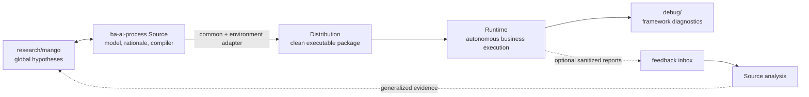

# ADR-017: Архитектура ba-ai-process — Source, Distribution и обратная связь

## Decision Metadata

| Field | Value |
| --- | --- |
| ADR id | ADR-017 |
| Decision type | methodology |
| Decision status | proposed (narrative summary; машиночитаемый canon — frontmatter `status`) |
| Decision date | 2026-09-22 |
| Owner | G-Ivan-A |
| Source | [issue #595](https://github.com/G-Ivan-A/hybrid-Intelligence-lab/issues/595); текущее состояние сборки — [PR #594](https://github.com/G-Ivan-A/hybrid-Intelligence-lab/pull/594) и [issue #593](https://github.com/G-Ivan-A/hybrid-Intelligence-lab/issues/593) |
| Impacted artifacts | целевой Source [`projects/ba-ai-process/`](https://github.com/G-Ivan-A/hybrid-Intelligence-lab/tree/main/projects/ba-ai-process), текущий Source [`projects/ba-gigacode-implementation/`](https://github.com/G-Ivan-A/hybrid-Intelligence-lab/tree/main/projects/ba-gigacode-implementation), runtime [`G-Ivan-A/mango-ba-ai-runtime-cli`](https://github.com/G-Ivan-A/mango-ba-ai-runtime-cli), исследования [`research/mango/`](https://github.com/G-Ivan-A/hybrid-Intelligence-lab/tree/main/research/mango) и [`research/ai-education/`](https://github.com/G-Ivan-A/hybrid-Intelligence-lab/tree/main/research/ai-education), канонический backlog [`ops/backlog.md`](https://github.com/G-Ivan-A/hybrid-Intelligence-lab/blob/main/ops/backlog.md) |
| Supersedes | none |
| Superseded by | none |

## Context

Текущий проект [`projects/ba-gigacode-implementation/`](https://github.com/G-Ivan-A/hybrid-Intelligence-lab/tree/main/projects/ba-gigacode-implementation)
одновременно хранит исследуемую мета-модель, концептуальные руководства, тесты
сборки и пакет для одной среды. Имя проекта связывает общую работу с конкретным
инструментом, хотя действующий
[`compilation-manifest.yaml`](https://github.com/G-Ivan-A/hybrid-Intelligence-lab/blob/main/projects/ba-gigacode-implementation/execution-package-gigacode-cli/compilation-manifest.yaml)
уже различает исходные материалы, преобразованные файлы и отброшенное rationale.
Скомпилированный MVP развернут в отдельном runtime-репозитории
[`G-Ivan-A/mango-ba-ai-runtime-cli`](https://github.com/G-Ivan-A/mango-ba-ai-runtime-cli),
где есть контракты, таксономии, маршруты, навыки, шаблоны, проверки и
пользовательские руководства, но нет исследовательского корпуса RRP.

Нужна явная архитектурная граница, которая позволит собирать пакеты для
нескольких сред и при этом:

- не превращать исследовательское rationale в runtime-зависимость;
- не смешивать отладку фреймворка с бизнес-прогонами;
- сохранять исполнимый runtime автономным при недоступности Source;
- возвращать наблюдения разных пользователей и экземпляров без обязательной
  телеметрии;
- связывать локальную практику с глобальными гипотезами, не объявляя
  локально проверенную модель универсальной.

Последний пункт задаёт существенную границу решения. Текущая
[`ba-meta-model`](https://github.com/G-Ivan-A/hybrid-Intelligence-lab/tree/main/projects/ba-gigacode-implementation/ba-meta-model)
имеет `scope: mango-only`; одного домена и одной среды недостаточно, чтобы
подтвердить переносимость её содержания. Настоящий ADR делает универсальной
**архитектуру поставки**, но сохраняет универсальность содержимого как
проверяемую гипотезу.

Индустриальные опоры используются пропорционально, без заявления о полном
соответствии внешним стандартам:

- [Python Packaging User Guide: The Packaging Flow](https://packaging.python.org/en/latest/flow/)
  разделяет source tree и артефакты распространения, содержащие то, что нужно
  среде пользователя;
- [SLSA Provenance](https://slsa.dev/spec/v1.2/provenance) связывает выход сборки
  с исходниками и процессом сборки; здесь заимствуется принцип provenance, а не
  заявляется SLSA-compliance;
- [Diátaxis](https://diataxis.fr/) разделяет документацию по потребности
  читателя, а не по одному формату файла;
- [GitHub `repository_dispatch`](https://docs.github.com/en/actions/reference/workflows-and-actions/events-that-trigger-workflows#repository_dispatch)
  показывает возможный opt-in транспорт внешнего события, но не становится
  обязательным каналом обратной связи.

## Decision

Принять архитектуру `Source → Distribution → Runtime → Feedback → Source` для
проекта `ba-ai-process`. После отдельного implementation gate текущий каталог
переименовывается в
[`projects/ba-ai-process/`](https://github.com/G-Ivan-A/hybrid-Intelligence-lab/tree/main/projects/ba-ai-process).
Настоящий ADR фиксирует целевое состояние; физическое переименование и перенос
файлов в его scope не входят.

### D1. Source: единственный дом модели и rationale

Source владеет мета-моделью, RRP-модулями, концептуальными руководствами,
решениями ADR/RFC, адаптерами сборки, тестами и историей причин. Целевая
структура:

```text
projects/ba-ai-process/
├── README.md
├── ba-meta-model/                 # RRP и проверяемые гипотезы
├── meta-model-guides/             # conceptual/explanation/reference для архитекторов и Senior BA
├── decisions/                     # project-scoped ADR
├── docs/
│   └── rfc/                       # project-scoped proposals
├── experiments/                   # draft/experimental work, not Distribution input by default
├── build/
│   ├── compiler/                  # allowlist-компиляция
│   ├── common/                    # общие входы всех пакетов
│   └── adapters/
│       └── <environment>/         # преобразования конкретной среды
├── tests/                         # тесты компилятора и пакетов
├── ops/
│   └── feedback/                  # inbox создаётся только при первом импорте
└── dist/
    └── execution-package-<environment>/  # сгенерированный Distribution
```

Каталоги `build/`, `dist/`, `tests/` и `ops/` являются project-specific delta:
они оправданы соответственно компиляцией, выходами поставки, проверкой пакетов
и импортом feedback. `experiments/` хранит незрелые разработки; их включение в
Distribution требует явного перевода в allowlist и смены lifecycle-статуса.

Backlog логически относится к Source, но физически остаётся в единственном
каноническом файле
[`ops/backlog.md`](https://github.com/G-Ivan-A/hybrid-Intelligence-lab/blob/main/ops/backlog.md).
Source README ссылается на его проектные записи; второй backlog и копия задач в
`projects/ba-ai-process/` не создаются. Это сохраняет SSOT и Anti-Inflation.

Source связан с
[`research/mango/`](https://github.com/G-Ivan-A/hybrid-Intelligence-lab/tree/main/research/mango)
двунаправленно:

- глобальная гипотеза из `research/mango/` входит в Source как явно
  процитированное основание или ограничение;
- локальный результат Source возвращается в `research/mango/` только после
  синтеза и проверки его обобщаемости;
- ссылка сама по себе не повышает lifecycle-статус знания.

Модули
[`research/ai-education/`](https://github.com/G-Ivan-A/hybrid-Intelligence-lab/tree/main/research/ai-education)
служат исследовательскими основаниями для Source-guides. Они не копируются в
Distribution целиком.

### D2. Distribution: чистый, версионированный результат компиляции

Каждый `execution-package-<environment>` строится из `common` и ровно одного
адаптера среды по декларативному allowlist. Пакет содержит только исполняемую
модель и документацию, необходимую пользователю среды:

```text
dist/execution-package-<environment>/
├── AGENTS.md
├── package-manifest.yaml          # package/source revisions, adapter, file hashes
├── <environment-native>/          # навыки и конфигурация среды
├── taxonomy/
├── contracts/
├── routes/
├── templates/
├── evaluation/
├── docs/
│   └── guides/                    # task-oriented runtime guides
├── tests/
└── tools/
```

Distribution не содержит RRP, исследовательские обзоры, ADR/RFC, backlog,
открытые вопросы, аргументацию отвергнутых вариантов или собранные feedback-
отчёты. Его нельзя редактировать как независимый источник: изменение начинается
в Source и приходит в пакет повторной компиляцией.

`package-manifest.yaml` обязан фиксировать как минимум версию пакета, revision
Source, имя и версию адаптера, allowlist входов и хеши выходных файлов. Это
обеспечивает трассировку по принципу provenance. Один набор входов и версия
компилятора должны давать один и тот же файловый manifest; исключения вроде
времени сборки не участвуют в содержательных хешах.

### D3. Runtime: автономная установка, а не зеркало Source

Runtime-репозиторий, например
[`G-Ivan-A/mango-ba-ai-runtime-cli`](https://github.com/G-Ivan-A/mango-ba-ai-runtime-cli),
получает содержимое одного Distribution и добавляет только локальную
операционную оболочку. Целевая граница runtime:

```text
<runtime-repository>/
├── <compiled package files>
├── runs/                          # только бизнес-прогоны
├── debug/                         # только отладка фреймворка в реальной среде
└── feedback/
    └── outbox/                    # необязательные локальные отчёты
```

Runtime обязан работать без чтения Source и без доступа к
[`G-Ivan-A/hybrid-Intelligence-lab`](https://github.com/G-Ivan-A/hybrid-Intelligence-lab).
Абсолютная ссылка на Source допустима как provenance, но не как шаг инструкции,
без которого невозможно выполнить работу.

Отладка фреймворка проводится только в реальной runtime-среде. `runs/` содержит
только бизнес-выполнение; диагностические сессии живут в `debug/` и не входят
автоматически ни в бизнес-доказательства, ни в Golden Set, ни в метрики качества
результата. Тесты компилятора в Source проверяют механизм, но не подменяют
эмпирическую runtime-отладку. В Source возвращаются только санитизированные
результаты и воспроизводимые практики, а не сырые пользовательские данные.
Репозиторий
[`G-Ivan-A/hybrid-Intelligence-lab`](https://github.com/G-Ivan-A/hybrid-Intelligence-lab)
агрегирует такие результаты из нескольких runtime только через Source-анализ;
он не зеркалирует их рабочие каталоги.

### D4. Два слоя руководств с явным происхождением

[`meta-model-guides/`](https://github.com/G-Ivan-A/hybrid-Intelligence-lab/tree/main/projects/ba-ai-process/meta-model-guides)
в Source содержит conceptual, explanation и reference-документы в Markdown для
архитекторов и Senior BA: почему модель устроена так, границы применимости и
связи с исследованиями.

`docs/guides/` в Distribution и runtime содержит короткие task-oriented
инструкции в Markdown или HTML для конечного пользователя, включая Junior BA:
как запустить работу, пройти human gate, интерпретировать ошибку и передать
feedback. Runtime-guide может адаптировать необходимый фрагмент Source-guide,
потому что runtime автономен, но обязан фиксировать `derived_from` и Source
revision в manifest. Он не должен копировать исследовательскую аргументацию.

Такое управляемое дублирование намеренно: потребность читателя важнее запрета
на повтор текста, а проверка сборки отвечает за синхронность.

### D5. Необязательная обратная связь от нескольких пользователей и экземпляров

Runtime не зависит от feedback-механизма. Отсутствие отчётов, сети или доступа
к [`G-Ivan-A/hybrid-Intelligence-lab`](https://github.com/G-Ivan-A/hybrid-Intelligence-lab)
не блокирует бизнес-прогон.

Минимальный переносимый отчёт имеет следующую форму; отдельный шаблон-файл до
первого реального использования не создаётся:

```yaml
schema_version: "1.0"
report_id: "fr-<environment>-<local-unique-id>"
created_at: "YYYY-MM-DDThh:mm:ssZ"
origin:
  environment: "gigacode-cli"
  runtime_repository: "https://github.com/OWNER/REPOSITORY"
  runtime_revision: "<commit>"
  package_version: "<version>"
  source_revision: "<commit>"
  instance_ref: "<local-pseudonym>"
  reporter_ref: "<optional-local-pseudonym>"
observation:
  category: "model-gap|adapter-gap|guide-gap|false-positive|false-negative|other"
  summary: "<one sentence>"
  expected: "<expected behaviour>"
  actual: "<observed behaviour>"
  reproduction:
    - "<sanitized step or fixture reference>"
  evidence_refs:
    - "<sanitized local or immutable URL>"
privacy:
  sanitized: true
  contains_secrets: false
```

`instance_ref` различает установки, `reporter_ref` — пользователей одной
установки. Оба идентификатора локальны и псевдонимны; глобальная идентичность
человека не требуется. Отчёт с секретами, персональными или сырыми бизнес-
данными не импортируется.

Фаундер инициирует сбор из явно разрешённых внешних репозиториев вручную или
workflow. Базовый транспорт — экспорт/PR выбранных файлов из `feedback/outbox/`.
Опциональный `repository_dispatch` передаёт ссылку и метаданные события, а не
обязан переносить содержимое отчёта. Автосбор требует отдельного opt-in внешнего
репозитория и минимальных read-only прав.

После первого импорта исходный отчёт сохраняется неизменяемо в логическом
адресе
`projects/ba-ai-process/ops/feedback/inbox/<environment>/<instance>/<report-id>.yaml`.
Анализ и обобщение создаются отдельно: локальная находка меняет Source только
после проверки, а глобальная гипотеза — только после синтеза в
[`research/mango/`](https://github.com/G-Ivan-A/hybrid-Intelligence-lab/tree/main/research/mango).

### D6. Поток и границы статусов



Архитектурный поток универсален. Содержимое `ba-meta-model` остаётся
`mango-only`, пока не проверено как минимум во второй независимой среде или
домене. Возможная публикация отдельного публичного `ba-ai-playbook` требует
нового human decision gate и не следует автоматически из этого ADR.

## Decision Drivers

- Автономность runtime при недоступности исследовательского репозитория.
- Один канонический Source для модели, rationale и адаптеров нескольких сред.
- Воспроизводимая, трассируемая компиляция вместо ручного копирования пакетов.
- Чистая граница между бизнес-выполнением и диагностикой фреймворка.
- Документация, соответствующая задаче и уровню пользователя.
- Privacy-preserving feedback, который полезен при нескольких пользователях,
  но не становится runtime-зависимостью.
- Проверяемая переносимость вместо преждевременного объявления универсальности.

## Alternatives Considered

| Alternative | Decision |
| --- | --- |
| Только переименовать текущий каталог | Отклонено: имя исчезнет, но смешанная граница Source/Distribution и ручное масштабирование на новые среды останутся. |
| Дать runtime прямой доступ к Source | Отклонено: runtime перестаёт быть автономным, а исследовательское rationale становится операционной зависимостью. |
| Вести отдельный пакет вручную для каждой среды | Отклонено: изменения common-части расходятся, provenance и повторяемость теряются. |
| Хранить debug-сессии как `runs/DEBUG-*` | Отклонено: диагностика фреймворка загрязняет множество бизнес-прогонов и может ошибочно попасть в оценку результата. |
| Включить обязательную централизованную телеметрию | Отклонено: нарушает offline/autonomy-границу, повышает privacy-риск и не нужна для полезного feedback. |
| Сразу объявить мета-модель универсальной | Отклонено текущим свидетельством: модель проверена в Mango и одной runtime-среде. Принята универсальная архитектура поставки при локальном scope содержимого. |

## Consequences

**Положительные.** Общая модель и причины решений получают один Source;
environment-specific пакеты становятся воспроизводимыми выходами; runtime
сохраняет автономность; бизнес-прогоны, отладка и feedback получают разные
границы; пользовательские руководства можно адаптировать без раскрытия всего
исследовательского корпуса.

**Цена и риски.** Потребуются отдельная миграция пути и абсолютных ссылок,
компилятор allowlist, адаптеры сред, проверка воспроизводимости, запрет ручных
изменений Distribution и миграция текущего соглашения `runs/DEBUG-*` в
`debug/`. Управляемая копия runtime-guides создаёт риск рассинхронизации, который
должен закрываться manifest и тестом сборки. Импорт feedback добавляет trust и
privacy boundary; поэтому по умолчанию он ручной и allowlisted.

**Не входит в решение.** Настоящий PR не переименовывает
[`projects/ba-gigacode-implementation/`](https://github.com/G-Ivan-A/hybrid-Intelligence-lab/tree/main/projects/ba-gigacode-implementation),
не меняет
[`G-Ivan-A/mango-ba-ai-runtime-cli`](https://github.com/G-Ivan-A/mango-ba-ai-runtime-cli),
не создаёт compiler, feedback inbox или новый публичный репозиторий. Эти
изменения допустимы только после принятия ADR и выполняются отдельными
reviewable PR.

## Compliance and Validation

После принятия решения реализация считается соответствующей, когда:

1. Source содержит модель, rationale и адаптеры; Distribution строится только
   по allowlist и не редактируется как независимый источник.
2. Повторная сборка из тех же inputs создаёт тот же список файлов и
   содержательные хеши.
3. Manifest каждого пакета фиксирует Source revision, версию пакета, адаптер,
   inputs и output hashes.
4. Автоматический negative test отклоняет в Distribution RRP, ADR/RFC, backlog,
   open questions и feedback inbox.
5. Runtime не требует сетевого доступа к Source для бизнес-прогона; `runs/` и
   `debug/` разделены структурно и проверяются validator-ом.
6. Source-guides и runtime-guides проходят аудит audience/task boundary;
   адаптированный текст имеет `derived_from` и revision.
7. Feedback импортируется только из allowlist, проходит schema/privacy checks и
   сохраняет различие environment, instance и reporter.
8. Source и
   [`research/mango/`](https://github.com/G-Ivan-A/hybrid-Intelligence-lab/tree/main/research/mango)
   содержат взаимные абсолютные ссылки, но lifecycle-статус повышается только
   по доказательству.

Для настоящего documentation-only PR применяются валидаторы
[`CONTRIBUTING.md`](https://github.com/G-Ivan-A/hybrid-Intelligence-lab/blob/main/CONTRIBUTING.md),
проверка порядка секций ADR, аудит абсолютных ссылок и подтверждение отсутствия
материалов исходного диалога в tracked files.

## Lifecycle

`proposed` означает, что архитектура подготовлена для human decision gate.
Переход в `accepted` требует явного review владельца или его merge decision;
до такого решения машиночитаемый статус остаётся `proposed`.

После принятия последовательность реализации такова: переименование Source и
починка абсолютных связей; выделение compiler/adapters/dist; обновление
Distribution и runtime; разделение `runs/`/`debug/`; включение feedback-механизма
только при первом реальном источнике отчётов. Физические изменения не должны
смешиваться с этим decision-only PR.

Пересмотр обязателен, если среда не может работать из чистого Distribution,
если сборка перестаёт быть воспроизводимой, если feedback требует передачи
несанитизированных данных или если две независимые среды показывают, что common
слой фактически environment-specific.

## Related Artifacts

- [Issue #595](https://github.com/G-Ivan-A/hybrid-Intelligence-lab/issues/595) — постановка решения и Definition of Done.
- [PR #594](https://github.com/G-Ivan-A/hybrid-Intelligence-lab/pull/594) — текущее выделение исполняемого пакета.
- [Текущий Source README](https://github.com/G-Ivan-A/hybrid-Intelligence-lab/blob/main/projects/ba-gigacode-implementation/README.md) — действующий локальный scope.
- [Текущий compilation manifest](https://github.com/G-Ivan-A/hybrid-Intelligence-lab/blob/main/projects/ba-gigacode-implementation/execution-package-gigacode-cli/compilation-manifest.yaml) — существующее зерно правил сборки.
- [Runtime `G-Ivan-A/mango-ba-ai-runtime-cli`](https://github.com/G-Ivan-A/mango-ba-ai-runtime-cli) — действующая среда исполнения.
- [Research Mango](https://github.com/G-Ivan-A/hybrid-Intelligence-lab/tree/main/research/mango) — глобальные гипотезы домена.
- [AI Education](https://github.com/G-Ivan-A/hybrid-Intelligence-lab/tree/main/research/ai-education) — исследовательские основания guides.
- [Project Structure Inheritance](https://github.com/G-Ivan-A/hybrid-Intelligence-lab/blob/main/standards/project-structure-inheritance.md) — правила project-scoped структуры.
- [ADR Structure Standard](https://github.com/G-Ivan-A/hybrid-Intelligence-lab/blob/main/standards/adr-structure-standard.md) — обязательная форма ADR.
- [External Sources Registry](https://github.com/G-Ivan-A/hybrid-Intelligence-lab/blob/main/research/external-knowledge/external-sources-registry.md) — записи `ext-127`, `ext-324`–`ext-326`.
- [Python Packaging Flow](https://packaging.python.org/en/latest/flow/) — source/distribution boundary.
- [SLSA Provenance](https://slsa.dev/spec/v1.2/provenance) — provenance-модель сборки.
- [Diátaxis](https://diataxis.fr/) — разделение типов документации по потребности пользователя.
- [GitHub `repository_dispatch`](https://docs.github.com/en/actions/reference/workflows-and-actions/events-that-trigger-workflows#repository_dispatch) — возможный opt-in транспорт feedback-события.
