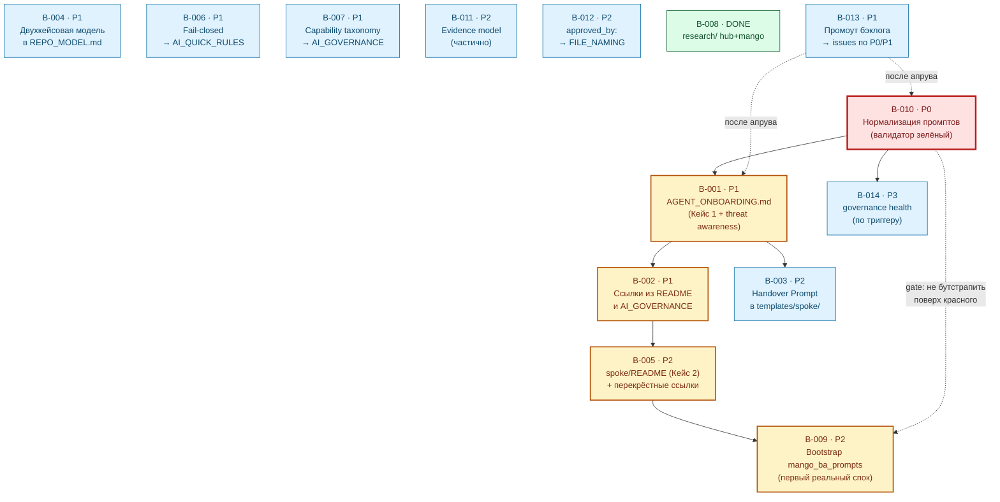

# BACKLOG — единый бэклог работ Хаба

Версия: 0.1

Дата: 2026-06-02

Статус: черновик для согласования (`draft`). Приоритеты, статусы и сам факт
заведения отдельных issues — за человеком (см. раздел
[8. Решение за человеком](#8-решение-за-человеком)).

> В этом документе используются термины из
> [standards/GLOSSARY.md](../standards/GLOSSARY.md): *Operating Mode*, *Policy*,
> *Standard*, *Practice*, *Artifact*, *Canonical*, *Draft*, *Runtime-онбординг
> (Кейс 1)*, *Bootstrap-клонирование (Кейс 2)*, *Handover Prompt*, *Readback*,
> *Среда работы агента*, *Источник контекста*, *North Star*, *Триггер
> внедрения*. Глоссарий — единственный источник истины для терминов; здесь они
> только **используются**.

---

## 1. Введение

### 1.1. Назначение документа

`BACKLOG.md` — это **единая точка входа в запланированные работы Хаба**. Карта
артефактов ([governance/ARTIFACT_MAP.md](ARTIFACT_MAP.md)) отвечает на вопрос
«*что уже есть и как связано*»; бэклог отвечает на ортогональный вопрос «*что
осталось сделать, в каком порядке и почему именно в этом*».

До этого документа задачи были рассыпаны по трём источникам, и ни один из них не
давал целостной картины:

- блоки **Follow-up** в трёх утверждённых RFC
  ([rfc-creative-template-design.md](proposals/rfc-creative-template-design.md),
  [rfc-agent-onboarding-protocol.md](proposals/rfc-agent-onboarding-protocol.md),
  [rfc-two-cases-of-project-initialization.md](proposals/rfc-two-cases-of-project-initialization.md));
- матрица применимости рекомендаций внешних экспертов
  ([research/hub/external-governance-patterns-review-2026-06.md](../research/hub/external-governance-patterns-review-2026-06.md));
- разрозненные задачи из обсуждений (рефакторинг `research/`, первый bootstrap,
  нормализация промптов).

Бэклог **не копирует** эти источники построчно. Он их *синтезирует*: переводит
рекомендации в задачи с единой системой приоритетов, прослеживает зависимости,
выделяет критический путь и явно фиксирует, что уже сделано, а что — нет.

Документ служит двум читателям:

1. **Человеку (Founder & PO)** — как инструмент Human Review: утвердить
   приоритеты, скорректировать порядок, дать команду заводить issues.
2. **Агенту (Конарду)** — как источник для последующего создания отдельных
   issues по маршруту «идея → задача» (но **не в этой задаче**: см.
   [раздел 6](#6-ограничения)).

### 1.2. Принцип приоритизации: «практика первична, документация растёт по факту боли»

Главный фильтр бэклога — тот же, что у матрицы применимости и Anti-Inflation
principle ([governance/REPO_MODEL.md](REPO_MODEL.md)): **артефакт создаётся
только под доказанную операционную боль, а не под красоту целевой архитектуры.**

Из этого принципа выводится шкала приоритетов. Приоритет — это *не* важность
идеи «в вакууме», а ответ на вопрос «*насколько остро эта работа болит
сейчас*»:

| Приоритет | Что означает (операционально) | Правило назначения |
| --- | --- | --- |
| **P0** | Ломает действующий инвариант репозитория **прямо сейчас**. | Назначается, только если что-то уже сломано или блокирует всё остальное. |
| **P1** | Высокая ценность при низкой стоимости: либо «бесплатное» улучшение (одна фраза/поле), либо ключевое звено критического пути онбординга/bootstrap. | Делать в первую очередь после снятия P0. |
| **P2** | Ценно, но стоимость оправдана только по мере удобства или при подходе к соответствующему этапу. | Делать после P1, не блокирует критический путь. |
| **P3** | Отложено до конкретного *Триггера внедрения*. | Не делать, пока триггер не сработал. |

> ⚖️ **Ключевое следствие принципа для этого спринта.** «Практика первична»
> означает, что **уже существующая практика (валидатор структуры) должна
> работать раньше, чем мы добавляем новые governance-правила.** Поэтому
> единственная задача уровня **P0** в бэклоге — это **B-010** (нормализация
> промптов), а не какая-либо «архитектурная» рекомендация команд С или Q. Это
> прямой, проверяемый вывод принципа, который ни одна из внешних команд не
> назвала, потому что он виден только изнутри репозитория (см.
> [раздел 4.3](#43-моя-позиция-конарда-в-чём-я-расхожусь-с-командами-с-и-q)).

### 1.3. Правила обновления бэклога

- **Источник обязателен.** Каждая задача ссылается на свой источник (RFC,
  команда С, команда Q, обсуждение, валидатор). Задача без трассируемого
  источника не добавляется.
- **Статус отражает факт, а не план.** `DONE` ставится только для работ, уже
  выполненных в репозитории (проверяемо через `git`/валидатор), а не «почти
  готово». Это та же дисциплина, что у [ARTIFACT_MAP.md](ARTIFACT_MAP.md):
  карта отражает фактическое состояние.
- **Новая задача — под боль.** Прежде чем добавить строку, ответь: какую
  повторяющуюся путаницу, review pain, ownership gap или невоспроизводимость она
  снижает (Anti-Inflation principle).
- **Без инфляции файлов.** Бэклог — это **один файл**. Идеи новых артефактов
  живут *строками таблицы*, а не новыми пустыми файлами.
- **Пересмотр — по триггеру, а не по календарю.** Условия возврата к бэклогу —
  в [разделе 7](#7-триггеры-для-пересмотра-бэклога).
- **После изменения** — обнови поле `updated` во frontmatter и прогони локальные
  проверки (`./tools/validate-frontmatter.sh .` и
  `./tools/validate-repository-structure.sh`).

---

## 2. Сводная таблица задач

Минимум 10 задач. Колонка «Источник» обеспечивает трассируемость (🔗). Статусы:
`TODO` — не начато; `DONE` — выполнено в репозитории; `ЧАСТИЧНО` — выполнено
частично.

| ID | Название | Приоритет | Зависимости | Статус | Источник | Обоснование приоритета |
| --- | --- | --- | --- | --- | --- | --- |
| **B-010** | Нормализация Mango-промптов до лимита ≤ 1000 символов | **P0** | — | TODO | Обсуждение §5; [validator](../tools/validate-repository-structure.sh) | Валидатор структуры **сейчас красный** из-за 3 промптов — сломан действующий инвариант. |
| **B-001** | Создать `governance/AGENT_ONBOARDING.md` (Кейс 1, вкл. threat awareness) | **P1** | — | TODO | RFC-онбординг; RFC-два-кейса (follow-up #3); Q «взять сейчас» | Краеугольный артефакт *Runtime-онбординга* и старт критического пути; без него правило «новый агент → начни здесь» не имеет адресата. |
| **B-002** | Связать онбординг ссылками из `README.md` Хаба и `AI_GOVERNANCE.md` | **P1** | B-001 | TODO | RFC-два-кейса (follow-up #5); RFC-онбординг | Дёшево и замыкает точку входа: артефакт без ссылок невидим. |
| **B-004** | Зафиксировать двухкейсовую модель инициализации в `governance/REPO_MODEL.md` | **P1** | — | TODO | RFC-два-кейса (follow-up #2) | Закрепляет концептуальный фундамент в каноне; снижает риск повторной терминологической путаницы (ошибка №5 ретроспективы). |
| **B-006** | Fail-closed semantics одной фразой → `templates/spoke/AI_QUICK_RULES.md` | **P1** | — | TODO | Q «взять сейчас»; С [C5]; [EGA] | «Бесплатно» (одна фраза), прямо снижает риск галлюцинаций агента уже сегодня. |
| **B-007** | Простая capability taxonomy (3 корзины) → `templates/spoke/AI_GOVERNANCE.md` | **P1** | — | TODO | Q «взять сейчас»; С [C5]; [GAP] | «Бесплатно» (3 строки прозой), даёт агенту ясные границы без машинерии. |
| **B-003** | Продублировать *Handover Prompt* в `templates/spoke/` | **P2** | B-001 | TODO | RFC-онбординг | Полезно для самодостаточности спока, но не блокирует критический путь. |
| **B-005** | Дополнить `templates/spoke/README.md` (Кейс 2) + перекрёстные ссылки README | **P2** | B-001 | TODO | RFC-два-кейса (follow-up #4, #5) | Завершает «обе точки входа ссылаются друг на друга»; нужен к моменту первого bootstrap. |
| **B-009** | Bootstrap первого спока `mango_ba_prompts` (Кейс 2) | **P2** | B-001, B-002, B-005 | TODO | Обсуждение §5; RFC-шаблон | Первая реальная обкатка модели; стоимость оправдана только после готовности входных точек. |
| **B-011** | Явно назвать Evidence model в RFC-манифесте | **P2** | — | ЧАСТИЧНО | Q «взять сейчас»; С [C5]; [GAP] | Термин уже введён в external-review; осталась консолидация — низкая срочность. |
| **B-012** | Поле `approved_by:` для критичных файлов → `standards/FILE_NAMING.md` | **P2** | — | TODO | Q «взять сейчас»; С [C5]; [EGA] | Делает апрув трассируемым; ценно, но боль появится при росте числа решений. |
| **B-008** | Рефакторинг `research/` (разделение `hub/` и `mango/`) | **P1** | — | DONE | Обсуждение §5 | Выполнено в предыдущих PR; зафиксировано как факт для целостности картины. |
| **B-013** | 💡 Промоут `BACKLOG.md` в `canonical` и завести issues по утверждённым P0/P1 | **P1** | (этот PR) | TODO | Креативное улучшение Конарда | Замыкает маршрут «бэклог → issues»; без него бэклог остаётся планом без исполнения. |
| **B-014** | 💡 Лёгкий «governance health»: регулярный прогон валидаторов + мониторинг триггеров | **P3** | B-010 | TODO | Креативное улучшение Конарда | Ценно, но боль возникнет позже; внедряется по триггеру, не сейчас. |

💡 — креативные задачи, предложенные Конардом и не упомянутые во входном
контексте напрямую (обоснование — в их детальных описаниях).

---

## 3. Детальное описание задач

Задачи описаны в порядке приоритета (P0 → P1 → P2 → P3), а не по номеру ID, —
чтобы порядок чтения совпадал с рекомендуемым порядком выполнения.

### B-010: Нормализация Mango-промптов до лимита ≤ 1000 символов

**Приоритет:** P0
**Источник:** 🔗 Обсуждение §5; правило длины в
[tools/validate-repository-structure.sh](../tools/validate-repository-structure.sh)
(`require_max_body_chars`); контекст — [projects/mango/experiments/prompts-selftest-2026-05-26.md](../projects/mango/experiments/prompts-selftest-2026-05-26.md)
**Зависимости:** —
**Режим работы:** `Structured`

**Контекст:**
Три `_exp`-промпта Mango превышают лимит 1000 символов, и валидатор структуры
**падает прямо сейчас** (`tz-stats-generator_exp` — 1374, `user-story-generator_exp`
— 1296, `usecase-stepwise-generator_exp` — 1312). Это не теоретический долг: это
сломанный действующий инвариант. Пока он красный, любой новый спок,
склонированный из шаблона, наследует культуру «валидатор и так не проходит» —
что подрывает саму практику, на которую опирается принцип «практика первична».

**Что нужно сделать:**
1. Сократить тело каждого из трёх `_exp`-промптов до ≤ 1000 символов, сохранив
   все структурные инструкции и RAG-ссылки (на `research/mango/classification.md`
   и `classification-glossary.md`).
2. При необходимости вынести длинные пояснения в связанный `experiments/`-файл,
   а в промпте оставить ссылку.
3. Прогнать `./tools/validate-repository-structure.sh` — три FAIL должны исчезнуть.

**Ожидаемые артефакты:**
- `projects/mango/prompts/tz-stats-generator_exp-2026-05.md` (изменён)
- `projects/mango/prompts/user-story-generator_exp-2026-05.md` (изменён)
- `projects/mango/prompts/usecase-stepwise-generator_exp-2026-05.md` (изменён)

**Критерии приёмки (DoD):**
- [ ] Каждый из трёх `_exp`-промптов имеет тело ≤ 1000 символов.
- [ ] Все RAG-ссылки и ключевые инструкции сохранены (проверено по диффу).
- [ ] `./tools/validate-repository-structure.sh` проходит без FAIL по длине.

**Обоснование приоритета:**
Единственный P0 в бэклоге. «Практика первична» в самой жёсткой форме: прежде чем
добавлять новые governance-правила, надо починить то, что уже формализовано и
сломано. Это **gate** для всего критического пути: бутстрапить новые споки
(B-009) поверх красного валидатора — значит тиражировать поломку.

**Риски и ограничения:**
Сокращение — это правка *продуктового контента* RAG-промптов; есть риск потерять
смысловую полноту. Поэтому задача требует отдельного review качества промптов и
**сознательно вынесена в отдельный issue/PR**, а не выполнена в задаче создания
бэклога (см. [раздел 6](#6-ограничения) и
[раздел 5](#5-локальная-валидация-и-текущее-состояние-инварианта)).

---

### B-001: Создать `governance/AGENT_ONBOARDING.md` (Кейс 1)

**Приоритет:** P1
**Источник:** 🔗 [rfc-agent-onboarding-protocol.md](proposals/rfc-agent-onboarding-protocol.md);
[rfc-two-cases-of-project-initialization.md](proposals/rfc-two-cases-of-project-initialization.md)
(follow-up #3); команда Q «взять сейчас» (threat awareness)
**Зависимости:** —
**Режим работы:** `Structured`

**Контекст:**
*Runtime-онбординг* (Кейс 1) — это процесс, в котором агент в *Среде работы
агента* (чате) загружает контекст из *Источника контекста* (репо) в оперативную
память. У этого процесса по дизайну должен быть один входной артефакт —
`governance/AGENT_ONBOARDING.md`, — но его пока **нет**. Без него правило «новый
агент → начни здесь» (системный вывод №2 ретроспективы про обязательное
pre-flight чтение) не имеет адресата.

**Что нужно сделать:**
1. Создать `governance/AGENT_ONBOARDING.md` по дизайну онбординг-RFC: 4-шаговый
   алгоритм (governance → контекст → *Readback* → стоп до апрува).
2. Включить *Handover Prompt* с плейсхолдером `{{REPO_NAME}}`.
3. Встроить раздел «Что может пойти не так» (3–5 рисков) — реализация *threat
   awareness* из матрицы команды Q без отдельного файла.
4. Добавить перекрёстную ссылку на `templates/spoke/README.md` (Кейс 2) и на
   RFC-манифест двух кейсов.

**Ожидаемые артефакты:**
- `governance/AGENT_ONBOARDING.md` (новый)
- строка в [ARTIFACT_MAP.md](ARTIFACT_MAP.md) и регистрация в валидаторе

**Критерии приёмки (DoD):**
- [ ] Файл содержит 4-шаговый протокол, *Handover Prompt* с `{{REPO_NAME}}` и
      раздел threat awareness.
- [ ] Все термины — со ссылкой на [GLOSSARY](../standards/GLOSSARY.md).
- [ ] Файл зарегистрирован в `ARTIFACT_MAP.md` и валидаторе; валидатор проходит.

**Обоснование приоритета:**
P1 и старт критического пути. Это не «бесплатное» улучшение, но это
*краеугольный камень* Кейса 1: от него зависят B-002, B-003, и косвенно
готовность к B-009. Threat awareness складывается сюда же — экономим файл
(Anti-Inflation).

**Риски и ограничения:**
Риск дублирования с онбординг-RFC: RFC остаётся *проектом* (`proposals/`), а
`AGENT_ONBOARDING.md` — рабочей инструкцией. Граница должна быть явной, иначе
получим два источника истины.

---

### B-002: Связать онбординг ссылками из `README.md` и `AI_GOVERNANCE.md`

**Приоритет:** P1
**Источник:** 🔗 [rfc-two-cases-of-project-initialization.md](proposals/rfc-two-cases-of-project-initialization.md)
(follow-up #5); онбординг-RFC
**Зависимости:** B-001
**Режим работы:** `Structured`

**Контекст:**
Артефакт без входной ссылки невидим. После создания `AGENT_ONBOARDING.md` нужно
поставить на него указатели из двух очевидных точек входа: визитки репозитория
(`README.md`) и контракта AI-работы (`AI_GOVERNANCE.md`).

**Что нужно сделать:**
1. В `README.md` добавить блок «Новый агент? Начни здесь → `governance/AGENT_ONBOARDING.md`».
2. В `AI_GOVERNANCE.md` сослаться на онбординг как на обязательный pre-flight шаг.

**Ожидаемые артефакты:**
- `README.md` (изменён), `AI_GOVERNANCE.md` (изменён)

**Критерии приёмки (DoD):**
- [ ] Из `README.md` и `AI_GOVERNANCE.md` есть рабочие ссылки на онбординг.
- [ ] Навигационные проверки валидатора (`require_text`) проходят.

**Обоснование приоритета:**
P1 — дёшево и замыкает Кейс 1. Откладывать нет смысла: создать артефакт и не
сослаться на него — значит оставить работу B-001 наполовину.

**Риски и ограничения:**
Минимальные; следить, чтобы не расплодить дублирующиеся описания протокола в
трёх местах — ссылки, а не копии.

---

### B-004: Зафиксировать двухкейсовую модель инициализации в `governance/REPO_MODEL.md`

**Приоритет:** P1
**Источник:** 🔗 [rfc-two-cases-of-project-initialization.md](proposals/rfc-two-cases-of-project-initialization.md)
(follow-up #2)
**Зависимости:** —
**Режим работы:** `Structured`

**Контекст:**
Разделение Кейс 1 / Кейс 2 уже зафиксировано в GLOSSARY и в RFC-манифесте, но
ещё не вошло в каноническое описание модели репозитория. `REPO_MODEL.md` —
правильное место для жизненного цикла spoke; без этого фрагмента модель неполна,
и сохраняется риск повторения терминологической путаницы (ошибка №5
ретроспективы).

**Что нужно сделать:**
1. Добавить в `REPO_MODEL.md` краткий раздел о двух ортогональных кейсах
   инициализации со ссылкой на RFC-манифест и GLOSSARY.
2. Привязать Operating Mode к кейсу (Кейс 1 → `Structured`, Кейс 2 → `Project`).

**Ожидаемые артефакты:**
- `governance/REPO_MODEL.md` (изменён)

**Критерии приёмки (DoD):**
- [ ] В `REPO_MODEL.md` есть раздел о двух кейсах со ссылками на GLOSSARY и
      RFC-манифест.
- [ ] Валидатор проходит.

**Обоснование приоритета:**
P1 — закрепляет концептуальный фундамент в каноне (а не только в `draft`-RFC).
Дёшево и снижает повторяющуюся путаницу.

**Риски и ограничения:**
Не превратить краткий раздел в копию RFC — каноничный документ ссылается на RFC,
а не дублирует его.

---

### B-006: Fail-closed semantics одной фразой → `templates/spoke/AI_QUICK_RULES.md`

**Приоритет:** P1
**Источник:** 🔗 Команда Q «взять сейчас»; команда С [C5]; внешний паттерн [EGA]
(через external-review)
**Зависимости:** —
**Режим работы:** `Structured`

**Контекст:**
«DENY BY DEFAULT»: что явно не разрешено — агент не делает, а запрашивает human
review. Операционно это уже заложено в Шаг 4 онбординга (стоп до апрува); не
хватает одной явной фразы в «инструкции по выживанию» спока.

**Что нужно сделать:**
1. Добавить в `templates/spoke/AI_QUICK_RULES.md` фразу: «Если действие не
   описано в контракте — не выполняй, а запроси human review».

**Ожидаемые артефакты:**
- `templates/spoke/AI_QUICK_RULES.md` (изменён)

**Критерии приёмки (DoD):**
- [ ] В шаблоне присутствует явная формулировка fail-closed.
- [ ] Валидатор проходит.

**Обоснование приоритета:**
P1 — «бесплатно» (одна фраза) и сразу снижает риск галлюцинаций. Классический
кандидат «взять сейчас»: высокая ценность при нулевой стоимости машинерии.

**Риски и ограничения:**
Формулировка не должна превратиться в жёсткое `Policy` с процедурой — это пока
*Practice*-уровень, одна фраза.

---

### B-007: Простая capability taxonomy (3 корзины) → `templates/spoke/AI_GOVERNANCE.md`

**Приоритет:** P1
**Источник:** 🔗 Команда Q «взять сейчас»; команда С [C5]; внешний паттерн [GAP]
(через external-review)
**Зависимости:** —
**Режим работы:** `Structured`

**Контекст:**
Агенту нужны ясные границы. Команда С предлагала формальный Capability Manifest
(YAML); команда Q справедливо упростила это до «ментального списка трёх корзин».
Я (Конард) иду дальше: это должны быть **3 строки прозой**, а не отдельный
раздел-машинерия (см. [раздел 4.3](#43-моя-позиция-конарда-в-чём-я-расхожусь-с-командами-с-и-q)).

**Что нужно сделать:**
1. Добавить в `templates/spoke/AI_GOVERNANCE.md` три строки: «можно без спроса /
   можно с апрувом / нельзя никогда» с 1–2 примерами на корзину.

**Ожидаемые артефакты:**
- `templates/spoke/AI_GOVERNANCE.md` (изменён)

**Критерии приёмки (DoD):**
- [ ] В шаблоне есть три корзины разрешений в прозе.
- [ ] Нет YAML-машинерии (соответствие решению «отложить» для манифеста).
- [ ] Валидатор проходит.

**Обоснование приоритета:**
P1 — «бесплатно» и снижает неопределённость границ. Стоимость близка к нулю,
ценность — высокая.

**Риски и ограничения:**
Соблазн сразу сделать YAML-манифест — это `ОТЛОЖИТЬ` до первого инцидента (см.
матрицу, [раздел 4.2](#42-моя-собственная-матрица-применимости)).

---

### B-003: Продублировать *Handover Prompt* в `templates/spoke/`

**Приоритет:** P2
**Источник:** 🔗 [rfc-agent-onboarding-protocol.md](proposals/rfc-agent-onboarding-protocol.md)
**Зависимости:** B-001
**Режим работы:** `Structured`

**Контекст:**
Чтобы новый спок был самодостаточен, *Handover Prompt* (с `{{REPO_NAME}}`)
должен лежать и в геноме шаблона, а не только в Хабе. Тогда у склонированного
репо сразу есть «доверенность» для запуска агента.

**Что нужно сделать:**
1. Поместить параметризованный *Handover Prompt* в подходящий файл
   `templates/spoke/` (вероятно, рядом с `AI_QUICK_RULES.md`).
2. Связать его ссылкой с хабовым `AGENT_ONBOARDING.md`.

**Ожидаемые артефакты:**
- файл(ы) в `templates/spoke/` (изменены/дополнены)

**Критерии приёмки (DoD):**
- [ ] В геноме спока есть *Handover Prompt* с `{{REPO_NAME}}`.
- [ ] Валидатор спока и Хаба проходят.

**Обоснование приоритета:**
P2 — полезно для UX bootstrap, но не блокирует критический путь и осмысленно
только после B-001.

**Риски и ограничения:**
Два места хранения промпта → риск рассинхронизации. Зафиксировать Хаб как
источник истины, спок — как копию шаблона.

---

### B-005: Дополнить `templates/spoke/README.md` (Кейс 2) + перекрёстные ссылки

**Приоритет:** P2
**Источник:** 🔗 [rfc-two-cases-of-project-initialization.md](proposals/rfc-two-cases-of-project-initialization.md)
(follow-up #4, #5)
**Зависимости:** B-001
**Режим работы:** `Project`

**Контекст:**
RFC-манифест требует, чтобы **обе** точки входа (Кейс 1 и Кейс 2) ссылались друг
на друга. `templates/spoke/README.md` существует как шаблон, но раздел про
адаптацию/валидацию и перекрёстная ссылка на онбординг (Кейс 1) нужны для
полноты.

**Что нужно сделать:**
1. Дополнить `templates/spoke/README.md` разделом «как адаптировать
   `{{...}}`-плейсхолдеры и валидировать структуру».
2. Добавить перекрёстные ссылки: спок-README → `AGENT_ONBOARDING.md` и наоборот.

**Ожидаемые артефакты:**
- `templates/spoke/README.md` (изменён); ссылки в `AGENT_ONBOARDING.md`

**Критерии приёмки (DoD):**
- [ ] Обе точки входа ссылаются друг на друга.
- [ ] Раздел про адаптацию/валидацию присутствует.

**Обоснование приоритета:**
P2 — нужно к моменту первого реального bootstrap (B-009), но до этого момента
боли нет.

**Риски и ограничения:**
Зависит от B-001 (онбординг должен существовать, чтобы на него ссылаться).

---

### B-009: Bootstrap первого спока `mango_ba_prompts` (Кейс 2)

**Приоритет:** P2
**Источник:** 🔗 Обсуждение §5; [rfc-creative-template-design.md](proposals/rfc-creative-template-design.md)
**Зависимости:** B-001, B-002, B-005
**Режим работы:** `Project`

**Контекст:**
Геном `templates/spoke/` создан, но ни один спок ещё не клонирован — *Bootstrap-
клонирование* не проверено на реальном проекте. `mango_ba_prompts` — естественный
первый кандидат: под него уже есть исследования и промпты в Хабе.

**Что нужно сделать:**
1. Создать репозиторий `mango_ba_prompts` из `templates/spoke/` (через `init.sh`).
2. Заменить плейсхолдеры, адаптировать контракт, прогнать валидатор спока.
3. Зафиксировать опыт (что в шаблоне сработало/не сработало) — вход для будущего
   улучшения шаблона.

**Ожидаемые артефакты:**
- новый репозиторий `mango_ba_prompts` (вне Хаба)
- заметка об опыте bootstrap (в `research/hub/` или `projects/`, по факту боли)

**Критерии приёмки (DoD):**
- [ ] Спок создан, плейсхолдеры заменены, валидатор спока зелёный.
- [ ] Зафиксированы выводы для улучшения генома.

**Обоснование приоритета:**
P2 — высокая стратегическая ценность (первая реальная обкатка модели), но
стоимость оправдана только после готовности входных точек (B-001/B-002/B-005) и
**после** восстановления зелёного валидатора (B-010) — иначе спок унаследует
красную практику.

**Риски и ограничения:**
Создание внешнего репозитория — действие за пределами Хаба; требует явного
решения человека. До B-010 не запускать.

---

### B-011: Явно назвать Evidence model в RFC-манифесте

**Приоритет:** P2
**Источник:** 🔗 Команда Q «взять сейчас»; команда С [C5]; [GAP]
**Зависимости:** —
**Статус:** ЧАСТИЧНО
**Режим работы:** `Research`

**Контекст:**
Тезис «git history + issues + PRs = evidence trail» уже **введён** в
[external-governance-patterns-review-2026-06.md](../research/hub/external-governance-patterns-review-2026-06.md)
(раздел 2). Осталась консолидация: команда Q указывала целевым местом
RFC-манифест двух кейсов, где термин логично закрепить рядом с моделью
жизненного цикла.

**Что нужно сделать:**
1. Добавить в RFC-манифест абзац, явно называющий evidence trail и ссылающийся
   на external-review.

**Ожидаемые артефакты:**
- `governance/proposals/rfc-two-cases-of-project-initialization.md` (изменён)

**Критерии приёмки (DoD):**
- [ ] Evidence trail явно назван и связан ссылкой с external-review.

**Обоснование приоритета:**
P2 — функция уже существует и частично описана; это «бухгалтерия», а не новая
способность. Низкая срочность.

**Риски и ограничения:**
Не вводить новый формат/обёртку — только *назвать* существующее (JSON-обёртка
Governance Metadata Envelope находится в «отклонить», см. матрицу).

---

### B-012: Поле `approved_by:` для критичных файлов → `standards/FILE_NAMING.md`

**Приоритет:** P2
**Источник:** 🔗 Команда Q «взять сейчас»; команда С [C5]; [EGA]
**Зависимости:** —
**Режим работы:** `Structured`

**Контекст:**
Approval semantics в простом виде: явный след апрува во frontmatter критичных
файлов (`approved_by:`). Делает апрув трассируемым, а не устным.

**Что нужно сделать:**
1. Описать в `standards/FILE_NAMING.md` опциональное поле `approved_by:` для
   критичных артефактов и правило его заполнения.

**Ожидаемые артефакты:**
- `standards/FILE_NAMING.md` (изменён)

**Критерии приёмки (DoD):**
- [ ] Поле `approved_by:` описано как опциональное для критичных файлов.
- [ ] Согласовано с soft-проверкой [validate-frontmatter.sh](../tools/validate-frontmatter.sh).

**Обоснование приоритета:**
P2 — ценно, но острая боль появляется при росте числа решений/участников
(см. триггеры). Сейчас один владелец — апрув виден в git author + PR.

**Риски и ограничения:**
Не делать поле обязательным глобально — это спровоцировало бы инфляцию
метаданных на всех файлах.

---

### B-008: Рефакторинг `research/` (разделение `hub/` и `mango/`)

**Приоритет:** P1 (исторический)
**Источник:** 🔗 Обсуждение §5
**Зависимости:** —
**Статус:** **DONE**
**Режим работы:** `Structured`

**Контекст:**
В `research/` смешивались исследования Хаба и Mango. Решение — `research/hub/` и
`research/mango/` с запретом файлов в корне `research/`.

**Что было сделано:**
1. Созданы `research/hub/` и `research/mango/` с индексами.
2. Валидатор структуры теперь требует размещения файлов только в подкаталогах
   (корень `research/` содержит лишь `README.md`).

**Ожидаемые артефакты:**
- `research/hub/`, `research/mango/` (созданы); правило в валидаторе (активно)

**Критерии приёмки (DoD):**
- [x] `research/hub/` и `research/mango/` существуют и проиндексированы.
- [x] Файлы в корне `research/` запрещены валидатором.

**Обоснование приоритета:**
Был P1 (разделяет scope `repo-wide` и `mango-only`). Зафиксирован как `DONE` для
целостности картины бэклога — бэклог отражает факт, а не только планы.

**Риски и ограничения:**
Закрыто; дальнейших действий не требует.

---

### B-013: 💡 Промоут `BACKLOG.md` в `canonical` и завести issues по P0/P1

**Приоритет:** P1
**Источник:** 🔗 Креативное улучшение Конарда (маршрут «идея → задача» из
онбординг-RFC)
**Зависимости:** этот PR (создание бэклога)
**Режим работы:** `Structured`

**Контекст:**
Бэклог без исполнения — это план на полке. После Human Review нужно (1) перевести
`BACKLOG.md` из `draft` в `canonical` и (2) завести отдельные issues по
утверждённым задачам P0/P1 — именно то, что эта задача **запрещает делать сейчас**
(см. [раздел 6](#6-ограничения)). Эта строка фиксирует, что маршрут существует и
его надо пройти явным шагом.

**Что нужно сделать:**
1. После апрува сменить `status: draft → canonical`, обновить `version`.
2. Завести issues по B-010 (P0), затем по P1-задачам, со ссылкой на строку
   бэклога как источник.

**Ожидаемые артефакты:**
- `governance/BACKLOG.md` (статус обновлён); набор issues

**Критерии приёмки (DoD):**
- [ ] Бэклог `canonical` после апрува человека.
- [ ] По каждой утверждённой P0/P1-задаче заведён issue со ссылкой на бэклог.

**Обоснование приоритета:**
P1 — замыкает петлю «бэклог → работа». Без него весь этот документ не имеет
исполнительной силы.

**Риски и ограничения:**
Не заводить issues до апрува (нарушит ограничение текущей задачи и Anti-Inflation
для issue-трекера).

---

### B-014: 💡 Лёгкий «governance health»: регулярный прогон валидаторов + мониторинг триггеров

**Приоритет:** P3
**Источник:** 🔗 Креативное улучшение Конарда
**Зависимости:** B-010
**Режим работы:** `Structured`

**Контекст:**
Сейчас валидаторы запускаются вручную, а *Триггеры внедрения* отслеживаются «на
глаз». При росте репозитория появится боль: регрессии (как красный валидатор в
B-010) обнаруживаются поздно. Лёгкая практика «health-прогон» (например, заметка
о периодическом запуске обоих валидаторов и сверке триггеров раздела 7) снизит
эту боль — **когда** она появится.

**Что нужно сделать:**
1. Зафиксировать практику регулярного прогона `validate-frontmatter.sh` и
   `validate-repository-structure.sh` (в `CONTRIBUTING.md` как чек-лист).
2. Привязать сверку с триггерами бэклога к тем же прогонам.

**Ожидаемые артефакты:**
- `CONTRIBUTING.md` (изменён) — без новых файлов

**Критерии приёмки (DoD):**
- [ ] Описана практика health-прогона и сверки триггеров.

**Обоснование приоритета:**
P3 — отложено до *Триггера внедрения*: «первая регрессия, не пойманная при
ревью» или «появление CI». Сейчас один контрибьютор прогоняет проверки вручную —
острой боли нет.

**Риски и ограничения:**
Не вводить тяжёлый CI/автоматизацию преждевременно (это `ОТЛОЖИТЬ` до появления
команды/CI-боли).

---

## 4. Анализ рекомендаций команд С и Q

### 4.1. Сравнение позиций

| Аспект | Команда С (внешний review) | Команда Q (внутренний фильтр) |
| --- | --- | --- |
| **Роль** | Описывает **целевое состояние** production-grade agent infrastructure через emerging patterns ([GAP]/[EGA]/[AID]). | Фильтрует рекомендации С через принцип «практика первична, документация растёт по факту боли». |
| **Оптика** | «Что *идеально* для auditable agent ecosystems». | «Что *окупается сейчас* при одном пользователе и нуле реальных споков». |
| **Главный вклад** | Назвала 6 архитектурных gaps и стратегический вывод (early governance substrate). | Перевела gaps в матрицу «взять сейчас / отложить / отклонить» с привязкой к артефактам и триггерам. |
| **Риск позиции** | Внедрить всё сразу → «смерть под весом governance-машины». | Недовнедрить → пропустить дешёвое, но ценное (Q это учитывает через «взять сейчас»). |

Команды **не противоречат** друг другу — они на разных уровнях. С отвечает на
вопрос «*куда*», Q — «*с какой скоростью и что первым*». Конфликт возник бы,
только если бы кто-то попытался выполнить PRIORITY 1–4 команды С (Formal State
Machine, YAML Capability Manifest, Signed Artifacts, JSON Envelope) **немедленно** —
а это ровно то, что Q корректно отправила в «отложить/отклонить».

### 4.2. Моя собственная матрица применимости

Я (Конард) **полностью принимаю** трёхкорзинную матрицу команды Q как
методологию и фактически наследую её распределение. Моя добавленная ценность —
не переспорить матрицу, а **операционализировать** её: превратить колонку Q «куда
встроить» в конкретные, приоритизированные, связанные зависимостями задачи
бэклога. Ниже — матрица с этой привязкой.

**ВЗЯТЬ СЕЙЧАС** (приняты, переведены в задачи):

| Идея (источник) | Решение | Задача бэклога |
| --- | --- | --- |
| Fail-closed semantics (Q, [C5], [EGA]) | ✅ Принять — одна фраза | **B-006** |
| Capability taxonomy простая (Q, [C5], [GAP]) | ✅ Принять — 3 строки прозой (упрощаю сильнее Q) | **B-007** |
| Threat awareness (Q, [C5]) | ✅ Принять — **без отдельного файла**, как раздел в B-001 | **B-001** |
| Evidence model — назвать (Q, [C5], [GAP]) | ✅ Принять — уже частично сделано в external-review | **B-011** |
| Approval semantics `approved_by:` (Q, [C5], [EGA]) | ✅ Принять — опциональное поле | **B-012** |

**ОТЛОЖИТЬ** (приняты как отложенные, привязаны к *Триггеру внедрения*):

| Идея (источник) | Триггер внедрения | Где зафиксировано |
| --- | --- | --- |
| Formal state machine (С PRIORITY 1, [EGA]) | 3+ агента одновременно → коллизии | [раздел 7](#7-триггеры-для-пересмотра-бэклога) |
| Capability Manifest YAML (С PRIORITY 2, [GAP]) | первый инцидент «агент сделал лишнее» | раздел 7 |
| Signed onboarding artifacts (С PRIORITY 3, [AID]) | первое требование compliance | раздел 7 |
| Delegation chain ([GAP]) | реальная multi-agent оркестрация | раздел 7 |
| Approval TTL / replay policy ([EGA], [AID]) | первый replay-инцидент | раздел 7 |
| OpenTelemetry traces ([GAP]) | первый серьёзный failure | раздел 7 |

**ОТКЛОНИТЬ / упростить** (согласен с Q):

| Идея (источник) | Почему не сейчас |
| --- | --- |
| Cryptographic agent identity (С, [AID]) | один пользователь/агент, локальные репо → identity = git author + апрув. |
| Governance Metadata Envelope JSON (С PRIORITY 4, [GAP]/[EGA]) | human-to-agent: markdown + git достаточно, у JSON нет потребителя. |
| Hash-chained events ([GAP]) | git уже даёт immutable history — дублирование. |
| Multi-party approval ([EGA]) | единственный владелец — кворум не нужен. |

### 4.3. Моя позиция (Конарда): в чём я расхожусь с командами С и Q

Я согласен с обеими по существу, но добавляю **четыре уточнения**, которые видны
только изнутри текущего состояния репозитория:

1. **Самый острый приоритет — не из внешних рекомендаций, а из факта поломки.**
   Ни С, ни Q не назвали `B-010`, потому что красный валидатор — это
   операционная реальность Хаба, а не emerging pattern. «Практика первична»
   буквально означает: сначала почини существующую практику (валидатор), потом
   добавляй новые правила. Поэтому **B-010 — единственный P0**, выше любой
   архитектурной идеи С.

2. **Threat awareness — без отдельного файла.** Q указала целью
   `governance/AGENT_ONBOARDING.md`. Я не создаю отдельный артефакт под threat
   awareness, а складываю его *разделом* в B-001 — иначе нарушим Anti-Inflation
   (новый файл без отдельной боли).

3. **Capability taxonomy — упрощаю сильнее Q.** Q предложила «ментальный список
   трёх корзин». Я фиксирую жёстче: это **3 строки прозой внутри существующего
   шаблона**, без отдельного раздела-машинерии. Любая попытка превратить это в
   структуру — сигнал, что мы скатываемся к YAML-манифесту, который сам же
   отложили.

4. **Evidence model — уже почти сделано.** Q держит его в «взять сейчас», но
   фактически термин уже введён в external-review. Поэтому я понижаю срочность до
   P2 (B-011): осталась консолидация, а не новая работа.

### 4.4. North Star проекта

> **North Star** (см. [GLOSSARY](../standards/GLOSSARY.md)): проект движется в
> сторону **governance-grade provenance-aware hybrid intelligence
> infrastructure** — не «очередного AI-agent framework», а *early governance
> substrate for auditable agent ecosystems*.

Обоснование (трассируется к выводу `[C6]` команды С и к
[external-review](../research/hub/external-governance-patterns-review-2026-06.md),
раздел 4): рынок orchestration переполнён, а ниша governance / provenance /
trust lifecycle / auditability только формируется. Актив раннего входа у Хаба уже
есть: git-native governance, зачаток trust lifecycle и фокус на anti-drift.

**North Star задаёт направление, бэклог задаёт темп.** Двигаться к нему нужно по
факту боли (приоритеты раздела 2), а не по факту красоты целевой архитектуры. В
этом смысле сам порядок бэклога — P0 (починить практику) перед P1 (дешёвые
governance-улучшения) перед P2/P3 — и есть операционализация North Star.

---

## 5. Локальная валидация и текущее состояние инварианта

Этот раздел честно фиксирует фактическое состояние проверки на момент создания
бэклога — чтобы Human Review опирался на реальность, а не на оптимистичное
«всё зелёно».

**Что сделано в этом PR для валидатора:**

- `governance/BACKLOG.md` зарегистрирован в
  [tools/validate-repository-structure.sh](../tools/validate-repository-structure.sh)
  (`is_active_file` и `required_files`) и в [ARTIFACT_MAP.md](ARTIFACT_MAP.md).
- Удалён сгенерированный харнессом файл `/.gitkeep` (его нет в `main`; валидатор
  справедливо помечал его как `tracked legacy file`). Это снимает один FAIL, не
  внося новых.

**Что осталось красным и почему это вне scope этой задачи:**

Валидатор продолжает сообщать о **3 предсуществующих** ошибках — это ровно
задача **B-010**:

```
FAIL: projects/mango/prompts/tz-stats-generator_exp-2026-05.md body is 1374 chars, expected <= 1000
FAIL: projects/mango/prompts/user-story-generator_exp-2026-05.md body is 1296 chars, expected <= 1000
FAIL: projects/mango/prompts/usecase-stepwise-generator_exp-2026-05.md body is 1312 chars, expected <= 1000
```

Эти три FAIL присутствуют **и на ветке `main`** (проверено), то есть появились до
данной задачи. Issue #103 явно выделяет их в **отдельную задачу B-010** с
решением «сократить промпты до лимита» и явно ограничивает текущую работу:
«Только файл `BACKLOG.md`… Создание отдельных issues — после утверждения
бэклога». Сокращение `_exp`-промптов — это правка продуктового RAG-контента,
которая требует отдельного review качества промптов.

**Поэтому в этой задаче промпты сознательно не правятся.** DoD-критерий «exit
code 0» достижим только после выполнения B-010 — и именно поэтому B-010
приоритизирован как **P0** (единственный) и помещён в начало критического пути.
Сам факт того, что бэклог *вскрыл* красное состояние валидатора, — это
запланированный результат креативного анализа, а не его провал: бэклог отражает
реальность, а не маскирует её (Anti-Inflation, дисциплина «статус = факт»).

> 📌 **Рекомендация человеку:** выполнить B-010 ближайшим issue/PR (после или
> параллельно с апрувом этого бэклога) — это вернёт валидатор в зелёное
> состояние и снимет единственный P0.

---

## 6. Ограничения

- **Бэклог — один файл.** В рамках этой задачи не создаётся ни одного нового
  артефакта, кроме `governance/BACKLOG.md` (Anti-Inflation principle,
  [REPO_MODEL.md](REPO_MODEL.md)). Все будущие артефакты живут *строками
  таблицы*.
- **Issues не заводятся.** Отдельные issues по задачам бэклога создаются **после**
  утверждения бэклога человеком (это сама задача B-013), а не в этом PR.
- **Промпты Mango не правятся** (B-010 — отдельная задача; см.
  [раздел 5](#5-локальная-валидация-и-текущее-состояние-инварианта)).
- **Внешние источники** `[GAP]`, `[EGA]`, `[AID]` не верифицированы независимо;
  используются как контекст рекомендаций команды С (граница анализа повторяет
  external-review).
- **Статусы отражают факт на 2026-06-02.** Пересмотр — по триггерам раздела 7.

---

## 7. Триггеры для пересмотра бэклога

Условия, при наступлении любого из которых нужно вернуться к бэклогу и
пересмотреть приоритеты и распределение «взять/отложить/отклонить» (см. термин
*Триггер внедрения* в [GLOSSARY](../standards/GLOSSARY.md)). Триггеры
**событийные**, а не календарные.

- [ ] **Утверждён новый RFC** → перенести его follow-up в бэклог отдельными
      строками с источником.
- [ ] **Валидатор стал красным** (новая регрессия структуры/длины) → завести
      P0-задачу, как сделано для B-010.
- [ ] **3+ активных spoke-проекта** одновременно → пересмотреть Formal state
      machine (из «отложить»).
- [ ] **Команда > 2 человек** → пересмотреть Approval semantics, multi-party
      approval, поле `approved_by:` (B-012 может стать P1).
- [ ] **Первый инцидент безопасности** (агент выполнил несанкционированное
      действие) → Capability Manifest (YAML), fail-closed как жёсткое `Policy`.
- [ ] **Первое требование compliance** от внешнего партнёра → Signed onboarding
      artifacts, agent identity.
- [ ] **Появилась multi-agent оркестрация** → Delegation chain, OpenTelemetry
      traces.
- [ ] **Первый replay-инцидент** → Approval TTL / replay policy.
- [ ] **Появился CI** или первая непойманная при ревью регрессия → поднять
      приоритет B-014 (governance health).

При срабатывании триггера: создаётся issue со ссылкой на конкретную строку
бэклога и на источник идеи (маршрут «идея → задача»).

---

## 8. Решение за человеком

Этот документ — предложение, а не финальное решение
([AI_GOVERNANCE.md](../AI_GOVERNANCE.md): humans принимают финальные решения по
governance). Прошу:

1. **Утвердить приоритизацию** (P0–P3) и распределение задач раздела 2 или
   скорректировать строки.
2. **Подтвердить, что B-010 — единственный P0** и должен выполняться ближайшим
   issue/PR, чтобы вернуть валидатор в зелёное состояние (раздел 5).
3. **Утвердить North Star** (раздел 4.4) как рабочее стратегическое направление.
4. **Согласовать триггеры** раздела 7 как условия возврата к бэклогу.
5. **Дать команду на B-013** — перевод бэклога в `canonical` и заведение issues
   по утверждённым P0/P1.

> **Что я НЕ делаю без твоего слова:** не правлю промпты Mango (B-010), не завожу
> отдельные issues по задачам бэклога, не создаю файлы будущих артефактов
> (`AGENT_ONBOARDING.md` и т.д.). Этот PR добавляет только `BACKLOG.md`, строку в
> `ARTIFACT_MAP.md` и регистрацию в валидаторе.

---

## 9. Связь с другими артефактами

| Артефакт | Роль в контексте бэклога |
| --- | --- |
| [governance/ARTIFACT_MAP.md](ARTIFACT_MAP.md) | Карта «что есть»; бэклог — её ортогональная пара «что осталось». |
| [governance/REPO_MODEL.md](REPO_MODEL.md) | Anti-Inflation principle — фундамент шкалы приоритетов. |
| [governance/proposals/rfc-agent-onboarding-protocol.md](proposals/rfc-agent-onboarding-protocol.md) | Источник задач B-001, B-002, B-003 (Кейс 1). |
| [governance/proposals/rfc-creative-template-design.md](proposals/rfc-creative-template-design.md) | Источник задачи B-009 (Кейс 2, геном шаблона). |
| [governance/proposals/rfc-two-cases-of-project-initialization.md](proposals/rfc-two-cases-of-project-initialization.md) | Источник задач B-004, B-005, B-011. |
| [research/hub/external-governance-patterns-review-2026-06.md](../research/hub/external-governance-patterns-review-2026-06.md) | Источник матрицы С/Q, North Star и триггеров (B-006, B-007, B-011, B-012). |
| [research/hub/ai-collaboration-retrospective-2026-06.md](../research/hub/ai-collaboration-retrospective-2026-06.md) | Системные ошибки, мотивирующие fail-closed, threat awareness и двухкейсовую модель. |
| [standards/GLOSSARY.md](../standards/GLOSSARY.md) | Единый источник терминов для всего бэклога. |

---

## 10. Зависимости и критический путь

Диаграмма зависимостей задач. **Критический путь** (красный) ведёт от
восстановления инварианта к первому реальному споку: `B-010 → B-001 → B-002 →
B-005 → B-009`. «Бесплатные» P1-улучшения (B-006, B-007, B-012) и B-004 идут
параллельно и не лежат на критическом пути.



Чтение диаграммы: красный узел (B-010) — единственный P0 и ворота критического
пути; жёлтые узлы — критический путь к первому реальному споку; голубые —
параллельные задачи (в том числе «бесплатные» P1); зелёный — уже выполненная
B-008. Пунктирные стрелки — мягкие зависимости (порядок/апрув), сплошные —
жёсткие.
