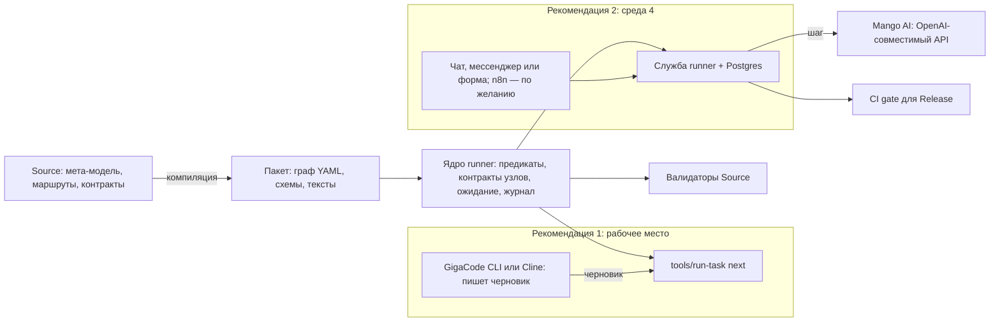

# Мета-модель → среды → инструменты: как эффективнее запускать BA-процесс

Этот документ расширяет аудит
[issue #639](https://github.com/G-Ivan-A/hybrid-Intelligence-lab/issues/639)
по [замечанию владельца](https://github.com/G-Ivan-A/hybrid-Intelligence-lab/pull/643#issuecomment-5884160620):
Cline в задаче был примером, а не границей. Граница исследования — Source
мета-модель и архитектура, на которой её разворачивают и эксплуатируют для
автоматизации БА-процессов. Путь разбора: мета-модель → среды (агент,
клиент, модель, человек) → инструменты автоматизации и запуска.
Первая часть аудита — разбор пакета Cline, гипотезы Г-01…Г-25 — остаётся в
силе как разбор одной среды:
[«Разрыв ожиданий и реализации: пакет Cline VS Code»](https://github.com/G-Ivan-A/hybrid-Intelligence-lab/blob/main/projects/ba-ai-process/docs/analysis/2026-09-29-cline-package-expectation-gap.md).
Здесь гипотезы продолжают нумерацию с Г-26.

## Вердикт

**Главный разрыв лежит не в Cline и не в модели, а в мета-модели: у роли
«оркестратор» нет исполнителя.** Мета-модель поручает оркестратору читать
граф маршрута и записывать лист прогона, но среди одиннадцати сущностей
его нет, а `Actor` — это агент или человек ([Г-26](#г-26)). Поэтому в
каждой среде эту роль молча взял на себя кто-то другой: в GigaCode CLI —
руки БА, который набирает каждую команду перехода; в Cline — модель, которая
читает текст правил. Отсюда остальные разрывы: условия ветвления из YAML
не исполняются ([Г-28](#г-28)), проверка шага проверяет пакет, а не
результат шага ([Г-29](#г-29)), прогон нельзя продолжить после ожидания
заказчика ([Г-31](#г-31)), а одна опечатка в команде навсегда блокирует
задачу ([Г-32](#г-32)).

**Рекомендации — два решения на одном ядре.**

1. **Рабочее место БА (среды 1 и 2).** Превратить `tools/run-task` из
   привратника в ведущего: runner сам читает граф и условия из Source,
   проверяет выход каждого узла, умеет ждать и продолжать, а на вопрос
   «что дальше» отвечает человеческим языком. GigaCode CLI и Cline остаются
   тем, чем они сильны, — местом, где модель пишет черновик. Решение не
   требует новой инфраструктуры и переиспользует Source, компилятор,
   валидаторы и тесты ([Рекомендация 1](#рекомендация-1-рабочее-место-ба)).
2. **Серверная среда 4.** То же ядро runner как служба: состояние и журнал
   в Postgres, вызов корпоративной модели на каждом шаге, согласование
   человека через чат или форму, ожидание ответа заказчика днями. Движок —
   собственный конечный автомат; библиотека LangGraph (MIT) — когда
   понадобятся параллельные ветви. Интерфейс для БА — тонкий клиент к API
   runner ([Рекомендация 2](#рекомендация-2-серверная-среда-4)).

**Гипотеза про n8n подтверждена частично** ([Г-44](#г-44)). n8n хорош как
оболочка: формы, паузы на дни, уведомления, Jira, вызов модели через
OpenAI-совместимый адрес. Как ядро маршрута он хуже собственного runner:
граф пришлось бы перерисовать в n8n и держать вторым источником истины
рядом с Source; узел AI Agent сам решает, какой инструмент вызвать, — та
же недетерминированность, что в Cline; а поток критических уязвимостей
2026 года требует закрытого контура и дисциплины обновлений. В
рекомендации 2 n8n допустим как слой интеграций поверх API runner, но не
вместо него.

## Контекст и охват

- **Что разбирается.** Мета-модель
  [`ba-meta-model/`](https://github.com/G-Ivan-A/hybrid-Intelligence-lab/tree/main/projects/ba-ai-process/ba-meta-model)
  как источник обязательств исполнения; два скомпилированных пакета —
  [GigaCode CLI](https://github.com/G-Ivan-A/hybrid-Intelligence-lab/tree/main/projects/ba-ai-process/dist/execution-package-gigacode-cli)
  и
  [Cline VS Code](https://github.com/G-Ivan-A/hybrid-Intelligence-lab/tree/main/projects/ba-ai-process/dist/execution-package-cline-vscode);
  среды 1–4 из
  [issue #615](https://github.com/G-Ivan-A/hybrid-Intelligence-lab/issues/615)
  и [ADR-019](https://github.com/G-Ivan-A/hybrid-Intelligence-lab/blob/main/projects/ba-ai-process/docs/adr/2026-09-adr-019-cline-mango-ai-pilot.md#L92-L96);
  внешние инструменты запуска: n8n, LangGraph, Temporal, Dify, Flowise,
  Windmill, Kestra, Prefect, Camunda, Operaton, чат-интерфейсы и клиенты
  на рабочем месте.
- **Что не разбирается.** Содержательная правильность требований,
  которые выдаёт процесс, и корпоративная инфраструктура Mango: сеть,
  права, доступ к Jira и Confluence. Живой прототип на n8n или LangGraph
  не собирался; выводы о них опираются на документацию и исходный код.
- **Для кого.** Для фаундера, который ставит задачи мультиагентной системе
  на продуктовом уровне. Поэтому в конце есть учебный раздел: как
  спрашивать про исполнителя, гейт и источник истины, прежде чем выбирать
  инструмент.

## Метод

1. **Три слоя.** Каждая гипотеза относится к одному слою: мета-модель
   (группа [Е](#е-слой-1-мета-модель-и-её-обязательства-исполнения)),
   среды (группа [Ж](#ж-слой-2-среды-агент-клиент-модель-человек)),
   инструменты (группа [З](#з-слой-3-инструменты-автоматизации-и-запуска)).
2. **Доказательства.** Строки кода и документов в `main`; пробы runner
   GigaCode `P10`…`P12` в
   [`experiments/issue_639_runner_probes.py`](https://github.com/G-Ivan-A/hybrid-Intelligence-lab/blob/main/projects/ba-ai-process/experiments/issue_639_runner_probes.py)
   с [журналом](https://github.com/G-Ivan-A/hybrid-Intelligence-lab/blob/main/projects/ba-ai-process/experiments/issue_639_runner_probes.log);
   внешние первоисточники — документация, лицензии и исходный код
   инструментов, прочитанные 2026-09-29. Вторичные источники помечены.
3. **Статусы.** «Подтверждено» и «Опровергнуто» — как в первой части.
   «Частично» — утверждение верно при условии, которое названо в
   доказательстве. «Не проверено» — первоисточника нет, указано, как
   проверить.
4. **Уверенность и тип рекомендации** — как в первой части: высокая,
   средняя, низкая; ограничение, исправить, ментальная модель. Для слоя 3
   добавлен тип **выбор** — решение человека между вариантами.
5. **Критерий успеха варианта.** Вариант годится как ядро, если исполняет
   обязательства мета-модели (граф с предикатами `EP-R3`/`EP-R5`, запись
   решений `EP-R6`, корректирующая попытка `EP-R7`, возобновление `EP-R8`,
   журнал `EP-R9`, G-human) кодом вне модели, берёт граф из Source без
   ручной перерисовки и работает в ограничениях своей среды.
6. **Порог опровержения варианта.** Вариант отвергается как ядро, если
   выполнено хотя бы одно: маршрут нужно перерисовать вручную и держать
   вторым источником истины; порядок шагов решает модель; нет доступа к
   корпоративной модели в целевой среде; лицензия запрещает внутреннее
   использование или требует платной версии для обязательной функции.

## Слой 1. Мета-модель: что она требует от среды исполнения

Мета-модель описывает не только сущности, но и обязательства исполнения:
как проходить граф, что записывать, когда останавливаться. Эти
обязательства — техническое задание для среды. Таблица сверяет их с тем,
что есть в пакетах.

| Обязательство | Где в мета-модели | Среда 1: пакет GigaCode | Среда 2: пакет Cline | Кто должен исполнять |
|---------------|-------------------|--------------------------|----------------------|----------------------|
| Читать граф маршрута при запуске, писать лист прогона | [`30-decision-framework.md` L49, L154](https://github.com/G-Ivan-A/hybrid-Intelligence-lab/blob/main/projects/ba-ai-process/ba-meta-model/30-decision-framework.md#L49) — «оркестратор» | Runner читает граф, но переход выбирает и набирает БА | Маршрут из одного отрезка Working → Release; остальное ведёт модель | Не назначено ([Г-26](#г-26)) |
| Ветвление по предикату ребра (`EP-R3`, `EP-R5`) | [L227, L229](https://github.com/G-Ivan-A/hybrid-Intelligence-lab/blob/main/projects/ba-ai-process/ba-meta-model/30-decision-framework.md#L227-L229) | 17 предикатов в YAML не читаются; ветви продублированы в Python для 8 узлов (`P11`) | Ветвлений нет | Runner ([Г-28](#г-28)) |
| Проверка выхода узла по контракту | [`10-theory.md` L50](https://github.com/G-Ivan-A/hybrid-Intelligence-lab/blob/main/projects/ba-ai-process/ba-meta-model/10-theory.md#L50): `Gate` — «в какой точке и кем проверяется контракт» | На промежуточных узлах проверяется пакет, а не выход (`P10`) | Только Working и Release | Runner ([Г-29](#г-29)) |
| Одна корректирующая попытка после отказа G-mach (`EP-R7`) | [L231](https://github.com/G-Ivan-A/hybrid-Intelligence-lab/blob/main/projects/ba-ai-process/ba-meta-model/30-decision-framework.md#L231) | Ноль попыток; любой отказ блокирует задачу (`P12`) | Повтор — с новым TASK ID | Runner ([Г-32](#г-32), [Г-33](#г-33)) |
| Возобновление прогона (`EP-R8`) | [L232](https://github.com/G-Ivan-A/hybrid-Intelligence-lab/blob/main/projects/ba-ai-process/ba-meta-model/30-decision-framework.md#L232) | `halt` — конечное состояние | Нет | Runner ([Г-31](#г-31)) |
| Append-only журнал событий (`EP-R9`) | [L233](https://github.com/G-Ivan-A/hybrid-Intelligence-lab/blob/main/projects/ba-ai-process/ba-meta-model/30-decision-framework.md#L233) | Есть: цепочка дайджестов, запись только runner | Есть trace прогона | Runner — уже работает ([Г-35](#г-35)) |
| Согласование человека (G-human) | `Gate` в [`10-theory.md` L50](https://github.com/G-Ivan-A/hybrid-Intelligence-lab/blob/main/projects/ba-ai-process/ba-meta-model/10-theory.md#L50) | Фраза-вызов с дайджестом в терминале | Поле `approval` пишет модель ([Г-18 первой части](https://github.com/G-Ivan-A/hybrid-Intelligence-lab/blob/main/projects/ba-ai-process/docs/analysis/2026-09-29-cline-package-expectation-gap.md#г-18)) | Runner + человек |

Вывод по слою 1: мета-модель описывает не «что должен знать агент», а
«что должна делать машина вокруг агента». Обязательства сформулированы
без привязки к среде, кроме `EP-R8`, где возобновление названо «передачей
в новый чат» ([Г-27](#г-27)). Значит, их можно исполнить и на рабочем
месте, и на сервере — если назначить исполнителя.

## Слой 2. Среды: кто какую роль выполняет

Слово «среда» скрывает шесть разных ролей. В обсуждении их легко
смешать; ниже каждая роль названа отдельно.

| Роль | Среда 1: GigaCode CLI | Среда 2: Cline + Mango AI | Среда 3: Qwen Chat | Среда 4: сервер |
|------|-----------------------|---------------------------|--------------------|-----------------|
| Модель | GigaCode, без API Mango AI | Mango AI через OpenAI-совместимый API | Qwen, временно | Mango AI через API, вызов из кода |
| Автор черновика | Агент GigaCode | Агент Cline | Модель в чате | Шаг runner, вызывающий модель |
| Интерфейс человека | Терминал | Панель Cline в VS Code | Веб-чат | Веб-чат, мессенджер или форма |
| Исполнитель маршрута | **БА руками** через `tools/run-task` | **Модель** по тексту `AGENTS.md` | Модель | Runner как служба |
| Исполнители гейтов | `validate-package.py` целиком | `run_task.py` для Working и Release | Нет | Валидаторы Source + CI для Release |
| Канал согласования | Фраза-вызов в терминале | Поле в JSON, которое пишет модель | Нет | Кнопка или форма с записью в журнал |

Строка «Исполнитель маршрута» и есть главный разрыв: ни в одной рабочей
среде эту роль не выполняет код, который читает граф. Клиенты на рабочем
месте не могут закрыть её сами: workflow, skill и команды — это текст,
который получает модель, а hooks могут запретить отдельный вызов, но не
заставить сделать следующий ([Г-37](#г-37)…[Г-39](#г-39)). Поэтому
маршрут должен жить в runner, а клиент — быть местом, где пишется черновик.

## Слой 3. Инструменты автоматизации и запуска

### Пересмотр прежних решений

Два решения проекта касаются инструментов прямо.

- **Вердикт `M4`: «build — YAML-артефакт, движок избыточен»**
  ([`research/ba-requirements/orchestration/30-decision-framework.md` L193](https://github.com/G-Ivan-A/hybrid-Intelligence-lab/blob/main/research/ba-requirements/orchestration/30-decision-framework.md#L193)).
  YAML построен. Исполнитель YAML в вердикт не вошёл: «не покупать
  движок» прочиталось как «исполнителя не нужно». Для одного аналитика на
  рабочем месте вердикт верен и сейчас. Для среды 4 меняется посылка
  вердикта — «единица работы — предпроектная задача аналитика»
  ([L199-L202](https://github.com/G-Ivan-A/hybrid-Intelligence-lab/blob/main/research/ba-requirements/orchestration/30-decision-framework.md#L199-L202)):
  появляются ожидание заказчика днями, несколько пользователей и общий
  журнал ([Г-36](#г-36)).
- **Альтернатива C RFC GigaCode: «Ввести внешний workflow engine» —
  «Отложено»**
  ([RFC L371-L375](https://github.com/G-Ivan-A/hybrid-Intelligence-lab/blob/main/projects/ba-ai-process/docs/rfc/2026-09-mango-ba-ai-runtime-cli-deployment.md#L371-L375)).
  Отложено, а не отвергнуто, и без условия пересмотра ([Г-54](#г-54)).
  Пробы `P10`…`P12` показывают, что файловый автомат цели пока не
  закрывает, но причины дешёвые и исправляются внутри runner, без внешнего
  движка. Условие пересмотра предлагается записать так: внешний движок
  рассматривается, когда одновременно нужны больше одного пользователя,
  ожидания дольше рабочей сессии и централизованный журнал, то есть при
  переходе в среду 4.
- **План n8n мая 2026.** Этап 4 дорожной карты RAG —
  «n8n-оркестрация» с human gates
  ([`2026-05-26-rag-mapping-roadmap.md` L275-L283](https://github.com/G-Ivan-A/hybrid-Intelligence-lab/blob/main/research/mango/2026-05-26-rag-mapping-roadmap.md#L275-L283))
  — и привязка этапов процесса к узлам n8n
  ([`2026-05-26-requirements-lifecycle-uncertainty.md` L425-L437](https://github.com/G-Ivan-A/hybrid-Intelligence-lab/blob/main/research/mango/2026-05-26-requirements-lifecycle-uncertainty.md#L425-L437)).
  Позже вердикт `M4` n8n не рассматривает, и опровержения в репозитории
  нет ([Г-50](#г-50)). Этот документ даёт недостающую оценку.

### Матрица вариантов

Обозначения: ● — выполнено, ◐ — с условием, ○ — не выполнено.
Критерии:
К1 — граф берётся из Source без ручной перерисовки;
К2 — пауза и возобновление на дни;
К3 — доступ к корпоративной модели в целевой среде;
К4 — удобство для БА, не программиста;
К5 — развёртывание в ограничениях проекта;
К6 — лицензия для внутреннего использования;
К7 — стоимость интеграции с Source, компилятором и валидаторами;
К8 — поверхность атаки.

| № | Вариант | К1 | К2 | К3 | К4 | К5 | К6 | К7 | К8 | Итог |
|---|---------|----|----|----|----|----|----|----|----|------|
| В-0 | Как сейчас: runner-привратник, БА набирает переходы | ○ | ○ | ● | ○ | ● | ● | ● | ● | Отправная точка |
| В-1 | Runner-ведущий на рабочем месте | ● | ◐ | ● | ◐ | ● | ● | ● | ● | **Рекомендация 1** |
| В-2 | Маршрут через MCP или skill клиента без runner-ведущего | ○ | ○ | ● | ● | ● | ● | ◐ | ◐ | Отвергнут: порядок решает модель |
| В-3 | Серверный runner: FastAPI + конечный автомат + Postgres | ● | ● | ● | ● | ◐ | ● | ● | ◐ | **Рекомендация 2** |
| В-4 | В-3 с движком LangGraph (библиотека, MIT) | ◐ | ● | ● | ● | ◐ | ● | ◐ | ◐ | Развитие рекомендации 2 |
| В-5 | Temporal | ◐ | ● | ● | ○ | ○ | ● | ◐ | ◐ | Избыточен для одного графа |
| В-6 | n8n как ядро маршрута | ○ | ● | ● | ● | ◐ | ◐ | ○ | ○ | Отвергнут как ядро |
| В-7 | n8n как оболочка вокруг В-3 | ● | ● | ● | ● | ◐ | ◐ | ◐ | ◐ | Допустимое дополнение к рекомендации 2 |
| В-8 | Dify или Flowise | ○ | ● | ● | ● | ◐ | ◐ | ○ | ◐ | Отвергнут |
| В-9 | Windmill, Kestra или Prefect | ◐ | ◐ | ● | ○ | ◐ | ◐ | ◐ | ◐ | Отвергнут: оркестраторы конвейеров данных |
| В-10 | BPMN: Camunda 8 или Operaton | ○ | ● | ◐ | ◐ | ○ | ◐ | ○ | ◐ | Отвергнут |

Основания оценок — в гипотезах группы
[З](#з-слой-3-инструменты-автоматизации-и-запуска) и в таблице
[«Отвергнутые варианты»](#отвергнутые-варианты-и-их-основания).

## Матрица гипотез

Ссылки ведут на `main`. Короткие обозначения: `G` — пакет
[`dist/execution-package-gigacode-cli/`](https://github.com/G-Ivan-A/hybrid-Intelligence-lab/tree/main/projects/ba-ai-process/dist/execution-package-gigacode-cli),
`MM` — мета-модель
[`ba-meta-model/`](https://github.com/G-Ivan-A/hybrid-Intelligence-lab/tree/main/projects/ba-ai-process/ba-meta-model),
`P10`…`P12` — пробы из
[журнала](https://github.com/G-Ivan-A/hybrid-Intelligence-lab/blob/main/projects/ba-ai-process/experiments/issue_639_runner_probes.log).

### Е. Слой 1: мета-модель и её обязательства исполнения

| № | Гипотеза | Доказательство | Статус | Уверенность | Рекомендация |
|---|----------|----------------|--------|-------------|--------------|
| <a id="г-26"></a>Г-26 | В мета-модели определено, кто исполняет маршрут | `MM` поручает чтение `routes/` и запись листа прогона «оркестратору» ([L49](https://github.com/G-Ivan-A/hybrid-Intelligence-lab/blob/main/projects/ba-ai-process/ba-meta-model/30-decision-framework.md#L49), [L154](https://github.com/G-Ivan-A/hybrid-Intelligence-lab/blob/main/projects/ba-ai-process/ba-meta-model/30-decision-framework.md#L154)), но среди [одиннадцати сущностей](https://github.com/G-Ivan-A/hybrid-Intelligence-lab/blob/main/projects/ba-ai-process/ba-meta-model/10-theory.md#L35-L53) оркестратора нет; `Actor` — «кто выполнил шаг», а `System` исполнителем быть не может ([`SY-1`](https://github.com/G-Ivan-A/hybrid-Intelligence-lab/blob/main/projects/ba-ai-process/ba-meta-model/10-theory.md#L65)) | Опровергнуто | Высокая | **Исправить модель.** Объявить роль «исполнитель маршрута» как свойство среды, а не как `Actor`: код, который читает граф, выбирает ребро по предикату, вызывает гейт и пишет журнал. Компилировать её в runner, а не в текст правил |
| <a id="г-27"></a>Г-27 | Обязательства исполнения мета-модели не зависят от среды и переносимы на сервер | `MM` объявлена специализированной под Mango и GigaCode ([`00-introduction.md` L69-L70](https://github.com/G-Ivan-A/hybrid-Intelligence-lab/blob/main/projects/ba-ai-process/ba-meta-model/00-introduction.md#L69-L70)), но `EP-R1`…`EP-R9` сформулированы через граф, лист прогона и журнал ([L225-L233](https://github.com/G-Ivan-A/hybrid-Intelligence-lab/blob/main/projects/ba-ai-process/ba-meta-model/30-decision-framework.md#L225-L233)); только `EP-R8` говорит о «передаче прогона в новый чат» | Частично | Средняя | **Исправить модель.** Переформулировать `EP-R8` как «возобновление прогона по проекции листа» — без чата как носителя |
| <a id="г-28"></a>Г-28 | Условия рёбер маршрута исполняются так, как записаны в YAML | `P11`: в [`routes/rg-bcreq-v1.yaml`](https://github.com/G-Ivan-A/hybrid-Intelligence-lab/blob/main/projects/ba-ai-process/dist/execution-package-gigacode-cli/routes/rg-bcreq-v1.yaml) 17 нетривиальных предикатов, runner их не читает; ветви заново написаны в Python для 8 узлов ([`run-task.py` L151-L187](https://github.com/G-Ivan-A/hybrid-Intelligence-lab/blob/main/projects/ba-ai-process/dist/execution-package-gigacode-cli/tools/run-task.py#L151-L187)). Изменение условия в Source не меняет поведение runner | Опровергнуто | Высокая | **Исправить код.** Runner вычисляет предикаты из YAML на закрытом языке выражений без `eval`; валидатор проверяет, что каждый предикат разбирается; ручные ветви удаляются |
| <a id="г-29"></a>Г-29 | G-mach на каждом шаге проверяет результат этого шага | `P10`: текст «lorem ipsum» принят как выход n1, n2 и n3. Гейт запускает проверку всего пакета ([`run-task.py` L76](https://github.com/G-Ivan-A/hybrid-Intelligence-lab/blob/main/projects/ba-ai-process/dist/execution-package-gigacode-cli/tools/run-task.py#L76)), а схема выхода проверяется только для entry, n0, n4, n5, n6, n8, n12 и n13 ([L220-L233](https://github.com/G-Ivan-A/hybrid-Intelligence-lab/blob/main/projects/ba-ai-process/dist/execution-package-gigacode-cli/tools/run-task.py#L220-L233)) | Опровергнуто | Высокая | **Исправить код и Source.** У каждого узла — объявленный выход и контракт; runner проверяет выход узла, а не пакет |
| <a id="г-30"></a>Г-30 | Метрика пилота `deterministic_share` показывает долю проверенных шагов | `P10`: после трёх шагов с произвольным текстом метрика равна `1.0`. [ADR-018](https://github.com/G-Ivan-A/hybrid-Intelligence-lab/blob/main/projects/ba-ai-process/docs/adr/2026-09-adr-018-gigacode-cli-execution-boundary.md#L69) считает шаги со `script_invoked`, а скрипт проверяет пакет ([Г-29](#г-29)). Критерий перехода ADR-018 «меньше 95% после 10 задач» ([L55](https://github.com/G-Ivan-A/hybrid-Intelligence-lab/blob/main/projects/ba-ai-process/docs/adr/2026-09-adr-018-gigacode-cli-execution-boundary.md#L55)) при такой метрике не сработает никогда | Опровергнуто | Высокая | **Исправить метрику.** Считать только шаги, где проверен выход узла по его контракту |
| <a id="г-31"></a>Г-31 | Прогон, который ждёт ответа заказчика, можно продолжить (`EP-R8`) | `halt` входит в конечные состояния ([`run-task.py` L30](https://github.com/G-Ivan-A/hybrid-Intelligence-lab/blob/main/projects/ba-ai-process/dist/execution-package-gigacode-cli/tools/run-task.py#L30)); `advance` отказывает любой задаче не в статусе `active` ([L199-L200](https://github.com/G-Ivan-A/hybrid-Intelligence-lab/blob/main/projects/ba-ai-process/dist/execution-package-gigacode-cli/tools/run-task.py#L199-L200)); ребро n7 → halt при `answers.count == 0` ([маршрут L49](https://github.com/G-Ivan-A/hybrid-Intelligence-lab/blob/main/projects/ba-ai-process/dist/execution-package-gigacode-cli/routes/rg-bcreq-v1.yaml#L49)) | Опровергнуто | Высокая | **Исправить код.** Состояние `waiting` с причиной и команда `resume` с новым артефактом (ответы заказчика); проекция листа по `EP-R8` |
| <a id="г-32"></a>Г-32 | Ошибку в команде runner можно исправить повторной командой | `P12`: переход к несуществующему узлу n9 блокирует задачу, правильная команда после этого получает `task is blocked or finished`. Любой отказ переводит задачу в `blocked` ([L143-L147](https://github.com/G-Ivan-A/hybrid-Intelligence-lab/blob/main/projects/ba-ai-process/dist/execution-package-gigacode-cli/tools/run-task.py#L143-L147)) | Опровергнуто | Высокая | **Исправить код.** Отличать ошибку ввода (нет такого ребра, нет файла) — её не записывать как отказ гейта — от отказа G-mach. До исправления: **ограничение** — одна опечатка стоит нового TASK ID |
| <a id="г-33"></a>Г-33 | Пакет и мета-модель согласованы по корректирующей попытке (`EP-R7`) | `EP-R7` допускает ровно одну попытку ([L231](https://github.com/G-Ivan-A/hybrid-Intelligence-lab/blob/main/projects/ba-ai-process/ba-meta-model/30-decision-framework.md#L231)); маршрут GigaCode — `corrective_attempts: 0` со ссылкой на `EP-R7` ([L66-L67](https://github.com/G-Ivan-A/hybrid-Intelligence-lab/blob/main/projects/ba-ai-process/dist/execution-package-gigacode-cli/routes/rg-bcreq-v1.yaml#L66-L67)) | Опровергнуто | Высокая | **Решение человека.** Предложение: одна попытка, записанная runner, — она не скрытая, поэтому не противоречит запрету ADR-018 |
| <a id="г-34"></a>Г-34 | Узел n7 «вопрос заказчику» описан однозначно | Примечание узла: «агент прерывает исполнение, печатает вопрос, ждёт ответа и продолжает» ([L24](https://github.com/G-Ivan-A/hybrid-Intelligence-lab/blob/main/projects/ba-ai-process/dist/execution-package-gigacode-cli/routes/rg-bcreq-v1.yaml#L24)); примечание ребра: «ожидание — ребро графа, а не пауза внутри навыка» ([L49](https://github.com/G-Ivan-A/hybrid-Intelligence-lab/blob/main/projects/ba-ai-process/dist/execution-package-gigacode-cli/routes/rg-bcreq-v1.yaml#L49)) | Опровергнуто | Высокая | **Исправить Source.** Оставить ожидание ребром графа и реализовать его через `waiting` ([Г-31](#г-31)) |
| <a id="г-35"></a>Г-35 | Журнал событий прогона append-only и защищён от подмены (`EP-R9`) | Runner дописывает событие с цепочкой дайджестов и `recorded_by: runner` ([L132-L139](https://github.com/G-Ivan-A/hybrid-Intelligence-lab/blob/main/projects/ba-ai-process/dist/execution-package-gigacode-cli/tools/run-task.py#L132-L139)) и сверяет цепочку при каждой команде ([L94-L122](https://github.com/G-Ivan-A/hybrid-Intelligence-lab/blob/main/projects/ba-ai-process/dist/execution-package-gigacode-cli/tools/run-task.py#L94-L122)) | Подтверждено | Высокая | **Сохранить.** Это готовая часть ядра, которую стоит переносить в любую среду, включая сервер |
| <a id="г-36"></a>Г-36 | Вердикт `M4` «движок избыточен» закрывает вопрос исполнителя маршрута | [Вердикт](https://github.com/G-Ivan-A/hybrid-Intelligence-lab/blob/main/research/ba-requirements/orchestration/30-decision-framework.md#L193) решает build против buy для артефакта, но не называет исполнителя; посылка — одна задача аналитика ([L199-L202](https://github.com/G-Ivan-A/hybrid-Intelligence-lab/blob/main/research/ba-requirements/orchestration/30-decision-framework.md#L199-L202)) — верна для среды 1 и неверна для среды 4 | Частично | Средняя | **Ментальная модель.** «Не покупать движок» не значит «не иметь исполнителя». Исполнитель — свой runner |

### Ж. Слой 2: среды (агент, клиент, модель, человек)

| № | Гипотеза | Доказательство | Статус | Уверенность | Рекомендация |
|---|----------|----------------|--------|-------------|--------------|
| <a id="г-37"></a>Г-37 | Клиент на рабочем месте (Cline, GigaCode CLI, аналоги) может гарантировать порядок шагов маршрута | Workflow Cline разворачивается в текст инструкции для модели ([тест `slash-command-expansion`](https://github.com/cline/cline/blob/main/apps/vscode/src/sdk/slash-command-expansion.test.ts)); команды Kilo Code, Gemini CLI и Qwen Code — тоже текст ([Kilo](https://kilo.ai/docs/customize/workflows), [Gemini](https://geminicli.com/docs/cli/custom-commands/), [Qwen](https://qwenlm.github.io/qwen-code-docs/en/users/features/commands/)). Skills GigaCode «не дают» машинной гарантии ([ADR-018 L54](https://github.com/G-Ivan-A/hybrid-Intelligence-lab/blob/main/projects/ba-ai-process/docs/adr/2026-09-adr-018-gigacode-cli-execution-boundary.md#L54)) | Опровергнуто | Высокая | **Ментальная модель.** Клиент — место, где модель пишет черновик. Маршрут живёт в runner |
| <a id="г-38"></a>Г-38 | MCP-сервер runner сделает маршрут детерминированным | Спецификация MCP: инструменты «model-controlled» ([MCP 2025-11-25, tools](https://modelcontextprotocol.io/specification/2025-11-25/server/tools)); вызывать ли инструмент, решает модель. ADR-018 приходит к тому же ([L54](https://github.com/G-Ivan-A/hybrid-Intelligence-lab/blob/main/projects/ba-ai-process/docs/adr/2026-09-adr-018-gigacode-cli-execution-boundary.md#L54)), ADR-019 допускает MCP как интерфейс, но не как единственный запуск ([L96](https://github.com/G-Ivan-A/hybrid-Intelligence-lab/blob/main/projects/ba-ai-process/docs/adr/2026-09-adr-019-cline-mango-ai-pilot.md#L96)) | Опровергнуто | Высокая | **Ограничение.** MCP-инструмент `next` полезен как удобный вход, но runner всё равно отказывает внеочередному переходу |
| <a id="г-39"></a>Г-39 | Hooks клиента могут охранять порядок шагов | Hook может отменить отдельный вызов: Cline — `cancel: true` ([пример SDK](https://github.com/cline/cline/blob/main/sdk/examples/hooks/PreToolUse_BlockDestructive.sh)), Gemini CLI — код выхода 2 ([hooks](https://geminicli.com/docs/hooks/)), Qwen Code — `permissionDecision: deny` ([hooks](https://qwenlm.github.io/qwen-code-docs/en/users/features/hooks/)). Заставить модель сделать следующий шаг hook не может. У GigaCode CLI hooks не подтверждены ([Г-42](#г-42)); hooks пакета Cline на Windows не запускаются ([Г-10 первой части](https://github.com/G-Ivan-A/hybrid-Intelligence-lab/blob/main/projects/ba-ai-process/docs/analysis/2026-09-29-cline-package-expectation-gap.md#г-10)) | Частично | Средняя | **Ограничение.** Hook — страж, а не ведущий. Использовать для запрета записи в `runs/` мимо runner |
| <a id="г-40"></a>Г-40 | Средам 1 и 2 нужны разные runner'ы | Сейчас их два: [`run-task.py`](https://github.com/G-Ivan-A/hybrid-Intelligence-lab/blob/main/projects/ba-ai-process/dist/execution-package-gigacode-cli/tools/run-task.py) с графом RG-BCREQ-v1 и [`run_task.py`](https://github.com/G-Ivan-A/hybrid-Intelligence-lab/blob/main/projects/ba-ai-process/dist/execution-package-cline-vscode/tools/run_task.py) с одним отрезком Working → Release. Логика переходов не зависит от того, кто пишет черновик; среда 4 задумана «совместимой с клиентами» ([ADR-019 L94](https://github.com/G-Ivan-A/hybrid-Intelligence-lab/blob/main/projects/ba-ai-process/docs/adr/2026-09-adr-019-cline-mango-ai-pilot.md#L94)) | Опровергнуто | Средняя | **Исправить код.** Одно ядро runner в Source, компилируемое в оба пакета; различаются только адаптер модели и тексты для человека |
| <a id="г-41"></a>Г-41 | Клиенты на рабочем месте стабильны, в них можно держать логику процесса | Roo Code в архиве, последний выпуск v3.54.0 от 2026-05-15 ([репозиторий](https://github.com/RooCodeInc/Roo-Code)); режим Orchestrator в Kilo Code устарел ([docs](https://kilo.ai/docs/code-with-ai/agents/orchestrator-mode)); Gemini CLI с 2026-06-18 обслуживает только платные и Enterprise-аккаунты ([Google](https://developers.googleblog.com/an-important-update-transitioning-gemini-cli-to-antigravity-cli/)); Cline v4 сменил имена инструментов, и hook пакета перестал их узнавать ([Г-11 первой части](https://github.com/G-Ivan-A/hybrid-Intelligence-lab/blob/main/projects/ba-ai-process/docs/analysis/2026-09-29-cline-package-expectation-gap.md#г-11)) | Опровергнуто | Высокая | **Ментальная модель.** Всё, что должно пережить смену клиента, живёт в Source и runner |
| <a id="г-42"></a>Г-42 | Происхождение и возможности GigaCode CLI известны | Страница установки GigaCode перечисляет только плагины IDE ([gitverse](https://gitverse.ru/features/gigacode/install/)); CLI известен по анонсу во вторичном источнике ([seonews](https://m.seonews.ru/events/sber-predstavil-gigacode-cli-ii-razrabotchik-teper-rabotaet-iz-komandnoy-stroki/)); поддержка hooks первоисточником не подтверждена | Не проверено | Низкая | **Проверить** на локальной установке: версия, hooks, запуск внешних команд без подтверждения |
| <a id="г-43"></a>Г-43 | Серверный runner может вызывать корпоративную модель напрямую | Среда 2 использует Mango AI через OpenAI-совместимый API ([ADR-019](https://github.com/G-Ivan-A/hybrid-Intelligence-lab/blob/main/projects/ba-ai-process/docs/adr/2026-09-adr-019-cline-mango-ai-pilot.md)); клиент OpenAI для Python принимает `base_url` ([openai-python](https://github.com/openai/openai-python)). В среде 1 API Mango AI нет ([issue #615](https://github.com/G-Ivan-A/hybrid-Intelligence-lab/issues/615)). Сетевой доступ с сервера не проверялся | Частично | Средняя | **Проверить** доступ к endpoint Mango AI с сервера до выбора среды 4 |

### З. Слой 3: инструменты автоматизации и запуска

| № | Гипотеза | Доказательство | Статус | Уверенность | Рекомендация |
|---|----------|----------------|--------|-------------|--------------|
| <a id="г-44"></a>Г-44 | n8n — более эффективное решение для запуска модели | За: паузы на дни ([Г-46](#г-46)), OpenAI-совместимый адрес ([Г-45](#г-45)), формы, чат, Jira, включая Server ([Jira](https://docs.n8n.io/integrations/builtin/credentials/jira.md)), Git ([docs](https://docs.n8n.io/integrations/builtin/core-nodes/n8n-nodes-base.git.md)). Против: граф перерисовывается в n8n ([Г-47](#г-47)); Python в узле Code — только разрешённые модули ([Code](https://docs.n8n.io/integrations/builtin/core-nodes/n8n-nodes-base.code.md)); парсер структурного вывода не поддерживает `$ref` ([docs](https://docs.n8n.io/integrations/builtin/cluster-nodes/sub-nodes/n8n-nodes-langchain.outputparserstructured.md)), а контракты пакета на нём построены; узел Confluence только для Cloud ([docs](https://docs.n8n.io/integrations/builtin/app-nodes/n8n-nodes-base.confluence.md)); уязвимости ([Г-48](#г-48)) | Частично | Средняя | **Выбор.** n8n — как оболочка интеграций и интерфейса поверх API runner (В-7), не как ядро маршрута |
| <a id="г-45"></a>Г-45 | n8n работает с корпоративной моделью через OpenAI-совместимый адрес | Учётные данные OpenAI в n8n имеют поле `Base URL` ([исходный код](https://github.com/n8n-io/n8n/blob/master/packages/nodes-base/credentials/OpenAiApi.credentials.ts)); в документации поля нет. Работа переключателя «Use Responses API» с `/chat/completions` не подтверждена | Подтверждено | Средняя | **Ограничение.** Держать Responses API выключенным; проверить на стенде |
| <a id="г-46"></a>Г-46 | n8n умеет держать человеческую паузу днями | Узел Wait продолжает по времени, webhook или форме; ожидание дольше 65 с хранится в базе ([Wait](https://docs.n8n.io/integrations/builtin/core-nodes/n8n-nodes-base.wait.md)); чат умеет «Send and Wait for Response» с кнопками согласования ([Chat](https://docs.n8n.io/integrations/builtin/core-nodes/n8n-nodes-langchain.chat.md)) | Подтверждено | Высокая | **Использовать** как канал согласования в В-7 |
| <a id="г-47"></a>Г-47 | В n8n маршрут остаётся детерминированным при использовании ИИ-узлов | Узел AI Agent: «the agent decides which tools to call» ([docs](https://docs.n8n.io/integrations/builtin/cluster-nodes/root-nodes/n8n-nodes-langchain.agent.md)). Детерминированный путь — Basic LLM Chain со структурным выводом плюс узлы ветвления ([docs](https://docs.n8n.io/integrations/builtin/cluster-nodes/root-nodes/n8n-nodes-langchain.chainllm.md)), но тогда граф Source рисуется второй раз в JSON n8n ([экспорт](https://docs.n8n.io/build/manage-workflows/export-and-import.md)) | Частично | Высокая | **Ограничение.** Не использовать AI Agent для шагов маршрута; граф держать в Source |
| <a id="г-48"></a>Г-48 | n8n можно развернуть рядом с Jira и Confluence без дополнительных мер защиты | CVE-2026-21858, CVSS 10.0, без аутентификации ([Rapid7](https://www.rapid7.com/blog/post/etr-ni8mare-n8scape-flaws-multiple-critical-vulnerabilities-affecting-n8n/)); уведомление правительства Канады ([AL26-001](https://www.cyber.gc.ca/en/alerts-advisories/al26-001-vulnerabilities-affecting-n8n-cve-2026-21858-cve-2026-21877-cve-2025-68613)); серия критических уязвимостей марта 2026 ([The Hacker News](https://thehackernews.com/2026/03/critical-n8n-flaws-allow-remote-code.html)); новые рекомендации от 2026-09-16 ([advisories](https://github.com/n8n-io/n8n/security/advisories)) | Опровергнуто | Высокая | **Ограничение.** Только закрытый контур, актуальная версия, внешние task runners, узкий круг редакторов |
| <a id="г-49"></a>Г-49 | Лицензия n8n допускает внутреннее использование без оплаты | Sustainable Use License разрешает использование «for your own internal business purposes» ([LICENSE](https://github.com/n8n-io/n8n/blob/master/LICENSE.md)); синхронизация с Git, SSO и журналирование в Community нет ([функции Community](https://docs.n8n.io/deploy/host-n8n/community-edition-features.md)), тариф Business — 667 € в месяц ([цены](https://n8n.io/pricing/)) | Частично | Высокая | **Выбор.** Без Git-синхронизации версии процесса живут только в Source — это довод за В-7, а не В-6 |
| <a id="г-50"></a>Г-50 | План n8n из мая 2026 был отвергнут по основаниям | Этап 4 «n8n-оркестрация» ([L275-L283](https://github.com/G-Ivan-A/hybrid-Intelligence-lab/blob/main/research/mango/2026-05-26-rag-mapping-roadmap.md#L275-L283)) и узлы n8n по этапам ([L425-L437](https://github.com/G-Ivan-A/hybrid-Intelligence-lab/blob/main/research/mango/2026-05-26-requirements-lifecycle-uncertainty.md#L425-L437)); вердикт `M4` n8n не упоминает ([L191](https://github.com/G-Ivan-A/hybrid-Intelligence-lab/blob/main/research/ba-requirements/orchestration/30-decision-framework.md#L193)); опровержения в репозитории не найдено | Опровергнуто | Средняя | **Ментальная модель.** Идея, снятая без оценки, возвращается — как сейчас. Отложенным решениям нужен триггер пересмотра |
| <a id="г-51"></a>Г-51 | LangGraph можно развернуть в закрытом контуре бесплатно | Библиотека — MIT ([LICENSE](https://github.com/langchain-ai/langgraph/blob/main/LICENSE)), пауза `interrupt()` и продолжение `Command(resume=…)` ([docs](https://docs.langchain.com/oss/python/langgraph/interrupts)), хранение в Postgres ([persistence](https://docs.langchain.com/oss/python/langgraph/persistence)). LangGraph Server требует ключ лицензии и выход на `beacon.langchain.com` ([docs](https://docs.langchain.com/langsmith/deploy-standalone-server)). При продолжении узел с `interrupt()` исполняется заново, побочные эффекты должны быть идемпотентны | Частично | Высокая | **Выбор.** Только библиотека внутри своего сервиса (В-4), не LangGraph Server |
| <a id="г-52"></a>Г-52 | Low-code платформы с ИИ (Dify, Flowise) подходят как ядро | Dify — изменённая Apache с ограничениями ([LICENSE](https://github.com/langgenius/dify/blob/main/LICENSE)), код в песочнице без сети и файлов ([docs](https://docs.dify.ai/en/use-dify/nodes/code)) — валидаторы Source не запустить; Flowise — Node.js ([LICENSE](https://github.com/FlowiseAI/Flowise/blob/main/LICENSE.md)); в обоих граф рисуется заново | Опровергнуто | Средняя | **Выбор.** Не брать как ядро; порог опровержения — вторая копия графа |
| <a id="г-53"></a>Г-53 | BPMN-движок подходит для маршрута БА | Camunda 8 требует производственную лицензию с версии 8.6 ([Camunda](https://camunda.com/blog/2024/04/licensing-update-camunda-8-self-managed/)); Operaton — Apache-2.0 ([репозиторий](https://github.com/operaton/operaton)), но это Java и BPMN: граф перерисовывается в BPMN, валидаторы вызываются как внешние работники | Опровергнуто | Средняя | **Выбор.** Не брать; вернуться, только если в компании уже есть BPMN-платформа |
| <a id="г-54"></a>Г-54 | Отложенная альтернатива «внешний workflow engine» имеет условие пересмотра | [RFC L371-L375](https://github.com/G-Ivan-A/hybrid-Intelligence-lab/blob/main/projects/ba-ai-process/docs/rfc/2026-09-mango-ba-ai-runtime-cli-deployment.md#L371-L375): «Отложено», причина — цена; условия, при которых вернуться, нет | Опровергнуто | Высокая | **Исправить документ.** Записать триггер: несколько пользователей, ожидания дольше сессии, общий журнал — то есть среда 4 |

## Целевая схема



## Рекомендация 1: рабочее место БА

**Суть.** Runner становится ведущим: он знает, где задача, что нужно
сделать сейчас и что проверить. Модель в GigaCode CLI или Cline пишет
черновик, БА проверяет и отдаёт его runner одной командой.

| № | Изменение | Что закрывает |
|---|-----------|---------------|
| 1.1 | Runner вычисляет предикаты рёбер из YAML на закрытом языке выражений; ручные ветви в Python удаляются; валидатор проверяет разбор каждого предиката | [Г-28](#г-28), `EP-R5` |
| 1.2 | У каждого узла — объявленный выход и контракт; runner проверяет выход узла; метрика пилота считает только такие проверки | [Г-29](#г-29), [Г-30](#г-30) |
| 1.3 | Состояние `waiting` и команда `resume` для ответа заказчика; ошибка ввода не блокирует задачу | [Г-31](#г-31), [Г-32](#г-32), [Г-34](#г-34), `EP-R8` |
| 1.4 | Решение по `EP-R7`: одна корректирующая попытка, записанная runner, или ноль с правкой мета-модели | [Г-33](#г-33) |
| 1.5 | Команда `next`: runner печатает по-русски текущий узел, что нужно получить от агента, где шаблон и какой командой сдать результат | [Ожидания 3 и 4 первой части](https://github.com/G-Ivan-A/hybrid-Intelligence-lab/blob/main/projects/ba-ai-process/docs/analysis/2026-09-29-cline-package-expectation-gap.md#карта-ожиданий) |
| 1.6 | Одно ядро runner в Source для обоих пакетов; в Cline — по желанию MCP-инструмент `next` и hook, запрещающий запись в `runs/` мимо runner | [Г-38](#г-38)…[Г-40](#г-40) |

**Почему это эффективнее остальных вариантов на рабочем месте.**
Переиспользуется всё, что уже работает: компилятор, схемы, валидаторы,
журнал с цепочкой дайджестов ([Г-35](#г-35)), тесты runner. Новой
инфраструктуры и согласований ИБ не нужно. Ограничения сред 1 и 2
соблюдены: в среде 1 модель не вызывается из кода, потому что API нет, и
runner ведёт процесс, а черновик пишет агент.

**Чего решение не даёт.** БА по-прежнему работает в терминале и сам
передаёт черновик. Ожидание заказчика хранится в файле на рабочем месте,
без напоминаний. Это граница рабочего места, а не дефект варианта.

**Порог опровержения.** Рекомендация 1 опровергнута, если после 10 задач
по критерию ADR-018 доля шагов с проверенным контрактом узла ниже 95% или
по журналу runner БА тратит на команды больше времени, чем на содержание.

## Рекомендация 2: серверная среда 4

**Суть.** То же ядро runner работает как служба. Она сама вызывает
модель на шаге, ждёт человека и заказчика сколько нужно и хранит журнал
централизованно. Это прямое продолжение
[ADR-019, среда 4](https://github.com/G-Ivan-A/hybrid-Intelligence-lab/blob/main/projects/ba-ai-process/docs/adr/2026-09-adr-019-cline-mango-ai-pilot.md#L92-L96):
«проектный runner с конечным автоматом BA-маршрута, вызываемый вне
модельного tool loop».

| Слой | Решение | Почему |
|------|---------|--------|
| Ядро | Ядро runner из рекомендации 1 внутри сервиса на FastAPI | Один код на рабочем месте и на сервере; рекомендация 1 — первый шаг рекомендации 2 |
| Состояние | Postgres: лист прогона и append-only журнал | `EP-R8`, `EP-R9`; несколько пользователей |
| Модель | Mango AI через OpenAI-совместимый API, вызов из кода на каждом шаге | Модель пишет черновик узла, но не выбирает ребро |
| Согласование | Конечная точка approval с дайджестом черновика, как фраза-вызов сейчас | G-human записывает runner, а не модель |
| Движок | Сначала собственный конечный автомат: в графе 15 узлов. Библиотека LangGraph (MIT) — когда понадобятся параллельные ветви или вложенные графы. Temporal — только при большом числе одновременных прогонов с требованием аудита | [Г-51](#г-51); цена эксплуатации |
| Интерфейс БА | Тонкий клиент к API runner: веб-чат (Open WebUI с Pipe — до 50 пользователей без смены брендинга, [лицензия](https://docs.openwebui.com/license)), бот корпоративного мессенджера ([Mattermost](https://docs.mattermost.com/developers/integrate/webhooks/outgoing)) или форма и чат n8n | Выбирается по корпоративному каналу; маршрут от выбора не зависит |
| Интеграции | По желанию n8n (В-7): задача в Jira, уведомления, формы, вызов API runner | [Г-44](#г-44)…[Г-49](#г-49); только закрытый контур |
| Release | Обязательный CI gate runtime-репозитория | ADR-019 |

**Условия запуска.** Сервер оправдан, когда централизованные права,
журнал и доступ к Jira и Confluence стоят эксплуатационных затрат
([ADR-019 L96](https://github.com/G-Ivan-A/hybrid-Intelligence-lab/blob/main/projects/ba-ai-process/docs/adr/2026-09-adr-019-cline-mango-ai-pilot.md#L96)).
До запуска нужно проверить три вещи: доступ сервера к Mango AI
([Г-43](#г-43)), согласование ИБ и внутреннее зеркало образов контейнеров:
Docker Hub ограничивал доступ из России с мая 2024
([The Record](https://therecord.media/docker-hub-suspends-services-russia)),
действует ли это в 2026, не проверено.

**Порог опровержения.** Рекомендация 2 опровергнута, если сервер не
получает доступ к корпоративной модели или ИБ не согласует размещение. Тогда
среда 4 сводится к CI gate поверх рекомендации 1 — этот вариант ADR-019
уже допускает.

## Отвергнутые варианты и их основания

| Вариант | Основание | Гипотезы |
|---------|-----------|----------|
| Маршрут через MCP, skill или workflow клиента (В-2) | Порядок вызовов решает модель; hooks только запрещают | [Г-37](#г-37)…[Г-39](#г-39) |
| n8n как ядро (В-6) | Вторая копия графа; AI Agent недетерминирован; нет `$ref` в структурном выводе; Git-синхронизация платная; поток уязвимостей | [Г-44](#г-44)…[Г-49](#г-49) |
| LangGraph Server | Ключ лицензии и выход в интернет | [Г-51](#г-51) |
| Temporal (В-5) | Кластер и модель отказов для одного графа из 15 узлов; нет интерфейса для БА | [RFC, альтернатива C](https://github.com/G-Ivan-A/hybrid-Intelligence-lab/blob/main/projects/ba-ai-process/docs/rfc/2026-09-mango-ba-ai-runtime-cli-deployment.md#L371-L375), [Temporal](https://docs.temporal.io/develop/python/message-passing) |
| Dify, Flowise (В-8) | Лицензия Dify, песочница без файлов, Node.js у Flowise, вторая копия графа | [Г-52](#г-52) |
| Windmill, Kestra, Prefect (В-9) | Оркестраторы конвейеров данных; формы согласования Windmill — только в Enterprise ([docs](https://www.windmill.dev/docs/flows/flow_approval)); у Activepieces пауза не больше 30 дней ([limits](https://www.activepieces.com/docs/flows/known-limits)) | — |
| Camunda 8, Operaton (В-10) | Производственная лицензия Camunda; Java и BPMN у Operaton | [Г-53](#г-53) |

## Поддерживающие и опровергающие свидетельства

- **За «маршрут в коде, модель на шаге».** Anthropic: workflow дают
  «predictability and consistency for well-defined tasks»
  ([Building effective agents](https://www.anthropic.com/engineering/building-effective-agents));
  HumanLayer, фактор 8 — «Own your control flow»
  ([12-factor agents](https://github.com/humanlayer/12-factor-agents));
  LangChain: почти все системы в производстве — сочетание workflow и
  агентов ([How to think about agent frameworks](https://www.langchain.com/blog/how-to-think-about-agent-frameworks)).
  BA-маршрут с контрактами и гейтами — хорошо определённая задача.
- **Против.** Та же статья Anthropic советует агентов там, где нужна
  гибкость. В BA-процессе гибкость нужна внутри узла — разбор расшифровки,
  формулировка вопросов, — поэтому модель остаётся автором черновика, а
  маршрут — нет.
- **Негативные кейсы.** Закрытие Roo Code и смена имён инструментов Cline
  ([Г-41](#г-41)) — логика в клиенте теряется при смене клиента.
  Критические уязвимости n8n ([Г-48](#г-48)) — платформа интеграций
  расширяет поверхность атаки. Повторное исполнение узла при продолжении в
  LangGraph ([Г-51](#г-51)) — движок не отменяет требования к
  идемпотентности. Пробы `P10`…`P12` — собственный runner тоже может
  создать ложное ощущение гарантии, если гейт проверяет не то.

## Корневые причины: дополнение

Первая часть называет шесть корневых причин. Слои 1–3 добавляют три.

7. **У роли «оркестратор» нет владельца.** Мета-модель назвала роль, но
   не сущность и не исполнителя, а вердикт `M4` решил вопрос покупки
   движка, не назвав исполнителя. В каждой среде роль заполнил тот, кто
   оказался рядом: БА или модель. Гипотезы [Г-26](#г-26), [Г-36](#г-36),
   [Г-40](#г-40).
8. **Гейт измеряет пакет, а не результат шага.** Проверка выглядит как
   гейт узла и записывается как `script_invoked`, но проверяет весь пакет;
   метрика пилота растёт вне зависимости от качества шагов. Гипотезы
   [Г-29](#г-29), [Г-30](#г-30).
9. **Отложенные решения не имеют триггеров пересмотра.** План n8n снят
   без оценки, внешний движок отложен без условия возврата. Поэтому вопрос
   «а не взять ли n8n» возвращается без накопленного ответа. Гипотезы
   [Г-50](#г-50), [Г-54](#г-54).

## Как ставить продуктовую задачу: выбор среды и инструмента

Продолжение учебного раздела первой части (правила 1–7).

8. **Для каждой роли назовите исполнителя.** Модель, автор черновика,
   интерфейс, исполнитель маршрута, исполнитель гейтов, канал
   согласования. Если в строке пусто или написано «агент по правилам» —
   гарантии нет ([Г-26](#г-26)).
9. **Спрашивайте, что именно проверяет гейт.** «G-mach прошёл» может
   значить «пакет цел», а не «результат шага верен». Требуйте в задаче:
   «гейт узла X проверяет выход X по контракту Y» ([Г-29](#г-29)).
10. **Отделяйте ядро от оболочки.** Ядро — граф, предикаты, контракты,
    журнал; оболочка — чат, формы, уведомления, Jira. Инструмент
    оценивайте вопросом: «где будет жить граф и сколько у него будет
    копий?» Если ответ — «ещё одна копия в инструменте», инструмент
    годится только в оболочку ([Г-47](#г-47)).
11. **Любое «отложено» записывайте с условием возврата.** «Отложено до
    появления второго пользователя» проверяемо; «отложено как избыточное»
    — нет ([Г-54](#г-54)).
12. **Сначала проверьте ограничения среды, потом выбирайте инструмент.**
    Есть ли у среды API модели, можно ли ставить сервер, какие образы
    доступны из корпоративной сети. Иначе сравнение инструментов —
    сравнение того, что нельзя развернуть ([Г-42](#г-42), [Г-43](#г-43)).

## Вывод: вектор развития и готовность к отладке

**Вектор верный, но у него не хватало одного звена.** Source →
Distribution → Runtime → Feedback по
[ADR-017](https://github.com/G-Ivan-A/hybrid-Intelligence-lab/blob/main/projects/ba-ai-process/decisions/2026-09-adr-017-ba-ai-process-source-distribution.md)
правильно отделяет теорию от исполнения. Недостающее звено — исполнитель
маршрута: код, который выполняет обязательства мета-модели. Его не нужно
покупать; его нужно дописать из уже существующего runner GigaCode. Поэтому
две рекомендации — это одна траектория: сначала runner-ведущий на рабочем
месте, затем тот же runner на сервере.

**Готовность к отладке.** Пакет Cline готов к отладке с условиями первой
части. Runner GigaCode готов к отладке переходов, но не к замерам пилота:
пока метрика считает проверку пакета, замер `deterministic_share` ничего
не говорит о качестве шагов ([Г-30](#г-30)). До первых 10 задач пилота
ADR-018 нужны изменения 1.1–1.3 рекомендации 1.

## Рекомендации для бэклога

Рекомендации — вход для бэклога и решений человека, а не принятые решения.

| Приоритет | Что сделать | Тип | Гипотезы | Задача бэклога |
|-----------|-------------|-----|----------|----------------|
| 1 | Runner вычисляет предикаты рёбер из YAML | Исправить код | [Г-28](#г-28) | B-211 |
| 1 | Контракт выхода для каждого узла; метрика считает проверенные выходы | Исправить код и Source | [Г-29](#г-29), [Г-30](#г-30) | B-212 |
| 1 | Ожидание и возобновление прогона; ошибка ввода не блокирует задачу | Исправить код | [Г-31](#г-31), [Г-32](#г-32), [Г-34](#г-34) | B-213 |
| 1 | Решить расхождение по корректирующей попытке `EP-R7` | Решение человека | [Г-33](#г-33) | B-214 |
| 2 | Назначить исполнителя маршрута в мета-модели; переформулировать `EP-R8` | Исправить модель | [Г-26](#г-26), [Г-27](#г-27) | B-215 |
| 2 | Одно ядро runner для пакетов GigaCode и Cline; команда `next` | Исправить код | [Г-40](#г-40) | B-216 |
| 2 | Проверить GigaCode CLI: версия, hooks, запуск внешних команд | Проверить | [Г-42](#г-42) | B-217 |
| 3 | RFC среды 4: служба runner, Postgres, интерфейс БА, место n8n; триггер пересмотра внешнего движка | Выбор | [Г-43](#г-43)…[Г-54](#г-54) | B-218 |

Задачи B-211…B-218 добавлены в
[Спринт 26 бэклога](https://github.com/G-Ivan-A/hybrid-Intelligence-lab/blob/main/ops/backlog.md)
со статусом `TODO` и приоритетом `null`: приоритет назначает человек.

## Воспроизведение

```bash
pip install -r projects/ba-ai-process/dist/execution-package-gigacode-cli/requirements.txt
python3 projects/ba-ai-process/experiments/issue_639_runner_probes.py
```

Скрипт копирует пакет GigaCode во временную папку и не меняет
репозиторий. `P10` — произвольный текст как выход n1, n2 и n3 после
подтверждённого n0; `P11` — предикаты YAML против веток в Python; `P12` —
одна опечатка в переходе и повтор правильной командой. Внешние источники
прочитаны 2026-09-29; версии: n8n 2.40.7, Cline 4.1.21, Open WebUI 0.11.4.

## Related Artifacts

- [Issue #639](https://github.com/G-Ivan-A/hybrid-Intelligence-lab/issues/639) и [замечание владельца в PR #643](https://github.com/G-Ivan-A/hybrid-Intelligence-lab/pull/643#issuecomment-5884160620) — задача и расширение охвата.
- [Первая часть: пакет Cline VS Code](https://github.com/G-Ivan-A/hybrid-Intelligence-lab/blob/main/projects/ba-ai-process/docs/analysis/2026-09-29-cline-package-expectation-gap.md) — гипотезы Г-01…Г-25.
- [Мета-модель: рамка решений и `EP-R1`…`EP-R9`](https://github.com/G-Ivan-A/hybrid-Intelligence-lab/blob/main/projects/ba-ai-process/ba-meta-model/30-decision-framework.md).
- [ADR-017](https://github.com/G-Ivan-A/hybrid-Intelligence-lab/blob/main/projects/ba-ai-process/decisions/2026-09-adr-017-ba-ai-process-source-distribution.md), [ADR-018](https://github.com/G-Ivan-A/hybrid-Intelligence-lab/blob/main/projects/ba-ai-process/docs/adr/2026-09-adr-018-gigacode-cli-execution-boundary.md), [ADR-019](https://github.com/G-Ivan-A/hybrid-Intelligence-lab/blob/main/projects/ba-ai-process/docs/adr/2026-09-adr-019-cline-mango-ai-pilot.md) — архитектура и границы сред.
- [Issue #615](https://github.com/G-Ivan-A/hybrid-Intelligence-lab/issues/615) — среды 1–4.
- [RFC развёртывания GigaCode CLI](https://github.com/G-Ivan-A/hybrid-Intelligence-lab/blob/main/projects/ba-ai-process/docs/rfc/2026-09-mango-ba-ai-runtime-cli-deployment.md) — альтернатива C.
- [Вердикт `M4`](https://github.com/G-Ivan-A/hybrid-Intelligence-lab/blob/main/research/ba-requirements/orchestration/30-decision-framework.md) и исследования мая 2026 про n8n: [дорожная карта RAG](https://github.com/G-Ivan-A/hybrid-Intelligence-lab/blob/main/research/mango/2026-05-26-rag-mapping-roadmap.md), [жизненный цикл требований](https://github.com/G-Ivan-A/hybrid-Intelligence-lab/blob/main/research/mango/2026-05-26-requirements-lifecycle-uncertainty.md).
- [Эксперимент](https://github.com/G-Ivan-A/hybrid-Intelligence-lab/blob/main/projects/ba-ai-process/experiments/issue_639_runner_probes.py) и [журнал](https://github.com/G-Ivan-A/hybrid-Intelligence-lab/blob/main/projects/ba-ai-process/experiments/issue_639_runner_probes.log).
