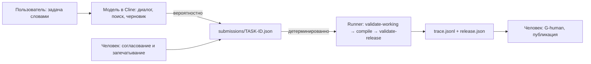

# Разрыв ожиданий и реализации: гипотезы по пакету Cline VS Code

> **Версия 0.2.** Этот разбор — первая часть аудита и разбор одной среды
> (среда 2). По [замечанию владельца](https://github.com/G-Ivan-A/hybrid-Intelligence-lab/pull/643#issuecomment-5884160620)
> охват расширен до мета-модели, сред и инструментов запуска, включая n8n и
> серверную среду 4: [«Мета-модель → среды → инструменты»](https://github.com/G-Ivan-A/hybrid-Intelligence-lab/blob/main/projects/ba-ai-process/docs/analysis/2026-09-29-ba-ai-process-runtime-options.md),
> гипотезы Г-26…Г-54.

## Вердикт

**Направление разработки верное, и пакет готов к отладке, но не к работе
«на живых задачах без присмотра».** Детерминированная часть — сборка и
проверка Release — работает и воспроизводится побайтно (гипотеза
[Г-16](#г-16)). Разрыв с ожиданиями возникает не в ней, а вокруг неё:
общение, навигация, поиск источников, смысловая проверка и выдача
человекочитаемого документа сейчас держатся на поведении модели и на
тексте инструкции, а не на коде.

Из шести ожиданий фаундера одно выполнено полностью (детерминизм — но только
для машинного отрезка), три выполнены частично и зависят от модели, два не
выполнены (готовая спецификация в человекочитаемом формате и выбор вариантов
как гарантированное поведение). Главные корневые причины:

1. **Смешение трёх разных сущностей** — мета-модели (теории), пакета
   (скомпилированного узкого среза) и агента (LLM с текстом правил). От
   пакета ожидают свойств теории, а от агента — свойств кода.
2. **Граница «вероятностное → машинное» проведена по Working JSON, но
   поля, которые эта граница проверяет, заполняет та же модель.**
   `semantic_review`, `approval` и `retrieval_status: "read"` —
   самодекларации: машина проверяет их наличие, а не истинность. Контрольная
   сумма цитаты доказывает, что цитату не меняли после запечатывания, но не
   то, что она взята из источника ([Г-17](#г-17), [Г-18](#г-18)).
3. **Правила пакета написаны для учебного примера, а реальный режим
   включается фразой в чате** — то есть пакет сам учит пользователя
   переопределять `AGENTS.md` своим «вектором» ([Г-04](#г-04), [Г-23](#г-23)).
4. **Результат выдаётся в форме для машины** (однострочный канонический JSON
   с английскими заголовками), а человекочитаемый вид получается пересказом
   модели ([Г-19](#г-19)).
5. **Инструкция и hooks написаны под Cline v3, а установка ставит v4.**
   В v4.1.21 другие имена инструментов и пункты подтверждений, правка файлов
   и команды по умолчанию разрешены без вопроса. Hook пакета, который на
   Windows сейчас не запускается, при запуске остановил бы задачу на первом
   чтении файла ([Г-11](#г-11), [Г-25](#г-25)).

Отладку можно начинать сейчас: для неё есть runner, trace, режим отладки и
Golden-пример. Условие — отладку ведёт человек, который понимает границу из
раздела [«Где кончается генерация и начинается G-mach»](#где-кончается-генерация-и-начинается-g-mach),
а пять исправлений первого приоритета из раздела [«Рекомендации»](#рекомендации) идут в Source
до первых замеров `M-1`…`M-5`.

## Контекст и охват

- **Что разбирается.** Пакет
  [`dist/execution-package-cline-vscode/`](https://github.com/G-Ivan-A/hybrid-Intelligence-lab/tree/main/projects/ba-ai-process/dist/execution-package-cline-vscode)
  (версия пакета `0.1.0`, инструкция v0.3 после
  [PR #637](https://github.com/G-Ivan-A/hybrid-Intelligence-lab/pull/637)) и
  шесть ожиданий фаундера из
  [issue #639](https://github.com/G-Ivan-A/hybrid-Intelligence-lab/issues/639).
- **Что не разбирается.** Содержательная правильность мета-модели и
  корпоративная инфраструктура Mango (MCP-серверы, Jira, Confluence) — к ним
  у этого разбора нет доступа. Пакет GigaCode CLI, обязательства исполнения
  мета-модели и варианты среды запуска разобраны во
  [второй части](https://github.com/G-Ivan-A/hybrid-Intelligence-lab/blob/main/projects/ba-ai-process/docs/analysis/2026-09-29-ba-ai-process-runtime-options.md).
- **Для кого.** Для фаундера, который изучает вайбкодинг и ставит задачи
  мультиагентной системе на продуктовом уровне. Поэтому каждая гипотеза
  заканчивается не только технической рекомендацией, но и типом
  рекомендации: принять ограничение, исправить код или инструкцию, изменить
  ментальную модель.

## Метод

1. **Декомпозиция ожиданий.** Каждое из шести ожиданий разложено на
   проверяемые утверждения о пакете («пакет делает X»). Утверждение — это
   гипотеза: её можно подтвердить или опровергнуть фактом.
2. **Доказательства — только проверяемые.** Ссылка на строку кода или
   инструкции в `main`, либо воспроизводимый эксперимент
   [`experiments/issue_639_gap_probes.sh`](https://github.com/G-Ivan-A/hybrid-Intelligence-lab/blob/main/projects/ba-ai-process/experiments/issue_639_gap_probes.sh)
   с журналом
   [`issue_639_gap_probes.log`](https://github.com/G-Ivan-A/hybrid-Intelligence-lab/blob/main/projects/ba-ai-process/experiments/issue_639_gap_probes.log)
   (пробы `P1`…`P9` и `P8b`). Поведение Cline проверено по исходному коду
   [`cline/cline`](https://github.com/cline/cline) двух версий с закреплёнными
   коммитами: последней v3 —
   [v3.89.2](https://github.com/cline/cline/tree/e1bdeeff68e95734901c7a4b3a31753bae54a634)
   и текущей на дату разбора
   [v4.1.21](https://github.com/cline/cline/tree/787ad1b077d8b697892dc3bfcd42e7c65b88789e)
   (выпущена 2026-09-24, работает на новом SDK с другими именами инструментов).
   Живой прогон Cline с моделью Mango AI в этом разборе не выполнялся:
   гипотезы о поведении модели оценены по инструкции и дизайну, и это
   отражено в уровне уверенности.
3. **Статус.** «Подтверждено» — утверждение гипотезы верно для текущего
   `main`. «Опровергнуто» — неверно. Гипотезы сформулированы так, как
   их, вероятно, формулирует пользователь, поэтому «Опровергнуто» чаще всего
   и есть найденный разрыв.
4. **Уверенность.** Высокая — есть строка кода или воспроизводимая проба.
   Средняя — вывод по инструкции, дизайну или одному источнику без прогона.
   Низкая — косвенные признаки.
5. **Рекомендация** — один из трёх типов: **ограничение** (принять и
   документировать), **исправить** (код или инструкцию в Source),
   **ментальная модель** (изменить ожидание пользователя).

## Карта ожиданий

| № | Ожидание фаундера | Что есть сейчас | Оценка | Гипотезы |
|---|-------------------|-----------------|--------|----------|
| 1 | Общение с ИИ человеческим языком | Диалог в панели Cline на русском; порядок диалога задан стартовой фразой, которую пользователь копирует сам | Частично: язык — да, ведение процесса — по доброй воле модели | [Г-02](#г-02), [Г-04](#г-04), [Г-23](#г-23) |
| 2 | Готовая бизнес-спецификация в заданном формате | `runs/TASK-ID/release.json`: канонический JSON в одну строку, английские заголовки разделов | Не выполнено для человека; выполнено для машины | [Г-19](#г-19) |
| 3 | Человекочитаемые подсказки для выбора и навигации | Подсказки «что дальше» просит стартовая фраза; команды и ошибки — в инструкции | Частично: зависит от модели и от того, что пользователь нашёл нужный раздел | [Г-02](#г-02), [Г-06](#г-06), [Г-20](#г-20), [Г-21](#г-21) |
| 4 | Пояснения целей и шагов процесса | Инструкции v0.3 объясняют шаги; модель поясняет по просьбе | Частично: объяснения модели не сверены с пакетом, модель придумывает термины | [Г-01](#г-01), [Г-08](#г-08) |
| 5 | Выбор вариантов командами на естественном языке | Нумерованные пункты «1 — да, 2 — нет» просит стартовая фраза; машинного меню нет | Не выполнено как гарантия; работает как договорённость с моделью | [Г-02](#г-02), [Г-03](#г-03) |
| 6 | Гарантия детерминированности процесса и результатов | Детерминированы проверка Working, сборка и проверка Release; остальное вероятностно | Выполнено только для машинного отрезка | [Г-16](#г-16), [Г-17](#г-17), [Г-18](#г-18) |

## Матрица гипотез

Ссылки ведут на `main`. Короткие обозначения:
`P` — пакет
[`dist/execution-package-cline-vscode/`](https://github.com/G-Ivan-A/hybrid-Intelligence-lab/tree/main/projects/ba-ai-process/dist/execution-package-cline-vscode),
`P1`…`P9` — пробы из
[журнала эксперимента](https://github.com/G-Ivan-A/hybrid-Intelligence-lab/blob/main/projects/ba-ai-process/experiments/issue_639_gap_probes.log).

### А. Ментальная модель: мета-модель как теория и пакет как исполнитель

| № | Гипотеза | Доказательство | Статус | Уверенность | Рекомендация |
|---|----------|----------------|--------|-------------|--------------|
| <a id="г-01"></a>Г-01 | Пакет «знает» мета-модель БА и ведёт работу по ней как агент | Теория — 11 сущностей, 33 навыка-подпроцесса, 31 операция — лежит в Source [`ba-meta-model/`](https://github.com/G-Ivan-A/hybrid-Intelligence-lab/blob/main/projects/ba-ai-process/README.md#L44-L58). В пакете папка `meta-model/` содержит только `.gitkeep` (проба `P9`), и инструкция прямо говорит: [«Runner его не читает»](https://github.com/G-Ivan-A/hybrid-Intelligence-lab/blob/main/projects/ba-ai-process/dist/execution-package-cline-vscode/docs/guides/05-commands-reference.md#L247). Мета-модель доходит до пакета только в скомпилированном виде: схема, профиль Release, таксономия, один маршрут | Опровергнуто | Высокая | **Ментальная модель.** Мета-модель — это теория и исходник компиляции, а не участник диалога. Пакет — узкий скомпилированный срез одного процесса. Агент — модель, которая читает текст правил и может его не выполнить |
| <a id="г-02"></a>Г-02 | Выбор процесса и навигация по шагам заданы в пакете машинно и исполняются одинаково каждый раз | В [`routes/pilot.json`](https://github.com/G-Ivan-A/hybrid-Intelligence-lab/blob/main/projects/ba-ai-process/dist/execution-package-cline-vscode/routes/pilot.json#L1-L9) один маршрут и нет шагов диалога. Меню процессов, вопросы о входных данных и нумерованное согласование задаёт [стартовая фраза](https://github.com/G-Ivan-A/hybrid-Intelligence-lab/blob/main/projects/ba-ai-process/dist/execution-package-cline-vscode/docs/guides/06-working-with-cline.md#L74-L92). Ограничение [О-4](https://github.com/G-Ivan-A/hybrid-Intelligence-lab/blob/main/projects/ba-ai-process/dist/execution-package-cline-vscode/docs/guides/01-junior-pilot.md#L138): «поведение модели по ней не гарантировано» | Опровергнуто | Высокая | **Исправить** (B-201): вынести диалог процесса в skill или workflow Cline с явными шагами. До этого — **ограничение**: стартовая фраза остаётся обязательной |
| <a id="г-03"></a>Г-03 | Cline исполняет процесс: сам запускает проверки и шаги | Hook отменяет всё, кроме чтения и записи черновика: `execute_command` → `cancel: true` (проба `P8`; [`cline_hook.py`](https://github.com/G-Ivan-A/hybrid-Intelligence-lab/blob/main/projects/ba-ai-process/dist/execution-package-cline-vscode/tools/cline_hook.py#L13-L36)). [`AGENTS.md`](https://github.com/G-Ivan-A/hybrid-Intelligence-lab/blob/main/projects/ba-ai-process/dist/execution-package-cline-vscode/AGENTS.md#L22-L23) велит агенту просить аналитика запустить runner. [Инструкция](https://github.com/G-Ivan-A/hybrid-Intelligence-lab/blob/main/projects/ba-ai-process/dist/execution-package-cline-vscode/docs/guides/01-junior-pilot.md#L65-L69) объясняет: иначе модель может «нарисовать» PASS | Опровергнуто | Высокая | **Ментальная модель.** Cline — составитель черновика и собеседник; runner — исполнитель; человек переносит результат между ними. Решение о запуске runner агентом — **исправить** через B-202 после B-200 |
| <a id="г-04"></a>Г-04 | Правила агента в пакете рассчитаны на реальную задачу | [`AGENTS.md`](https://github.com/G-Ivan-A/hybrid-Intelligence-lab/blob/main/projects/ba-ai-process/dist/execution-package-cline-vscode/AGENTS.md#L15-L18): «Use a public synthetic input… `submissions/TASK-0001.json`»; пункт 5 разрешает коммитить только синтетику. Ограничение [О-1](https://github.com/G-Ivan-A/hybrid-Intelligence-lab/blob/main/projects/ba-ai-process/dist/execution-package-cline-vscode/docs/guides/01-junior-pilot.md#L135) | Опровергнуто | Высокая | **Исправить** (B-198): переписать `AGENTS.md` и `templates/working-prompt.md` под реальную задачу с `kb-policy` |

### Б. Терминология: процесс, контракт, гейт

| № | Гипотеза | Доказательство | Статус | Уверенность | Рекомендация |
|---|----------|----------------|--------|-------------|--------------|
| <a id="г-05"></a>Г-05 | Слово «контракт» в пакете означает одно и то же | Минимум четыре значения: JSON Schema в [`contracts/`](https://github.com/G-Ivan-A/hybrid-Intelligence-lab/tree/main/projects/ba-ai-process/dist/execution-package-cline-vscode/contracts); состояние trace [`contract_mode`](https://github.com/G-Ivan-A/hybrid-Intelligence-lab/blob/main/projects/ba-ai-process/dist/execution-package-cline-vscode/tools/run_task.py#L128-L129), которое означает «нужна проверка человеком»; «контракты отладки» из [О-5](https://github.com/G-Ivan-A/hybrid-Intelligence-lab/blob/main/projects/ba-ai-process/dist/execution-package-cline-vscode/docs/guides/01-junior-pilot.md#L139); `AGENTS.md` как [контракт агента](https://github.com/G-Ivan-A/hybrid-Intelligence-lab/blob/main/standards/agents-md-bootstrap-standard.md#L51) по норме Хаба | Опровергнуто | Средняя | **Исправить** инструкцию: в глоссарии развести «схема (contracts/)», «запись trace contract_mode», «правила агента». В разговоре с агентом называть вещь по файлу, а не по классу |
| <a id="г-06"></a>Г-06 | Все гейты, которые проверяет runner, объяснены пользователю | Валидатор требует `semantic_review` со статусом `passed`, обоснованием и контрпримером — [`bcreq_pipeline.py`](https://github.com/G-Ivan-A/hybrid-Intelligence-lab/blob/main/projects/ba-ai-process/dist/execution-package-cline-vscode/tools/bcreq_pipeline.py#L370-L374); без него `FAIL` (проба `P2`). В [глоссарии](https://github.com/G-Ivan-A/hybrid-Intelligence-lab/blob/main/projects/ba-ai-process/dist/execution-package-cline-vscode/docs/guides/01-junior-pilot.md#L165-L166) есть только G-mach и G-human. [Шаг 4](https://github.com/G-Ivan-A/hybrid-Intelligence-lab/blob/main/projects/ba-ai-process/dist/execution-package-cline-vscode/docs/guides/06-working-with-cline.md#L152-L175) просит записать только согласование, а в [таблице ситуаций](https://github.com/G-Ivan-A/hybrid-Intelligence-lab/blob/main/projects/ba-ai-process/dist/execution-package-cline-vscode/docs/guides/06-working-with-cline.md#L350-L363) нет ошибки `SEMANTIC` | Опровергнуто | Высокая | **Исправить** инструкцию: добавить G-semantic в глоссарий, в шаг 4 и в таблицу ситуаций. Связано с [Г-18](#г-18): решить, чей это гейт |
| <a id="г-07"></a>Г-07 | «Задача Jira», «процесс», «маршрут», «TASK ID» и «прогон» соотносятся один к одному | Одной задаче Jira соответствует несколько TASK ID — [по одному на попытку](https://github.com/G-Ivan-A/hybrid-Intelligence-lab/blob/main/projects/ba-ai-process/dist/execution-package-cline-vscode/docs/guides/06-working-with-cline.md#L54-L62). Процесс «Сформировать бизнес-спецификацию» в файлах называется `RG-BCREQ-v1/synthetic-working-release`. Ключ Jira как номер прогона [отклоняется](https://github.com/G-Ivan-A/hybrid-Intelligence-lab/blob/main/projects/ba-ai-process/dist/execution-package-cline-vscode/tools/run_task.py#L97-L99) | Опровергнуто | Средняя | **Исправить**: runner принимает внешний ключ (Jira) как метаданные прогона и пишет его в trace. До этого — **ограничение**: таблица соответствия ведётся вручную |
| <a id="г-08"></a>Г-08 | Термины, которые называет модель (`G-self`, `V-BIZ`, узлы `intake`), есть в пакете | Их нет в пакете; инструкция [предупреждает](https://github.com/G-Ivan-A/hybrid-Intelligence-lab/blob/main/projects/ba-ai-process/dist/execution-package-cline-vscode/docs/guides/06-working-with-cline.md#L324-L346). При этом `G-self` — термин теории Хаба ([B-128](https://github.com/G-Ivan-A/hybrid-Intelligence-lab/blob/main/ops/backlog.md)): модель приносит в диалог теорию из прошлых чатов, а не из пакета | Опровергнуто | Средняя | **Ограничение** + **ментальная модель**: правило «нет файла — нет термина» уже в инструкции; его стоит повторить в `AGENTS.md`, когда будет сделана B-198 |

### В. Физика работы: Python, hooks, MCP, режимы Cline

| № | Гипотеза | Доказательство | Статус | Уверенность | Рекомендация |
|---|----------|----------------|--------|-------------|--------------|
| <a id="г-09"></a>Г-09 | Hook пакета отклоняет один опасный вызов, а задача продолжается | В Cline отмена из PreToolUse останавливает всю задачу. v3.89.2: [«Abort the entire task»](https://github.com/cline/cline/blob/e1bdeeff68e95734901c7a4b3a31753bae54a634/apps/vscode/src/core/task/tools/utils/ToolHookUtils.ts#L93-L101). v4.1.21: `cancel` превращается в [`stop: true`](https://github.com/cline/cline/blob/787ad1b077d8b697892dc3bfcd42e7c65b88789e/apps/vscode/src/sdk/hooks-adapter.ts#L41-L60), и прогон завершается как прерванный; поштучный `skip` в [рантайме есть](https://github.com/cline/cline/blob/787ad1b077d8b697892dc3bfcd42e7c65b88789e/sdk/packages/agents/src/agent-runtime.ts#L2374-L2379), но файловые hooks его не используют. Текст пакета говорит «blocks Cline shell commands» ([README](https://github.com/G-Ivan-A/hybrid-Intelligence-lab/blob/main/projects/ba-ai-process/dist/execution-package-cline-vscode/README.md#L41-L43)) и не предупреждает, что задача закончится | Опровергнуто | Высокая | **Ограничение** + **исправить** инструкцию: «если сработал hook, задача остановлена — начните новую и продолжите с черновика». Для пользователя это выглядит как «агент сломался», а не как «защита сработала» |
| <a id="г-10"></a>Г-10 | Hooks пакета защищают пакет на Windows | Cline на Windows ищет только `<Hook>.ps1`: [«Extensionless hooks are intentionally ignored on Windows»](https://github.com/cline/cline/blob/787ad1b077d8b697892dc3bfcd42e7c65b88789e/apps/vscode/src/core/hooks/hook-factory.ts#L975-L997); hooks пакета — Python-файлы без расширения ([`.clinerules/hooks/`](https://github.com/G-Ivan-A/hybrid-Intelligence-lab/tree/main/projects/ba-ai-process/dist/execution-package-cline-vscode/.clinerules/hooks)). Это уже честно записано как [О-3](https://github.com/G-Ivan-A/hybrid-Intelligence-lab/blob/main/projects/ba-ai-process/dist/execution-package-cline-vscode/docs/guides/01-junior-pilot.md#L137). Дополнительно: если hook упал без JSON-ответа, v4 [разрешает вызов](https://github.com/cline/cline/blob/787ad1b077d8b697892dc3bfcd42e7c65b88789e/apps/vscode/src/sdk/hooks-adapter.ts#L184-L195) — hooks работают по принципу fail-open | Опровергнуто | Высокая | **Ограничение** (уже в О-3) + **исправить** (B-200). **Ментальная модель**: hook — удобный фильтр, а не граница; граница — runner и CI ([Г-24](#г-24)) |
| <a id="г-11"></a>Г-11 | Список разрешённых инструментов в hook совпадает с инструментами Cline, который поставит пользователь | Hook знает имена Cline v3: `read_file`, `write_to_file`, `use_mcp_tool`… ([`cline_hook.py`](https://github.com/G-Ivan-A/hybrid-Intelligence-lab/blob/main/projects/ba-ai-process/dist/execution-package-cline-vscode/tools/cline_hook.py#L13-L17)). С v4.0 инструменты называются [`read_files`, `search_codebase`, `run_commands`, `editor`, `ask_question`…](https://github.com/cline/cline/blob/787ad1b077d8b697892dc3bfcd42e7c65b88789e/sdk/packages/core/src/extensions/tools/constants.ts#L12-L22), MCP — `сервер__инструмент`, и [PreToolUse срабатывает на каждый](https://github.com/cline/cline/blob/787ad1b077d8b697892dc3bfcd42e7c65b88789e/apps/vscode/src/sdk/hooks-adapter.ts#L147-L174). Проба `P8b`: hook отменяет `read_files`, `ask_question` и даже запись черновика через `editor`. Там, где hooks запускаются (Linux, macOS, будущие `.ps1` из B-200), Cline v4.1.21 остановит задачу на первом чтении файла. Событие `TaskResume` v4 [не вызывает](https://github.com/cline/cline/blob/787ad1b077d8b697892dc3bfcd42e7c65b88789e/apps/vscode/src/sdk/hooks-adapter.ts#L1-L12). Инструкция [не фиксирует версию Cline](https://github.com/G-Ivan-A/hybrid-Intelligence-lab/blob/main/projects/ba-ai-process/dist/execution-package-cline-vscode/docs/guides/02-install.md#L42-L44) | Опровергнуто | Высокая | **Исправить** (B-200): поддержать оба набора имён или зафиксировать проверенную версию Cline в инструкции установки. Без этого исправление О-3 сломает работу, а не защитит её |
| <a id="г-12"></a>Г-12 | Доступ к Jira/Confluence через MCP ограничен чтением на уровне пакета | Hook пропускает любой `use_mcp_tool` без проверки имени сервера или инструмента — [`READ_TOOLS`](https://github.com/G-Ivan-A/hybrid-Intelligence-lab/blob/main/projects/ba-ai-process/dist/execution-package-cline-vscode/tools/cline_hook.py#L13-L16), проба `P8`. «Только чтение» — требование к подключению в [`kb-policy.md`](https://github.com/G-Ivan-A/hybrid-Intelligence-lab/blob/main/projects/ba-ai-process/dist/execution-package-cline-vscode/docs/kb-policy.md#L10-L17), то есть организационная мера. Реальная граница — ручное подтверждение: [MCP не в Auto-approve](https://github.com/G-Ivan-A/hybrid-Intelligence-lab/blob/main/projects/ba-ai-process/dist/execution-package-cline-vscode/docs/guides/03-deploy-package.md#L204-L210) | Опровергнуто | Высокая | **Исправить**: в hook — allowlist пар «сервер/инструмент» только на чтение; в инструкции — явная фраза «подтверждайте только поиск и чтение». До этого — **ограничение** |
| <a id="г-13"></a>Г-13 | Режим Plan технически запрещает менять файлы и запускать команды | Инструкция: Plan [«Файлы не меняет, команды не запускает»](https://github.com/G-Ivan-A/hybrid-Intelligence-lab/blob/main/projects/ba-ai-process/dist/execution-package-cline-vscode/docs/guides/06-working-with-cline.md#L262). Cline v3.89.2: запрет на запись только при `strictPlanModeEnabled`, который [по умолчанию выключен](https://github.com/cline/cline/blob/e1bdeeff68e95734901c7a4b3a31753bae54a634/apps/vscode/src/shared/storage/state-keys.ts#L262), а команды [не запрещены и в строгом режиме](https://github.com/cline/cline/blob/e1bdeeff68e95734901c7a4b3a31753bae54a634/apps/vscode/src/core/task/ToolExecutor.ts#L289-L296). Cline v4.1.21: редактор в Plan [выключен, оболочка включена](https://github.com/cline/cline/blob/787ad1b077d8b697892dc3bfcd42e7c65b88789e/sdk/packages/core/src/extensions/tools/presets.ts#L39-L57); команды правки ловит чёрный список, который [по словам авторов ловит не всё](https://github.com/cline/cline/blob/787ad1b077d8b697892dc3bfcd42e7c65b88789e/sdk/packages/core/src/extensions/tools/command-guard.ts#L10-L17) | Опровергнуто | Высокая | **Исправить** инструкцию: Plan — режим разговора, а не замок; защита — подтверждения в панели Cline. **Ментальная модель**: режим задаёт намерение модели, гарантию даёт только проверка вне модели |
| <a id="г-14"></a>Г-14 | Поле `temperature: 0.1` в файлах пакета делает ответы модели стабильными | `temperature` стоит в заголовке правила [`.clinerules/01-package.md`](https://github.com/G-Ivan-A/hybrid-Intelligence-lab/blob/main/projects/ba-ai-process/dist/execution-package-cline-vscode/.clinerules/01-package.md#L5) и других файлов. Это метка документа по стандартам Хаба, а не настройка модели: Cline v3 из заголовка правила читает только [`paths`](https://github.com/cline/cline/blob/e1bdeeff68e95734901c7a4b3a31753bae54a634/apps/vscode/src/core/context/instructions/user-instructions/rule-conditionals.ts#L77-L106), v4 — только [`name`, `disabled`, `enabled`](https://github.com/cline/cline/blob/787ad1b077d8b697892dc3bfcd42e7c65b88789e/sdk/packages/core/src/extensions/config/user-instruction-config-loader.ts#L383-L408) | Опровергнуто | Высокая | **Ментальная модель**: стабильность ответа модели не настраивается текстом в файлах; её параметры задаются на сервере модели. Детерминизм процесса обеспечивает runner, а не температура ([Г-16](#г-16)) |
| <a id="г-15"></a>Г-15 | Команда «Запечатать черновик» проверена в оболочке, которая стоит у пользователя | Инструкция: [«проверен в PowerShell 7 на Linux; в Windows PowerShell 5.1 его пока не проверяли»](https://github.com/G-Ivan-A/hybrid-Intelligence-lab/blob/main/projects/ba-ai-process/dist/execution-package-cline-vscode/docs/guides/05-commands-reference.md#L105-L108); на Windows по умолчанию стоит 5.1. Ограничение [О-2](https://github.com/G-Ivan-A/hybrid-Intelligence-lab/blob/main/projects/ba-ai-process/dist/execution-package-cline-vscode/docs/guides/01-junior-pilot.md#L136) | Опровергнуто | Средняя | **Исправить** (B-199): команда `seal` в runner — одна строка Python вместо here-string в PowerShell |
| <a id="г-25"></a>Г-25 | Настройка подтверждений в инструкции совпадает с тем, что пользователь увидит в Cline | Инструкция называет пункты [«Read project files», «Edit project files», «Execute safe commands», «YOLO Mode»](https://github.com/G-Ivan-A/hybrid-Intelligence-lab/blob/main/projects/ba-ai-process/dist/execution-package-cline-vscode/docs/guides/03-deploy-package.md#L204-L215) — это меню Cline v3 ([список](https://github.com/cline/cline/blob/e1bdeeff68e95734901c7a4b3a31753bae54a634/apps/vscode/webview-ui/src/components/chat/auto-approve-menu/constants.ts)). В v4.1.21 пункты другие — [«Read files», «Edit files», «Execute commands», «Fetch web content», «Use MCP servers»](https://github.com/cline/cline/blob/787ad1b077d8b697892dc3bfcd42e7c65b88789e/apps/vscode/webview-ui/src/components/chat/auto-approve-menu/constants.ts#L6-L31), и по умолчанию [правка файлов и все команды разрешены без вопроса](https://github.com/cline/cline/blob/787ad1b077d8b697892dc3bfcd42e7c65b88789e/apps/vscode/src/shared/AutoApprovalSettings.ts#L28-L43). Вместе с [Г-10](#г-10) это значит: на Windows с новым Cline до ручной настройки агента не останавливает ничего, кроме [проверки защиты](https://github.com/G-Ivan-A/hybrid-Intelligence-lab/blob/main/projects/ba-ai-process/dist/execution-package-cline-vscode/docs/guides/03-deploy-package.md#L223-L252), которая такую ситуацию ловит. Живая установка v4 в этом разборе не выполнялась | Опровергнуто | Средняя | **Исправить** инструкцию установки: указать проверенную версию Cline и названия пунктов для неё; в проверку защиты добавить попытку команды, а не только записи файла |

### Г. Баланс валидации: где кончается генерация и начинается G-mach

| № | Гипотеза | Доказательство | Статус | Уверенность | Рекомендация |
|---|----------|----------------|--------|-------------|--------------|
| <a id="г-16"></a>Г-16 | Сборка и проверка Release детерминированы: одинаковый Working даёт одинаковый Release | Две сборки Golden дают побайтно одинаковый `release.json` (проба `P5`). Вывод — канонический JSON с сортировкой ключей ([`canonical`](https://github.com/G-Ivan-A/hybrid-Intelligence-lab/blob/main/projects/ba-ai-process/dist/execution-package-cline-vscode/tools/bcreq_pipeline.py#L20-L29)); `validate-release` пересобирает и сравнивает | Подтверждено | Высокая | **Принять** как опору: это и есть гарантия ожидания 6, но только от Working до Release |
| <a id="г-17"></a>Г-17 | Машинный PASS подтверждает, что источники существуют и цитаты взяты из них | Контрольная сумма — `sha256` от самой цитаты ([`EVID-03`](https://github.com/G-Ivan-A/hybrid-Intelligence-lab/blob/main/projects/ba-ai-process/dist/execution-package-cline-vscode/tools/bcreq_pipeline.py#L178-L185)); `retrieval_status: "read"` пишет модель. Черновик с несуществующим адресом `https://nonexistent.invalid/page/42` и выдуманной цитатой после запечатывания получает `PASS` (проба `P4`). Проверку подлинности [чек-лист G-human](https://github.com/G-Ivan-A/hybrid-Intelligence-lab/blob/main/projects/ba-ai-process/dist/execution-package-cline-vscode/evaluation/g-human-checklist.md#L10) отдаёт человеку | Опровергнуто | Высокая | **Ментальная модель**: сумма доказывает неизменность цитаты после согласования, а не её подлинность. **Исправить** для KB: если источник — файл `docs/kb/`, runner может детерминированно проверить, что цитата есть в файле |
| <a id="г-18"></a>Г-18 | Смысловая проверка (G-semantic) и согласование выполняются независимо от модели | Валидатор проверяет, что поля `semantic_review` и `approval` [непустые](https://github.com/G-Ivan-A/hybrid-Intelligence-lab/blob/main/projects/ba-ai-process/dist/execution-package-cline-vscode/tools/bcreq_pipeline.py#L369-L374), а кто их заполнил — не проверяет. `semantic_review` с `reviewed_by: "cline-agent"`, `rationale: "ok"`, `counterexample: "none"` проходит G-mach (проба `P3`). Согласование пользователь [диктует агенту](https://github.com/G-Ivan-A/hybrid-Intelligence-lab/blob/main/projects/ba-ai-process/dist/execution-package-cline-vscode/docs/guides/06-working-with-cline.md#L156-L164), и агент же его записывает | Опровергнуто | Высокая | **Исправить**: либо переименовать `semantic_review` в самопроверку модели и не называть её гейтом, либо записывать её и согласование отдельной командой runner, которую запускает человек (вместе с B-199). **Ментальная модель**: поле в JSON — не подпись |
| <a id="г-19"></a>Г-19 | Результат — готовая бизнес-спецификация в заданном формате, которую можно читать и отдавать | `release.json` — одна строка, 2053 байта; заголовки разделов английские — `Terms`, `Business context`… (проба `P6`; профиль [`bcreq-client-v1.json`](https://github.com/G-Ivan-A/hybrid-Intelligence-lab/blob/main/projects/ba-ai-process/dist/execution-package-cline-vscode/contracts/bcreq-client-v1.json#L8-L36)). Чтобы прочитать, инструкция [предлагает попросить Cline пересказать файл](https://github.com/G-Ivan-A/hybrid-Intelligence-lab/blob/main/projects/ba-ai-process/dist/execution-package-cline-vscode/docs/guides/06-working-with-cline.md#L242-L243) — то есть детерминированный результат читается через вероятностный пересказ | Опровергнуто | Высокая | **Исправить**: детерминированный рендер Release в Markdown (или DOCX) с русскими заголовками из профиля как четвёртый машинный шаг. Это закрывает ожидание 2 без участия модели |
| <a id="г-20"></a>Г-20 | Причина неудачного прогона сохраняется для разбора | В trace записан только код выхода, текст ошибки уходит в терминал ([`run_task.py`](https://github.com/G-Ivan-A/hybrid-Intelligence-lab/blob/main/projects/ba-ai-process/dist/execution-package-cline-vscode/tools/run_task.py#L117-L123)); проба `P7`: `detail` у `validate-working` пустой | Опровергнуто | Высокая | **Исправить**: писать `stderr` шага в `detail` trace. Это дёшево и сразу помогает режиму отладки |
| <a id="г-21"></a>Г-21 | Ошибка дёшево исправляется: поправил и перезапустил | Повтор с тем же TASK ID запрещён (`run already exists`, проба `P7`); после каждой правки нужно заново запечатать и взять [новый TASK ID](https://github.com/G-Ivan-A/hybrid-Intelligence-lab/blob/main/projects/ba-ai-process/dist/execution-package-cline-vscode/docs/guides/05-commands-reference.md#L159-L180). Проверка без расхода номера есть только в [режиме отладки](https://github.com/G-Ivan-A/hybrid-Intelligence-lab/blob/main/projects/ba-ai-process/dist/execution-package-cline-vscode/docs/guides/05-commands-reference.md#L292-L319) | Опровергнуто | Средняя | **Исправить**: команда runner «проверить черновик» (только `validate-working`, без trace и без номера) в режиме прогона. Правило «один TASK ID — один прогон» — **принять**: оно защищает журнал |
| <a id="г-22"></a>Г-22 | Проверка продуктовой привязки подтверждает, что привязка верна по смыслу | Runner проверяет, что путь «домен / capability / feature / атомарная функция» есть в закрытой таксономии; допустимые пути — [все сочетания](https://github.com/G-Ivan-A/hybrid-Intelligence-lab/blob/main/projects/ba-ai-process/dist/execution-package-cline-vscode/tools/bcreq_pipeline.py#L117-L125) feature × атомарная функция внутри capability. Уместность привязки для задачи — [пункт G-human](https://github.com/G-Ivan-A/hybrid-Intelligence-lab/blob/main/projects/ba-ai-process/dist/execution-package-cline-vscode/evaluation/g-human-checklist.md#L11) | Опровергнуто | Средняя | **Ограничение**: машина проверяет существование пути, смысл — человек. Уточнить в глоссарии, что значит `PRODUCT` в PASS |

### Д. Нарушение правил: вектор пользователя против `AGENTS.md`

| № | Гипотеза | Доказательство | Статус | Уверенность | Рекомендация |
|---|----------|----------------|--------|-------------|--------------|
| <a id="г-23"></a>Г-23 | Когда просьба пользователя противоречит `AGENTS.md`, агент следует `AGENTS.md` | Пакет сам строит работу на переопределении: [`AGENTS.md`](https://github.com/G-Ivan-A/hybrid-Intelligence-lab/blob/main/projects/ba-ai-process/dist/execution-package-cline-vscode/AGENTS.md#L15-L18) требует синтетику, а [стартовая фраза](https://github.com/G-Ivan-A/hybrid-Intelligence-lab/blob/main/projects/ba-ai-process/dist/execution-package-cline-vscode/docs/guides/06-working-with-cline.md#L75) говорит «реальная задача, а не учебный пример». Выход из конфликта инструкция [описывает как неопределённый](https://github.com/G-Ivan-A/hybrid-Intelligence-lab/blob/main/projects/ba-ai-process/dist/execution-package-cline-vscode/docs/guides/01-junior-pilot.md#L51-L54): модель может отказаться или согласиться. Живой прогон в этом разборе не выполнялся | Опровергнуто | Средняя | **Исправить** (B-198). **Ментальная модель**: если правило приходится оспаривать в чате, неверно правило, а не чат — его чинят в Source и перекомпилируют пакет. Каждое такое переопределение — сигнал для бэклога |
| <a id="г-24"></a>Г-24 | Агент не может выдать свой текст за машинный PASS в зачётном результате | Trace и Release пишет только runner; hook запрещает агенту писать вне `submissions/` (проба `P8`: запись в `AGENTS.md` отменена). CI пересобирает каждый черновик ([`verify-ci`](https://github.com/G-Ivan-A/hybrid-Intelligence-lab/blob/main/projects/ba-ai-process/dist/execution-package-cline-vscode/tools/run_task.py#L133-L149)). Оговорки: на Windows hook не работает ([Г-10](#г-10)), и CI становится обязательным, только если администратор сделает его [required check](https://github.com/G-Ivan-A/hybrid-Intelligence-lab/blob/main/projects/ba-ai-process/dist/execution-package-cline-vscode/README.md#L51-L55) | Подтверждено | Средняя | **Принять** и **исправить** настройку: required check в репозитории спутника (так же, как B-181 для пакета GigaCode). Текст модели «проверка прошла» — не результат; результат — строка runner и CI |

## Где кончается генерация и начинается G-mach



| Отрезок | Кто делает | Детерминирован? | Что проверяется машиной |
|---------|------------|-----------------|-------------------------|
| Выбор процесса, вопросы, навигация | Модель по стартовой фразе | Нет | Ничего |
| Поиск источников (MCP, `docs/kb/`) | Модель + подтверждения человека | Нет | Ничего |
| Черновик Working | Модель | Нет | Схема, ссылки между разделами, форма требований, путь в таксономии |
| `semantic_review`, `approval`, `retrieval_status` | Модель по диктовке человека | Нет | Только наличие полей ([Г-18](#г-18)) |
| Контрольные суммы | Человек (запечатывание) | Да | Неизменность после запечатывания ([Г-17](#г-17)) |
| Working → Release | Runner | Да | Всё, включая побайтное совпадение ([Г-16](#г-16)) |
| Чтение Release человеком | Модель (пересказ) | Нет | Ничего ([Г-19](#г-19)) |
| Смысл и публикация | Человек | — | Ничего; trace только напоминает (`contract_mode`) |

Вывод для ожидания 6: гарантия детерминированности честно выполнена для
одной стрелки из шести. Это не дефект направления — это его устройство:
вероятностная часть неизбежна там, где есть понимание текста. Дефект в
том, что в зону машины попали поля, которые заполняет модель, и они выглядят
как гейты.

## Корневые причины

1. **Три сущности названы одним словом «система».** Мета-модель (теория),
   пакет (компиляция одного процесса) и агент (LLM + текст правил) — разные
   вещи с разными гарантиями. Ожидания 1, 3, 4, 5 относятся к агенту, а
   гарантию ожидания 6 даёт только пакет. Гипотезы [Г-01](#г-01)…[Г-03](#г-03).
2. **Самодекларации внутри машинной границы.** Runner доверяет полям,
   которые пишет модель: статусу чтения источника, смысловой проверке,
   согласованию. Машина проверяет форму, и PASS читается шире, чем
   значит. Гипотезы [Г-06](#г-06), [Г-17](#г-17), [Г-18](#г-18).
3. **Учебный пакет используется как рабочий.** Правила, шаблон и CI
   рассчитаны на синтетический `TASK-0001`; реальный режим включается
   фразой. Это делает соблюдение правил вопросом удачи. Гипотезы
   [Г-04](#г-04), [Г-23](#г-23).
4. **Человекочитаемый слой не скомпилирован.** Всё, что видит человек,
   кроме инструкции, — либо JSON, либо пересказ модели: результат, ошибки,
   меню процессов. Гипотезы [Г-02](#г-02), [Г-19](#г-19), [Г-20](#г-20).
5. **Среда пользователя проверена хуже среды разработчика.** Hooks и
   запечатывание проверены на Linux, имена инструментов и меню подтверждений
   — по Cline v3, а пользователь работает в Windows и получает при установке
   Cline v4. Гипотезы группы
   [В](#в-физика-работы-python-hooks-mcp-режимы-cline).
6. **Терминология растёт быстрее глоссария.** Контракт, гейт, процесс,
   маршрут, прогон имеют по несколько значений, и модель добавляет свои.
   Гипотезы [Г-05](#г-05)…[Г-08](#г-08).

## Как ставить продуктовую задачу мультиагентной системе

Этот раздел — учебный: он переводит найденные разрывы в правила постановки
задач. Каждое правило опирается на гипотезу из матрицы.

1. **Разделяйте «что должно быть гарантировано» и «что должно быть
   удобно».** Гарантию даёт только код, который исполняется вне модели
   (runner, CI). Удобство даёт модель, и оно вероятностно. В задаче пишите
   отдельно: «гарантировать: …» и «желательно в диалоге: …» ([Г-16](#г-16), [Г-02](#г-02)).
2. **Для каждого поля результата спрашивайте: «кто его пишет и кто
   проверяет?»** Если пишет модель и проверяет машина только наличие — это
   не гейт, а самодекларация. Задача должна назвать того, кто подписывает
   ([Г-18](#г-18)).
3. **Формат результата задавайте как файл, который выдаёт машина.**
   «Готовая спецификация в формате X» — это требование к шагу сборки, а не
   к модели. Иначе каждый пересказ будет немного другим ([Г-19](#г-19)).
4. **Если вы спорите с правилами в чате — ставьте задачу на правила.**
   Фраза «у меня реальная задача, а не пример» — сигнал, что правила пакета
   отстали от использования. Правильная реакция — задача в бэклог на Source,
   а не более убедительная фраза ([Г-23](#г-23)).
5. **Называйте вещи по файлам.** Вместо «контракт процесса» — «схема
   `contracts/c-working-bcreq.schema.json`»; вместо «гейт прошёл» — «runner
   напечатал PASS для TASK-0002». Модель лучше держит точные ссылки, чем
   классы понятий ([Г-05](#г-05), [Г-08](#г-08)).
6. **Проверяйте среду, в которой будет работать пользователь.** «Работает у
   разработчика» и «работает у аналитика на Windows» — разные утверждения;
   в задаче указывайте целевую ОС и версию инструмента (группа
   [В](#в-физика-работы-python-hooks-mcp-режимы-cline)).
7. **Каждое ожидание формулируйте так, чтобы его можно было опровергнуть.**
   «ИИ понимает человеческий язык» не проверить; «на фразу X агент
   показывает нумерованный список процессов из `routes/`» — проверить. Такая
   формулировка сразу превращается в тест.

## Вывод: эффективность направления и готовность к отладке

**Эффективность.** Архитектура Source → Distribution → runner → CI —
правильный ответ на главный риск LLM-процессов: модель не может выдать свой
текст за проверку ([Г-24](#г-24)), а машинный результат воспроизводим
([Г-16](#г-16)). Опровергнутые гипотезы почти все лежат в слое
«человек ↔ модель», который пока не компилировался, а описывался
инструкцией. Это ожидаемая стадия, а не тупик: исправления точечные и не
требуют пересмотра архитектуры, принятой в
[анализе готовности](https://github.com/G-Ivan-A/hybrid-Intelligence-lab/blob/main/projects/ba-ai-process/docs/analysis/2026-09-24-architecture-convergence-and-readiness.md).

**Готовность к отладке — да, с условиями:**

- отладку на реальных задачах ведёт человек, который читает trace и
  терминал, а не только ответы модели;
- PASS трактуется как «форма и связность верны», а не «источники и смысл
  верны» — до исправления [Г-17](#г-17) и [Г-18](#г-18);
- до первых замеров `M-1`…`M-5` (B-183) в Source вносятся пять
  дешёвых исправлений: проверенная версия Cline в инструкции
  ([Г-25](#г-25)), текст ошибки в trace ([Г-20](#г-20)), команда
  `seal` ([Г-15](#г-15)), G-semantic в инструкции ([Г-06](#г-06)) и проверка
  без расхода TASK ID ([Г-21](#г-21)). Без них замеры будут мерить трение
  интерфейса, а не качество процесса.

**За пределами пакета.** Главный разрыв лежит глубже Cline: у роли
«оркестратор» в мета-модели нет исполнителя, поэтому в среде 2 порядок
шагов ведёт модель. Разбор и две рекомендации — runner-ведущий на рабочем
месте и серверная среда 4 — во [второй части](https://github.com/G-Ivan-A/hybrid-Intelligence-lab/blob/main/projects/ba-ai-process/docs/analysis/2026-09-29-ba-ai-process-runtime-options.md#вердикт).

**Не готово:** работа без присмотра, выдача Release заказчику без
ручного оформления, опора на hooks как на защиту на Windows и работа на
Cline v4 до проверки инструкции на этой версии ([Г-25](#г-25)).

## Рекомендации

Рекомендации — вход для бэклога и решений человека, а не принятые решения.

| Приоритет | Что сделать | Тип | Гипотезы | Задача бэклога |
|-----------|-------------|-----|----------|----------------|
| 1 | Зафиксировать проверенную версию Cline; описать подтверждения и режим Plan для неё | Исправить инструкцию | [Г-09](#г-09), [Г-11](#г-11), [Г-13](#г-13), [Г-25](#г-25) | B-208 |
| 1 | Писать текст ошибки шага в `detail` trace | Исправить код | [Г-20](#г-20) | B-203 |
| 1 | Команда `seal` в runner вместо here-string | Исправить код | [Г-15](#г-15), [Г-17](#г-17) | B-199 |
| 1 | G-semantic в глоссарии, шаге 4 и таблице ситуаций; развести «контракт», «процесс», «маршрут» | Исправить инструкцию | [Г-05](#г-05)…[Г-07](#г-07) | B-204 |
| 1 | Проверка черновика без расхода TASK ID в режиме прогона | Исправить код | [Г-21](#г-21) | B-205 |
| 2 | Решить, чей гейт `semantic_review`, и перенести запись согласования в команду человека | Исправить код и модель | [Г-18](#г-18) | B-206 |
| 2 | Детерминированный рендер Release в документ с русскими заголовками | Исправить код | [Г-19](#г-19) | B-207 |
| 2 | Правила агента для реальной задачи | Исправить код | [Г-04](#г-04), [Г-23](#г-23) | B-198 |
| 2 | Hooks для Windows с именами инструментов обеих версий Cline | Исправить код | [Г-10](#г-10), [Г-11](#г-11) | B-200 |
| 3 | Список MCP-инструментов только на чтение в hook | Исправить код | [Г-12](#г-12) | B-209 |
| 3 | Проверка цитат из `docs/kb/` по файлу | Исправить код | [Г-17](#г-17) | B-210 |
| 3 | Skill Cline для ведения процесса | Исправить код | [Г-02](#г-02) | B-201 |

Задачи B-203…B-210 добавлены в
[Спринт 25 бэклога](https://github.com/G-Ivan-A/hybrid-Intelligence-lab/blob/main/ops/backlog.md)
со статусом `TODO` и приоритетом `null`: приоритет назначает человек.
Приоритет в таблице выше — предложение аудита.

## Воспроизведение

```bash
./projects/ba-ai-process/experiments/issue_639_gap_probes.sh
```

Скрипт копирует пакет во временную папку и не меняет репозиторий. Пробы:
`P1` — исходная проверка; `P2` — без `semantic_review`; `P3` —
`semantic_review` от имени агента; `P4` — выдуманный источник; `P5` —
повторная сборка; `P6` — форма Release; `P7` — неудачный прогон и повтор;
`P8` — решения hook для имён Cline v3; `P8b` — для имён Cline v4.1.21;
`P9` — `meta-model/` и маршруты.

## Related Artifacts

- [Вторая часть: мета-модель, среды и инструменты запуска](https://github.com/G-Ivan-A/hybrid-Intelligence-lab/blob/main/projects/ba-ai-process/docs/analysis/2026-09-29-ba-ai-process-runtime-options.md) — гипотезы Г-26…Г-54, рекомендации 1 и 2.
- [Issue #639](https://github.com/G-Ivan-A/hybrid-Intelligence-lab/issues/639) — задача этого разбора.
- [Issue #636](https://github.com/G-Ivan-A/hybrid-Intelligence-lab/issues/636) и [PR #637](https://github.com/G-Ivan-A/hybrid-Intelligence-lab/pull/637) — инструкция v0.3 и ограничения О-1…О-5.
- [Инструкции пакета](https://github.com/G-Ivan-A/hybrid-Intelligence-lab/blob/main/projects/ba-ai-process/dist/execution-package-cline-vscode/docs/guides/README.md).
- [Бэклог, Спринты 24 и 25](https://github.com/G-Ivan-A/hybrid-Intelligence-lab/blob/main/ops/backlog.md) — задачи B-198…B-202 и B-203…B-210.
- [Анализ готовности архитектуры](https://github.com/G-Ivan-A/hybrid-Intelligence-lab/blob/main/projects/ba-ai-process/docs/analysis/2026-09-24-architecture-convergence-and-readiness.md).
- [Эксперимент](https://github.com/G-Ivan-A/hybrid-Intelligence-lab/blob/main/projects/ba-ai-process/experiments/issue_639_gap_probes.sh) и [журнал](https://github.com/G-Ivan-A/hybrid-Intelligence-lab/blob/main/projects/ba-ai-process/experiments/issue_639_gap_probes.log).
