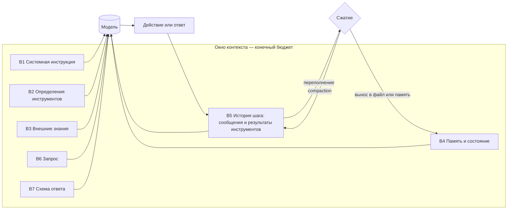

# Agent Context Engineering: введение и карта чтения

## Карта чтения

| Файл | Главный вопрос |
| --- | --- |
| [`10-theory.md`](10-theory.md) | Что такое контекст агента как объект проектирования, из каких блоков он собран и почему «больше контекста» ≠ «лучше результат»? |
| [`20-taxonomy.md`](20-taxonomy.md) | Какие есть блоки входа, приёмы формулирования инструкций, стратегии подачи знаний и управления объёмом — и откуда эта таксономия взята? |
| [`30-decision-framework.md`](30-decision-framework.md) | По каким измеримым порогам выбирается подход: сколько токенов, куда положить инструкцию, что вынести из промпта, когда сжимать? |
| [`40-practice-and-cases.md`](40-practice-and-cases.md) | Что делают вендоры и фреймворки, какие контекстные сбои воспроизводимы и чем промпт версионируется и тестируется? |
| [`50-open-research.md`](50-open-research.md) | Что остаётся открытым, чем это отличается от B-091, как связано с соседними модулями и чему здесь учить? |

## BLUF

1. **Предмет сместился с формулировки сообщения на управление состоянием
   окна.** Anthropic формулирует контекст-инжиниринг как «набор стратегий
   курирования и поддержания оптимального набора токенов **во время инференса**»
   и явно противопоставляет его промпт-инжинирингу как написанию удачной
   формулировки — потому что у агента вход пересобирается на каждом шаге цикла
   ([Anthropic, Effective context engineering](https://www.anthropic.com/engineering/effective-context-engineering-for-ai-agents)).
   LangChain фиксирует ту же смену предмета со стороны фреймворков
   ([LangChain](https://blog.langchain.com/the-rise-of-context-engineering/)).
2. **Контекст — конечный ресурс с убывающей отдачей, а не свободное место.**
   Деградация на длинном входе воспроизведена независимо: U-образная кривая по
   позиции релевантного документа ([Liu et al., TACL 2024](https://arxiv.org/abs/2307.03172)),
   расхождение заявленной и эффективной длины окна ([RULER](https://arxiv.org/abs/2404.06654)),
   падение 11 из 12 моделей ниже 50% своего короткоконтекстного базиса к 32K при
   снятии буквального совпадения слов ([NoLiMa](https://arxiv.org/abs/2502.05167)),
   деградация даже на простых задачах при росте длины входа
   ([Chroma, Context Rot](https://research.trychroma.com/context-rot)).
3. **Вход — это объект со структурой, а не текст.** И Anthropic, и OpenAI
   описывают агента как триаду «модель + инструменты + инструкции», где
   инструкции и подаваемые данные проектируются отдельно от модели
   ([OpenAI, A practical guide to building agents](https://cdn.openai.com/business-guides-and-resources/a-practical-guide-to-building-agents.pdf)).
   Модуль раскладывает вход на семь блоков B1–B7 (см. [`10-theory.md`](10-theory.md))
   и делает каждый блок отдельной точкой решения.
4. **Конфликт инструкций разрешается уровнем, а не формулировкой.** Отраслевая
   норма — явная иерархия «системное сообщение > сообщение разработчика >
   сообщение пользователя > содержимое инструментов и документов»
   ([OpenAI Model Spec](https://model-spec.openai.com/),
   [Wallace et al.](https://arxiv.org/abs/2404.13208)). Спорить с этим внутри
   одного уровня, добавляя «ОБЯЗАТЕЛЬНО» капслоком, — работа не с той
   переменной.
5. **Позиция инструкции — управляемый параметр.** Руководство OpenAI по GPT-4.1
   рекомендует при длинном контексте помещать инструкции и в начало, и в конец
   входа, а если бюджет позволяет только одно место — в начало
   ([OpenAI, GPT-4.1 prompting guide](https://cookbook.openai.com/examples/gpt4-1_prompting_guide)).
   Это прямое инженерное следствие U-кривой из тезиса 2.
6. **Форма промпта — не косметика: она измеримо меняет результат.**
   Семантически эквивалентные варианты форматирования одного и того же промпта
   дают разброс до 76 процентных пунктов точности, и ранжирование моделей от
   формата тоже меняется ([Sclar et al., FormatSpread](https://arxiv.org/abs/2310.11324)).
   Следствие для практики: промпт без регрессионного набора — это не артефакт, а
   черновик.
7. **Промпт — носитель приоритета, а не гарантии.** Хаб уже зафиксировал
   отрицательную часть: ярус G1 «текст в промпте» даёт гарантию «ничего»
   ([`task-processing/20-taxonomy.md`](../task-processing/20-taxonomy.md)),
   гипотеза H12 — «промпт худший носитель критического правила»
   ([`task-processing/10-theory.md`](../task-processing/10-theory.md)). Модуль
   даёт положительную часть: что тогда в промпте **должно** быть и как это
   сформулировать, — и правило переноса требования на ярусы G2–G7
   (см. [`30-decision-framework.md`](30-decision-framework.md)).
8. **Экономика сборки входа задаёт порядок блоков.** Кэширование префикса
   переводит повторно подаваемую часть контекста в другую ценовую категорию
   (чтение из кэша тарифицируется как 0.1× базовой цены входных токенов у
   Anthropic при минимальном кэшируемом префиксе от 1024 токенов
   ([Anthropic, prompt caching](https://docs.claude.com/en/docs/build-with-claude/prompt-caching));
   автоматическая скидка на повторяющийся префикс от 1024 токенов у OpenAI
   ([OpenAI, prompt caching](https://platform.openai.com/docs/guides/prompt-caching))).
   Отсюда жёсткое правило: статическое — в начало, динамическое — в конец, и
   никаких меток времени в системном блоке.

## Объект и метод

Модуль рассматривает **вход модели на одном шаге агентного цикла**: из каких
блоков он собирается, чем каждый блок оправдан, как распределяется бюджет окна и
как эта сборка проверяется перед выпуском. Объект — граница «Человек → Агент»:
как поставить задачу и дать контекст.

Evidence разделено на три неравнозначных класса — в том же виде, что и в
соседних модулях:

| Класс | Что доказывает | Чего не доказывает |
| --- | --- | --- |
| peer-reviewed papers и открытые бенчмарки | результат на опубликованной выборке, протоколе и поколении моделей | переносимость на наш корпус, наши модели и наши задачи |
| официальная документация вендоров и фреймворков | наличие механизма и рекомендуемый способ его применения на дату проверки | его качество, цену и стабильность рекомендации между версиями моделей |
| engineering-блоги вендоров | инженерный опыт эксплуатации в масштабе | воспроизводимость: внутренние eval-наборы закрыты |

Дата проверки источников — **2026-08-17**. Это обзор индустриальных практик, а
не локальный бенчмарк: он не выбирает архитектуру Source Intelligence Engine, не
пишет RFC и не вводит правил репозитория (AI Governance, Rule 4).

## Сквозная модель

Три узла определяют качество всей схемы: **отбор** (что вообще попадает в окно),
**размещение** (в каком блоке и в каком месте окна) и **вытеснение** (что
уходит, когда места не хватает). Петля `A → B5` — причина, по которой предмет
модуля шире одного промпта: вход растёт сам по себе, и без правила вытеснения
любая удачная формулировка тонет в накопленных результатах инструментов
([Anthropic](https://www.anthropic.com/engineering/effective-context-engineering-for-ai-agents)).

## Границы модуля

Модуль намеренно узок; соседние предметы принадлежат другим артефактам Хаба.

| Смежная тема | Владелец | Граница |
| --- | --- | --- |
| Что хранить между шагами, сессиями и перезапусками, забывание, темпоральность | [`memory/`](../memory/00-introduction.md) | память отвечает на вопрос **хранения**, контекст-инжиниринг — на вопрос **сборки на текущем шаге**: одно и то же воспоминание может быть в хранилище и не быть в окне |
| Декомпозиция задачи, планирование, мандаты, ярусы guardrail G1–G7 | [`task-processing/`](../task-processing/00-introduction.md) | task-processing владеет исполнением **внутри** цикла и решает, **где** стоит контроль; модуль берёт вывод «в промпте гарантии нет» как вход и определяет, что тогда в промпт класть |
| Как достать релевантный фрагмент из корпуса | [`retrieval/`](../retrieval/00-introduction.md) | retrieval отвечает «чем достать и насколько это релевантно», модуль — «класть ли достанное в окно заранее, по требованию или не класть вовсе» |
| Контракт вызова инструмента, восстановление после отказа | [`tool-use/`](../tool-use/00-introduction.md) | tool-use владеет протоколом и жизненным циклом вызова; модуль — только текстовой частью: как описание инструмента и текст ошибки читаются моделью |
| Классификация промптов как артефактов библиотеки БА (6 осей, уровни зрелости проекта) | [`research/hub/2026-05-28-prompts-classification-standard.md`](../../hub/2026-05-28-prompts-classification-standard.md) | стандарт классифицирует **готовые промпты как артефакты** для выбора человеком; модуль проектирует **вход агента в рантайме**. Соответствие осей и явная граница — в [`20-taxonomy.md`](20-taxonomy.md#граница-с-классификацией-промптов-хаба) |
| Измерение качества, golden sets, LLM-as-judge | [`evaluation/`](../evaluation/00-introduction.md) | evaluation владеет метриками и порогами; модуль лишь требует их наличия как ворот изменения промпта и не назначает числовых порогов |

Не рассматриваются: обучение и дообучение моделей под инструкцию (RLHF,
instruction tuning), состязательные атаки на промпт (prompt injection,
jailbreak) глубже, чем это нужно для правила «инструкция из внешних данных —
данные, а не инструкция», и мультимодальный вход.
