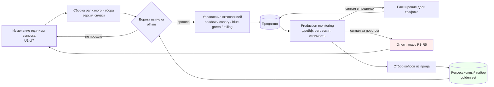

# Agent Delivery & Release: введение и карта чтения

## Карта чтения

| Файл | Главный вопрос |
| --- | --- |
| [`10-theory.md`](10-theory.md) | Что именно выпускается, когда «выпускают агента», и чем релиз недетерминированной системы отличается от релиза кода? |
| [`20-taxonomy.md`](20-taxonomy.md) | Какие есть единицы выпуска, стратегии выката, механизмы управления экспозицией, классы дрейфа и классы отката — и откуда эта таксономия взята? |
| [`30-decision-framework.md`](30-decision-framework.md) | По каким числам выбирается стратегия выката, какие ворота обязательны, при каком сигнале откатывать и за какое время? |
| [`40-practice-and-cases.md`](40-practice-and-cases.md) | Что реально поддерживают платформы выката и мониторинга, какие релизные отказы воспроизводимы и чем спорит индустрия? |
| [`50-open-research.md`](50-open-research.md) | Что проверяется только на собственных данных, как замыкается петля «прод → golden set», чему здесь учить? |

## BLUF

1. **Выпускается не код, а связка.** Единица выпуска агента — это набор
   «модель + системный промпт + определения инструментов + политики/guardrails +
   индекс retrieval + конфигурация оркестрации», и его части версионируются
   независимо друг от друга. Причина, по которой их нельзя выпускать порознь,
   названа в ML-инженерии прямо: у ML-систем нет изолированных изменений, любое
   изменение меняет всё (**CACE — Changing Anything Changes Everything**,
   [Sculley et al., NeurIPS 2015](https://papers.nips.cc/paper/5656-hidden-technical-debt-in-machine-learning-systems)).
2. **Релиз недетерминированной системы не бывает «зелёным».** Тест кода даёт
   бинарный ответ, eval агента даёт распределение с доверительным интервалом.
   Поэтому ворота выпуска формулируются как порог на нижней границе интервала и
   на критических срезах, а не как «тесты прошли»
   ([`evaluation/30-decision-framework.md`](../evaluation/30-decision-framework.md),
   [Breck et al., The ML Test Score](https://research.google/pubs/the-ml-test-score-a-rubric-for-ml-production-readiness-and-technical-debt-reduction/)).
3. **Часть релизов вы не инициируете.** Провайдер модели депрекирует и заменяет
   версии по собственному расписанию
   ([Anthropic, model deprecations](https://docs.claude.com/en/docs/about-claude/model-deprecations),
   [OpenAI, deprecations](https://platform.openai.com/docs/deprecations)).
   Отсюда требование, которого нет в релизе обычного кода: **версия модели
   пинуется явно, а календарь депрекаций — часть релизного плана**.
4. **Экспозиция — управляемый параметр, а не побочный эффект.** Индустриальная
   норма — выпускать на долю трафика и расширять её по измеренному сигналу:
   canary как метод оценки релиза на подмножестве пользователей
   ([Google SRE Workbook, Canarying Releases](https://sre.google/workbook/canarying-releases/)),
   веса трафика в service mesh
   ([Istio, traffic shifting](https://istio.io/latest/docs/tasks/traffic-management/traffic-shifting/)),
   пошаговое расширение с автоматическим анализом
   ([Argo Rollouts](https://argoproj.github.io/argo-rollouts/),
   [Flagger](https://docs.flagger.app/)).
5. **Скорость отката важнее скорости выката.** Blue-green держит вторую полную
   среду именно ради мгновенного переключения обратно
   ([Fowler, BlueGreenDeployment](https://martinfowler.com/bliki/BlueGreenDeployment.html)),
   feature flag даёт «kill switch» без передеплоя
   ([Hodgson, Feature Toggles](https://martinfowler.com/articles/feature-toggles.html),
   [LaunchDarkly](https://docs.launchdarkly.com/home/flags)). Индустриальная
   метрика, по которой это меряется, — **time to restore service** из четвёрки
   DORA ([DORA, four keys](https://dora.dev/guides/dora-metrics-four-keys/)).
6. **Не всё откатывается.** Откат веса трафика обратим за секунды; отправленное
   письмо, выполненный платёж и перезаписанный индекс — нет. Поэтому необратимые
   действия агента защищаются не откатом, а предварительным ограничением: слой
   guardrail'ов и человек в контуре для действий высокого риска
   ([OpenAI, A practical guide to building agents](https://cdn.openai.com/business-guides-and-resources/a-practical-guide-to-building-agents.pdf)).
7. **Дрейф — это класс отказа, а не «падение метрики».** Индустрия различает
   сдвиг входного распределения, сдвиг целевого и изменение самой зависимости
   ([Huyen, Data Distribution Shifts and Monitoring](https://huyenchip.com/2022/02/07/data-distribution-shifts-and-monitoring.html)),
   и меряет их разными статистиками — PSI, Jensen–Shannon, Wasserstein,
   KS-тест ([Evidently, data drift](https://docs.evidentlyai.com/metrics/explainer_drift)).
   Лечение у классов разное, и путать их — значит переобучать систему там, где
   сломался парсер.
8. **Контур замыкается только через возврат наблюдения в тест.** Production
   escape, не превратившийся в кейс регрессионного набора, будет повторён.
   Платформы поддерживают этот путь явно: онлайн-оценка на живом трафике и
   добавление трейсов в датасет
   ([LangSmith](https://docs.langchain.com/langsmith/home),
   [Braintrust](https://www.braintrust.dev/docs),
   [Arize Phoenix](https://arize.com/docs/phoenix),
   [W&B Weave](https://weave-docs.wandb.ai/)). Открытый вопрос
   [`evaluation/50-open-research.md`](../evaluation/50-open-research.md)
   («как обнаруживаются drift и production escapes») адресуется именно сюда.

## Объект и метод

Модуль рассматривает **границу «Агент → Продакшн»**: что считается релизом
агента, какие ворота он проходит, как расширяется его экспозиция, по каким
сигналам его откатывают и как наблюдение возвращается в проверку. Предмет —
механизм доставки, а не качество агента: **числовые пороги качества модуль не
назначает, он требует, чтобы они были назначены и связаны с решением о выпуске**.

Evidence разделено на три неравнозначных класса — в том же виде, что и в
соседних модулях:

| Класс | Что доказывает | Чего не доказывает |
| --- | --- | --- |
| peer-reviewed papers и отраслевые исследования с публичной методологией (DORA, ML Test Score) | наличие связи на опубликованной выборке и её методологию | что связь причинная и переносится на команду из трёх человек и одного агента |
| официальная документация платформ (Kubernetes, Istio, Argo Rollouts, Flagger, LaunchDarkly, Unleash, LangSmith, Phoenix, Braintrust, Weave, Evidently) | наличие механизма, его параметры и значения по умолчанию на дату проверки | что дефолт платформы — правильное значение для вашей нагрузки |
| engineering-книги и блоги вендоров (Google SRE, Fowler, Anthropic, OpenAI) | инженерный опыт эксплуатации в масштабе и словарь предмета | воспроизводимость: внутренние данные и eval-наборы закрыты |

Дата проверки источников — **2026-08-18**. Это обзор индустриальных практик, а
не локальный бенчмарк: он не выбирает пайплайн для Source Intelligence Engine,
не пишет RFC и не вводит правил репозитория (AI Governance, Rule 4). Числа, у
которых нет внешнего источника, помечены в
[`30-decision-framework.md`](30-decision-framework.md) как **инженерный дефолт
Хаба, подлежащий замеру**.

## Сквозная модель: контур выпуска

Контур держится на трёх узлах, и каждый из них — точка отказа со своим
владельцем: **ворота** (что не выпускается вообще), **экспозиция** (на ком
проверяется то, что выпустили) и **возврат** (что происходит с наблюдением).
Разрыв любого из трёх превращает остальные в ритуал: ворота без экспозиции
проверяют агента на данных, которых в проде нет; экспозиция без возврата
повторяет один и тот же инцидент; возврат без ворот копит кейсы, которые никто
не прогоняет.

## Границы модуля

Модуль намеренно узок. Соседние предметы принадлежат другим артефактам Хаба, и
пересечения разведены по вопросу, а не по словам.

| Смежная тема | Владелец | Граница |
| --- | --- | --- |
| Метрики качества, golden sets, LLM-as-judge, пороги и доверительные интервалы | [`evaluation/`](../evaluation/00-introduction.md) | evaluation отвечает **«насколько агент хорош и как это измерить»**; модуль — **«что делать с измеренным: выпускать, расширять, откатывать»**. Числовые пороги качества назначает evaluation, модуль лишь требует, чтобы у каждых ворот был назначенный порог и владелец |
| Трассировка выполнения, спаны, `trace_id`, сэмплирование, семантические соглашения OTel | [`observability/`](../observability/00-introduction.md) | observability отвечает **«что происходит внутри одного прогона»**; модуль — **«что происходит с популяцией прогонов между версиями»**: дрейф распределения, регрессия после выката, сравнение canary с baseline. Модуль потребляет телеметрию observability и не проектирует её |
| CI/CD кодовой базы: сборка, тесты, линтеры, публикация пакетов | [`research/cicd/`](../../cicd/README.md) | cicd владеет пайплайном **кода**; модуль — доставкой **агента как системы**, где половина единиц выпуска (промпт, версия модели, индекс, политики) вообще не проходит компиляцию и не ловится юнит-тестом |
| Декомпозиция, планирование, ярусы guardrail G1–G7, мандаты исполнителя | [`task-processing/`](../task-processing/00-introduction.md) | task-processing владеет **исполнением внутри цикла** и тем, где стоит контроль; модуль берёт ярусы как вход и добавляет измерение времени: **на каком проценте трафика и с какого момента мандат расширяется** |
| Сборка входа модели, бюджет окна, версионирование промпта как артефакта (ось F0–F5) | [`agent-context-engineering/`](../agent-context-engineering/00-introduction.md) | ACE владеет **содержанием** промпта и его подготовкой к выпуску (ворота изменения промпта, §7 его рамки); модуль — **выкатом** изменённого промпта в прод и его откатом. Стык явный: ворота ACE — это offline-часть ворот этого модуля |
| Что хранится между сессиями, забывание, темпоральность | [`memory/`](../memory/00-introduction.md) | memory владеет содержимым и жизненным циклом хранилища; модуль — только вопросом **обратимости**: миграция схемы памяти и переиндексация относятся к классу откатов R4 и требуют плана отката до выката |
| Цена координации, топология команды агентов | [`multi-agent-orchestration/`](../multi-agent-orchestration/00-introduction.md) | MAO владеет решением «сколько агентов»; модуль — тем, что **релизной единицей становится вся топология**: выкат одного участника меняет поведение остальных (CACE) |
| Контракт вызова инструмента, восстановление после отказа | [`tool-use/`](../tool-use/00-introduction.md) | tool-use владеет протоколом вызова; модуль — версионированием набора инструментов как части релизного набора и классом дрейфа D4 «инструмент/среда изменились под агентом» |

Не рассматриваются: инфраструктура развёртывания как таковая (кластеры, образы,
сети), обучение и дообучение моделей, экономика закупки inference, юридические
режимы выпуска ИИ-систем. Каталог `research/cicd/` и `research/ai-education/`
границ не меняют: модуль не создаёт новых governance-файлов и не переписывает
чужие правила (Anti-Inflation, AI Governance Rule 4).

## Research questions

| # | Вопрос | Где отвечается |
| --- | --- | --- |
| RQ1 | Что является атомарной единицей выпуска агента и почему её нельзя выпускать по частям | [`10-theory.md §1–§2`](10-theory.md) |
| RQ2 | Чем релиз недетерминированной системы отличается от релиза кода | [`10-theory.md §3`](10-theory.md) |
| RQ3 | Какие стратегии выката существуют и из каких источников выведена их таксономия | [`20-taxonomy.md`](20-taxonomy.md) |
| RQ4 | По каким измеримым признакам выбирается стратегия и настраиваются её параметры | [`30-decision-framework.md §2–§5`](30-decision-framework.md) |
| RQ5 | Какие сигналы прода обязаны приводить к откату и за какое время | [`30-decision-framework.md §6–§7`](30-decision-framework.md) |
| RQ6 | Как наблюдение возвращается в проверку и не теряется | [`30-decision-framework.md §8`](30-decision-framework.md), [`50-open-research.md §3`](50-open-research.md) |
