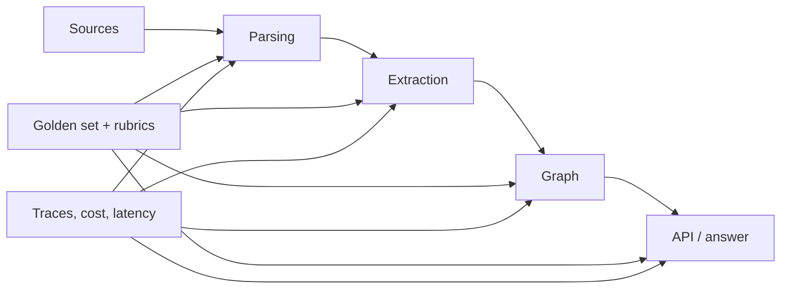

# Agentic Evaluation: введение и карта чтения

## Карта чтения

| Файл | Главный вопрос |
| --- | --- |
| [`10-theory.md`](10-theory.md) | Что именно измеряет eval и почему одного score недостаточно? |
| [`20-taxonomy.md`](20-taxonomy.md) | Какие метрики соответствуют RAG, extraction, graph и agent tasks? |
| [`30-decision-framework.md`](30-decision-framework.md) | Как собрать risk-based контракт качества и golden set? |
| [`40-practice-and-cases.md`](40-practice-and-cases.md) | Что поддерживают Ragas, DeepEval, TruLens, LangSmith, Braintrust и Promptfoo? |
| [`50-open-research.md`](50-open-research.md) | Что остаётся проверить локально и чему учить бизнес-аналитика? |

## BLUF

1. **Eval — это система измерений, а не одна метрика.** Нужны отдельно
   component, end-to-end, safety, cost и latency signals; агрегат не должен
   скрывать критический провал.
2. **Faithfulness не равна истинности.** Ответ может точно воспроизводить
   ошибочный контекст. Поэтому source grounding, source authority и factual
   correctness — разные оси ([RAGAS](https://aclanthology.org/2024.eacl-demo.16/)).
3. **LLM-as-judge масштабирует semantic review, но не отменяет калибровку.**
   MT-Bench показал высокое согласие сильного judge с людьми на своём протоколе,
   одновременно выявив position, verbosity и self-enhancement biases
   ([Zheng et al.](https://arxiv.org/abs/2306.05685)).
4. **Golden set — версионированная выборка решений и ошибок.** Она должна
   включать обычные, пограничные, негативные и high-impact случаи, provenance
   разметки и disagreement, а не только «идеальные ответы».
5. **Для графа текстового score недостаточно.** Нужны entity/relation/triple
   precision, recall и F1, resolution false-merge/false-split, provenance
   coverage, constraint violations и downstream query success.
6. **Фреймворк не создаёт валидность.** Инструменты различаются прежде всего
   execution model, datasets, tracing, CI и hosting; смысл rubric, gold и
   acceptance threshold остаётся доменным решением.
7. **Порог нельзя импортировать из статьи.** Он выводится из цены false accept /
   false reject, human baseline и локального confidence interval. Числа вроде
   `faithfulness > 0.9` до калибровки — гипотезы, не DoD.

## Объект и метод

Модуль рассматривает evaluation для цепочки `source → parsing → extraction →
resolution → graph → retrieval/API`. Evidence разделено на: официальные
контракты продуктов, peer-reviewed papers/benchmarks и vendor case studies.
Документация доказывает наличие функции, но не её качество на нашем домене;
benchmark доказывает результат только для опубликованной выборки и протокола.

Это сравнительный обзор, не локальный benchmark. Он не выбирает архитектуру
Source Intelligence Engine и не вводит правила репозитория.

## Сквозная модель

Оценка на каждом переходе локализует дефект; end-to-end задача показывает,
сохранилась ли бизнес-полезность. Только один из этих видов не диагностирует
конвейер полностью.
