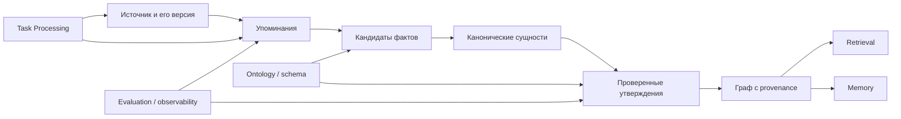

# Information Extraction & Graph Modeling: введение и карта чтения

## Карта чтения

| Файл | Главный вопрос | Быстрый маршрут |
| --- | --- | --- |
| [`00-introduction.md`](00-introduction.md) | Что исследовано и как читать результат? | всем |
| [`10-theory.md`](10-theory.md) | Какие объекты и решения образуют конвейер? | архитектору, исследователю |
| [`20-taxonomy.md`](20-taxonomy.md) | Какие классы методов, схем и графов существуют? | аналитику, инженеру |
| [`30-decision-framework.md`](30-decision-framework.md) | Как сравнивать варианты без преждевременного выбора стека? | владельцу продукта, архитектору |
| [`40-practice-and-cases.md`](40-practice-and-cases.md) | Что реально дают фреймворки и чему учить бизнес-аналитика? | инженеру, преподавателю |
| [`50-open-research.md`](50-open-research.md) | Что остаётся неизвестным, как связаны модули и где источники? | ревьюеру, автору следующего исследования |

## Граф зависимостей

## Summary / BLUF

1. **Извлечение — не одна операция.** Полезная единица конвейера — не JSON и
   не тройка, а утверждение с каноническими участниками, источником, точным
   фрагментом evidence, временем и состоянием проверки.
2. **Строгая схема решает синтаксис, а не истинность.** Constrained decoding у
   OpenAI и Anthropic обеспечивает разбор выводов по поддерживаемой JSON Schema,
   но не доказывает полноту, корректность сущностей или связей
   ([OpenAI Structured Outputs](https://platform.openai.com/docs/guides/structured-outputs),
   [Anthropic Structured Outputs](https://platform.claude.com/docs/en/build-with-claude/structured-outputs)).
3. **Closed-schema и open-schema extraction — разные продукты.** Первый
   проверяет текст против заранее заданной онтологии; второй обнаруживает новые
   типы и отношения и поэтому требует последующей кластеризации, naming review
   и governance словаря.
4. **Coreference и entity resolution нельзя сворачивать в один fuzzy match.**
   Coreference связывает упоминания в контексте; entity linking сопоставляет их
   с каноническим ID; normalization приводит значения и имена к форме; entity
   resolution объединяет записи из нескольких источников. Ошибка на этом слое
   превращает локальную неточность в ложный узел или ложное слияние графа.
5. **Графовая модель должна сохранять evidence до дедупликации.** Иначе после
   объединения `OpenAI`, `Open AI` и `OpenAI Inc.` нельзя объяснить, какой
   источник утверждал конкретную связь или отменить только одну версию факта.
6. **Property graph, RDF и in-memory graph оптимизируют разные задачи.** RDF
   даёт стандартизованные идентификаторы, triples/datasets и shapes; property
   graph удобен для прикладных свойств и traversal; NetworkX — библиотека
   анализа в памяти, а не долговременная multi-user база
   ([RDF 1.2 Concepts](https://www.w3.org/TR/rdf12-concepts/),
   [NetworkX data structure](https://networkx.org/documentation/stable/reference/introduction.html)).
7. **Graph database и vector index не заменяют друг друга.** Векторный индекс
   ищет близкие представления; графовая структура отвечает на точные связи и
   пути. Гибрид полезен только при раздельной оценке retrieval и factual graph.
8. **LLM особенно полезен на старте и длинном хвосте схемы, но не всегда на
   массовом устойчивом потоке.** При фиксированной онтологии, размеченных данных
   и высокой нагрузке специализированная модель или правила могут быть дешевле
   и точнее. Исследования показывают сильную зависимость от домена, сложности
   графа и определения метрики
   ([Wadhwa et al., 2023](https://aclanthology.org/2023.acl-long.868/),
   [Jiang et al., 2024](https://aclanthology.org/2024.naacl-long.155/),
   [Taillé et al., 2026](https://aclanthology.org/2026.acl-short.17/)).
9. **Итеративность оправдана измеримым вторым проходом.** Отдельные проходы
   discovery → normalization → verification снижают когнитивную нагрузку одной
   генерации; бесконтрольная self-reflection без внешнего evidence лишь
   умножает стоимость и уверенность.
10. **Мультиагентность — способ разнести роли, не гарантия качества.** Она
    оправдана независимыми источниками или проверяющими с разными инструментами;
    несколько одинаковых моделей над одним фрагментом дают коррелированные
    ошибки.
11. **Оценивать нужно по слоям.** Минимум: mention/entity/relation precision,
    recall и F1; accuracy linking; false-merge/false-split; schema violations;
    provenance coverage; противоречия; стоимость и latency на документ; затем
    downstream-вопросы, которые граф должен поддерживать.
12. **Для бизнес-аналитика главный результат — контракт извлечения.** Он задаёт
    объект решения, онтологию и её open-world границы, правила идентичности,
    evidence/provenance, политику неопределённости, golden set и цену ошибок.

## Research questions

### Методы и качество

- RQ1. Где проходит граница между NER, relation/event extraction, coreference,
  entity linking и graph construction?
- RQ2. Когда rules/specialized NLP устойчивее prompt-based LLM extraction?
- RQ3. Что действительно гарантируют JSON mode, JSON Schema и Pydantic?
- RQ4. Когда one-shot достаточно, а когда нужен каскад или независимая проверка?
- RQ5. Как оценивать generative extraction, если gold annotation неполна?

### Идентичность и модель графа

- RQ6. Как не смешать упоминание, сущность и запись источника?
- RQ7. Какие ключи и evidence нужны для обратимого merge/split сущностей?
- RQ8. Когда нужен property graph, RDF/ontology, relational representation или
  NetworkX?
- RQ9. Как представлять время, отрицание, модальность и противоречащие claims?
- RQ10. Какой минимум provenance позволяет аудит и переизвлечение?

### Эксплуатация и образование

- RQ11. Как сравнивать LangChain, LlamaIndex, OpenAI Agents SDK и Anthropic, не
  смешивая orchestration с качеством модели?
- RQ12. Где действительно помогает graph database, а где это преждевременная
  инфраструктура?
- RQ13. Какие метрики показывают экономику, а не только benchmark F1?
- RQ14. Как graph extraction стыкуется с Retrieval, Memory и Task Processing?
- RQ15. Какие решения обязан явно поставить бизнес-аналитик?

## Метод и границы доказательности

Исследование — сравнительный обзор, а не benchmark конкретного корпуса. Оно
использует четыре уровня свидетельств:

| Класс | Что доказывает | Чего не доказывает |
| --- | --- | --- |
| S1 — спецификация / официальная документация | существование API, семантику контракта, заявленные ограничения | качество на чужом домене |
| S2 — peer-reviewed paper / benchmark | результат на описанном датасете и протоколе | production TCO и переносимость |
| S3 — open-source implementation | реализуемость механизма, наблюдаемую форму кода | production maturity без отдельной evidence |
| S4 — vendor case / engineering report | реальный сценарий и заявленную эксплуатационную мотивацию | независимую сравнительную эффективность |

Все продуктовые выводы здесь условны относительно языка, домена, качества
исходного текста, онтологии, модели и времени проверки. Цены провайдеров быстро
меняются, поэтому рамка сравнивает число проходов, токены, инфраструктуру и
human review, а не фиксирует прайс. Эксперимент не создавался: issue требует
отраслевую фактологическую базу, а не выбор модели на локальном корпусе.

## Границы

- Не предлагается архитектура Source Intelligence Engine и не выбирается стек.
- Не вводятся правила или нормативные требования репозитория.
- GraphRAG рассматривается как downstream consumer, а не как синоним extraction.
- Мультимодальное OCR/layout extraction отмечено как соседний слой, но не
  исследовано глубоко.
- Security, privacy, licensing и deletion входят как интерфейсы, но не заменяют
  отдельное исследование этих доменов.
