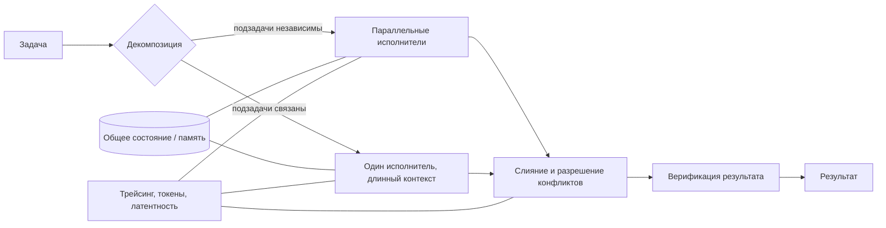

# Multi-Agent Orchestration: введение и карта чтения

## Карта чтения

| Файл | Главный вопрос |
| --- | --- |
| [`10-theory.md`](10-theory.md) | Что такое оркестрация, откуда берётся её цена и почему мультиагентные системы отказывают? |
| [`20-taxonomy.md`](20-taxonomy.md) | Какие есть паттерны оркестрации и механизмы координации, и где проходят их границы? |
| [`30-decision-framework.md`](30-decision-framework.md) | Когда команда агентов окупается, и подтверждается ли принцип RFC #470 §P.5? |
| [`40-practice-and-cases.md`](40-practice-and-cases.md) | Что реально поддерживают LangGraph, CrewAI, Microsoft Agent Framework, OpenAI Agents SDK, MetaGPT, CAMEL и протоколы A2A/MCP? |
| [`50-open-research.md`](50-open-research.md) | Как это встраивается в Source Intelligence Engine, чему учить любые роли и что остаётся проверить локально? |

## BLUF

1. **Мультиагентность — это способ купить параллелизм и изоляцию контекста за
   токены, латентность и риск рассогласования.** Anthropic измерила у себя
   ≈×4 токенов у агента против чата и ≈×15 у мультиагентной системы
   ([Anthropic](https://www.anthropic.com/engineering/multi-agent-research-system)).
   Это эмпирически подтверждает формулировку RFC #470 §P.5: команда — покупка за
   конкретную цену, а не улучшение по умолчанию.
2. **Главный отказ мультиагентных систем — не «глупая модель», а организация.**
   MAST по 1 000+ размеченных трейсов из 7 фреймворков даёт 14 режимов отказа в
   трёх категориях: specification issues 41.77%, inter-agent misalignment 36.94%,
   task verification 21.30% (Cohen's κ = 0.88)
   ([Cemri et al.](https://arxiv.org/abs/2503.13657)). Почти 79% отказов лежат
   вне «качества рассуждения» одного агента.
3. **Индустрия расколота, и это содержательный раскол, а не мода.** Anthropic
   сообщает о выигрыше orchestrator-worker над одиночным агентом на своём
   research-eval (+90.2% на внутреннем наборе), Cognition (Devin) публикует
   противоположный вывод «не стройте мультиагентов» для задач с общим контекстом
   ([Cognition](https://cognition.com/blog/dont-build-multi-agents)). Оба правы
   в своих границах: расходится не оценка, а класс задачи.
4. **Разделительная линия — независимость подзадач и стоимость слияния.**
   Мультиагентность выигрывает на breadth-first поиске, где подзадачи почти
   независимы и результат сливается дёшево; проигрывает там, где решения
   агентов взаимозависимы (кодинг, единый артефакт), потому что цена интеграции
   растёт быстрее выигрыша от параллелизма.
5. **Debate/дебаты — не бесплатный ускоритель качества.** При равном
   вычислительном бюджете multi-agent debate у Smit et al. не превзошёл
   устойчиво self-consistency и ensembling и оказался чувствителен к
   гиперпараметрам ([Smit et al.](https://arxiv.org/abs/2311.17371)). Это
   уточняет нашу практику adversarial stress testing: её ценность — в
   ортогональности перспектив и опровержении, а не в «больше голосов = точнее».
6. **Топология победила «эмерджентность».** К 2026 индустриальный мейнстрим —
   явные графы/workflow с состоянием, чекпоинтами и детерминированной передачей
   управления (LangGraph, Microsoft Agent Framework workflows), а не свободный
   чат агентов. Free-form conversation остаётся исследовательским и
   демонстрационным режимом.
7. **Консолидация фреймворков — фактор выбора 2026.** OpenAI Swarm переведён в
   образовательный статус в пользу Agents SDK; AutoGen и Semantic Kernel слиты в
   Microsoft Agent Framework 1.0 (апрель 2026), AutoGen — в режиме сопровождения
   ([Microsoft Learn](https://learn.microsoft.com/en-us/agent-framework/overview/)).
   Ставка на конкретный SDK устаревает быстрее, чем ставка на паттерн.
8. **Наблюдаемость — предусловие, а не дополнение.** Без трейсинга с общим
   идентификатором выполнения нельзя ни отнести отказ к конкретному агенту, ни
   посчитать реальную цену координации. Отраслевая точка схождения —
   OpenTelemetry GenAI semantic conventions, где SIG прорабатывает конвенции для
   multi-agent систем ([OTel GenAI SIG](https://github.com/open-telemetry/semantic-conventions-genai/issues/35)).

## Объект и метод

Модуль рассматривает **оркестрацию** — то есть распределение работы, передачу
управления, обмен состоянием и слияние результатов — между несколькими
LLM-агентами, решающими одну задачу. Объект охватывает конвейер
`источники → парсинг → извлечение → граф → API`, к которому готовится Source
Intelligence Engine.

Evidence разделено на три класса и они не равнозначны:

| Класс | Что доказывает | Чего не доказывает |
| --- | --- | --- |
| peer-reviewed papers и бенчмарки | результат на опубликованной выборке и протоколе | переносимость на наш корпус и модели |
| официальная документация фреймворков | наличие функции на дату проверки | её качество, стоимость и стабильность API |
| vendor / engineering blog posts | инженерный опыт и внутренние измерения | воспроизводимость: внутренние eval-ы закрыты |

Дата проверки источников — 2026-08-11. Это сравнительный обзор, а не локальный
бенчмарк: он не выбирает архитектуру Source Intelligence Engine, не пишет RFC и
не вводит правил репозитория.

## Сквозная модель

Три узла определяют экономику всей схемы: **декомпозиция** (насколько подзадачи
независимы), **слияние** (сколько стоит собрать результат обратно) и
**верификация** (кто ловит ошибку до того, как она попала в артефакт). MAST
показывает, что именно эти узлы, а не «сила» отдельного агента, дают основную
массу отказов ([Cemri et al.](https://arxiv.org/abs/2503.13657)).

## Границы модуля

Не рассматриваются: обучение агентов (RL/fine-tuning мультиагентных политик),
экономические механизмы (аукционы, торги), робототехнические MAS с физическими
ограничениями, а также вопросы безопасности мультиагентных систем глубже, чем
это нужно для оценки цены координации.
