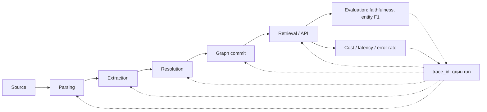

# Observability & Tracing: введение и карта чтения

## Карта чтения

| Файл | Главный вопрос |
| --- | --- |
| [`10-theory.md`](10-theory.md) | Чем логи, метрики, трейсы и профили различаются для агента и что вообще является единицей наблюдения? |
| [`20-taxonomy.md`](20-taxonomy.md) | Какие паттерны трейсинга существуют и какие данные пишутся на каждом уровне? |
| [`30-decision-framework.md`](30-decision-framework.md) | Сколько observability покупать: sampling, retention, где трейс, а где лог? |
| [`40-practice-and-cases.md`](40-practice-and-cases.md) | Что реально дают Langfuse, LangSmith, OpenTelemetry, Phoenix, Braintrust, Helicone и Weave? |
| [`50-open-research.md`](50-open-research.md) | Что должна понимать любая роль и что остаётся проверить локально? |

## BLUF

1. **Observability для агента — это не «включить логи».** Это решение о том,
   какая единица выполнения получает идентификатор, какие данные к ней
   привязываются и сколько они живут. Без корреляционного идентификатора
   многошаговое выполнение не восстанавливается post factum ни одним объёмом
   логов.
2. **Трассировка агента отличается от трассировки workflow тем, что топология
   заранее неизвестна.** У workflow граф шагов фиксирован до запуска; у агента
   следующий шаг — результат решения модели. Поэтому дерево спанов строится во
   время выполнения, а «ожидаемая» форма трейса не может быть проверена
   сравнением с эталоном.
3. **Индустрия сходится на OpenTelemetry как транспорте и модели данных.**
   GenAI-семантические соглашения выделены в отдельный репозиторий
   `open-telemetry/semantic-conventions-genai` и описывают операции `chat`,
   `invoke_agent`, `execute_tool`, `plan`, `retrieval`, `create_memory` и др., а
   также метрики `gen_ai.client.token.usage`,
   `gen_ai.invoke_agent.tool_calls`, `gen_ai.execute_tool.duration`
   ([semconv-genai](https://github.com/open-telemetry/semantic-conventions-genai)).
   Статус атрибутов — `Development`, то есть контракт ещё меняется.
4. **Содержимое промптов и ответов — отдельное решение, а не «часть трейса».**
   Спецификация прямо требует не записывать инструкции, входы и выходы по
   умолчанию и предлагает три режима: не писать, писать в атрибуты спана, писать
   во внешнее хранилище со ссылкой на спан
   ([gen-ai-spans](https://github.com/open-telemetry/semantic-conventions-genai/blob/main/docs/gen-ai/gen-ai-spans.md)).
   Это одновременно cost-, privacy- и access-control-решение.
5. **Полный трейсинг не бесплатен и это измерено.** В Dapper при сэмплировании
   1/1 средняя латентность веб-поиска росла на 16.3%, при 1/16 — на 2.12%, при
   1/1024 — в пределах ошибки измерения; production-версия использовала одну
   трассируемую единицу на 1024 кандидата
   ([Sigelman et al.](https://research.google/pubs/dapper-a-large-scale-distributed-systems-tracing-infrastructure/)).
6. **Прямой перенос ставок сэмплирования из web-инфраструктуры в агентные
   системы некорректен.** У агента трафик на порядки ниже, а стоимость одного
   выполнения на порядки выше; при десятках-сотнях запусков в день выборка 1/1024
   не оставит ни одного трейса инцидента. Ограничением становится не CPU, а объём
   хранения полезной нагрузки и privacy.
7. **Наличие трейса не равно способности объяснить отказ.** В TRAIL — 148
   размеченных человеком агентных трейсов с таксономией ошибок — лучшая модель
   набрала 11% на задаче локализации ошибки в трейсе
   ([Deshpande et al.](https://arxiv.org/abs/2505.08638)). Трейс — необходимое,
   но не достаточное условие диагностики.
8. **Observability — вход для Evaluation, а не альтернатива ему.** Faithfulness,
   Entity F1, cost/doc и p95 latency считаются по данным, которые кто-то должен
   был записать в момент выполнения, с сохранением связи «case → шаг → источник».

## Объект и метод

Модуль рассматривает наблюдаемость цепочки
`source → parsing → extraction → resolution → graph → retrieval/API`, где часть
шагов выполняется агентом, самостоятельно выбирающим следующее действие.

Evidence разделено на три класса и в тексте различается явно:

| Класс | Что доказывает | Чего не доказывает |
| --- | --- | --- |
| спецификации (OTel, W3C) | нормативный контракт и его статус зрелости | что вендор его реализует полностью |
| документация продуктов | наличие функции и коммерческие границы на дату | качество и стоимость на нашей нагрузке |
| статьи и benchmarks | результат на опубликованном протоколе | переносимость чисел на наш домен |

Это сравнительный обзор, а не локальный benchmark. Он не выбирает инструмент для
Хаба, не вводит правил репозитория и не содержит предписаний по изменению нашей
кодовой базы. Коммерческие условия зафиксированы на дату исследования
(2026-08-11) и устаревают быстрее технических характеристик.

## Сквозная модель

Пунктир — корреляция, а не поток данных: один и тот же `trace_id` должен
позволить пройти от метрики качества обратно к конкретному вызову инструмента и
конкретному фрагменту источника. Если эта связь не заложена в момент
инструментирования, она не восстанавливается позже.
