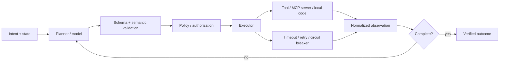

# Tool Use & Function Calling: введение и карта чтения

<!-- CROSS-REVIEW [Codex-validation]: traceability. Ни в одном из шести файлов модуля нет frontmatter-полей source, related_artifacts и related_issues, поэтому ни постановка (issue #485), ни взаимные ссылки модуля не восстанавливаются машинно. Валидатор tools/validate-frontmatter.sh для класса knowledge требует только status, version, updated и temperature, поэтому отклонение проходит CI. Сравнение внутри корпуса: у модуля information-extraction-graph-modeling эти поля заполнены во всех шести файлах, у модулей evaluation и tool-use — ни в одном. -->

## Карта чтения

| Файл | Главный вопрос |
| --- | --- |
| [`10-theory.md`](10-theory.md) | Где проходит граница между решением модели, протоколом и исполнением? |
| [`20-taxonomy.md`](20-taxonomy.md) | Какие виды вызовов, отказов и контуров управления существуют? |
| [`30-decision-framework.md`](30-decision-framework.md) | Как выбрать способ исполнения по риску, зависимости и цене? |
| [`40-practice-and-cases.md`](40-practice-and-cases.md) | Что реально дают OpenAI, Anthropic, MCP и agent frameworks? |
| [`50-open-research.md`](50-open-research.md) | Что ещё нужно измерить локально и чему учить независимо от роли? |

## BLUF

1. **Модель предлагает вызов, но не исполняет его.** JSON Schema и native tool
   calling уменьшают синтаксическую неопределённость; авторизация, таймаут,
   идемпотентность, retry, журнал и проверка результата остаются обязанностью
   runtime ([OpenAI](https://platform.openai.com/docs/guides/function-calling),
   [Anthropic](https://docs.anthropic.com/en/docs/agents-and-tools/tool-use/implement-tool-use)).
2. **MCP — протокол интеграции, не движок надёжности.** Он стандартизует
   discovery/call/result, capability negotiation, progress и cancellation, но
   host по-прежнему отвечает за consent, policy и orchestration
   ([MCP architecture](https://modelcontextprotocol.io/specification/2025-06-18/architecture/index),
   [MCP security](https://modelcontextprotocol.io/specification/2025-03-26/index)).
3. **Надёжный вызов — конечный автомат с durable state.** Минимальные состояния:
   proposed → validated → authorized → dispatched → succeeded/failed/unknown;
   повтор разрешён только по taxonomy ошибок и idempotency contract.
4. **Parallel — свойство графа зависимостей, не пожелание модели.** Параллельны
   только независимые read-only или коммутативные операции в пределах budget;
   state-changing вызовы сериализуются либо получают transactional contract.
5. **Retry не лечит семантическую ошибку.** Backoff + jitter полезны для 429,
   некоторых 5xx и сетевых сбоев; 400/404, schema mismatch и policy denial
   требуют исправления плана, данных или эскалации
   ([AWS Builders' Library](https://aws.amazon.com/builders-library/timeouts-retries-and-backoff-with-jitter/)).
6. **Оценивать нужно траекторию и восстановление.** BFCL покрывает single,
   parallel, multiple, abstention и multi-turn; τ-bench добавляет stateful
   interaction. Высокий single-call score не доказывает надёжность конвейера
   ([BFCL](https://proceedings.mlr.press/v267/patil25a.html),
   [τ-bench](https://arxiv.org/abs/2406.12045)).
7. **Для Source Intelligence Engine нужен не автономный общий агент, а узкий
   typed orchestrator.** Модель уместна там, где есть семантическая
   неопределённость; parsing, SQLite/NetworkX invariants и публикация API должны
   оставаться детерминированными и проверяемыми.

## Объект, метод и границы доказательства

Исследование рассматривает цепочку `intent → tool selection → argument
generation → policy → execution → observation → next action`. Evidence
разделено на официальные API/specification contracts, код поддерживаемых OSS
frameworks, peer-reviewed benchmarks и vendor engineering guidance. Наличие
механизма в документации не доказывает его production reliability; benchmark
не переносится на другой набор инструментов без локальной проверки.

Это фактологическая база и рамка вариантов, а не архитектурная спецификация
Source Intelligence Engine и не предписание изменить репозиторий.

## Сквозная модель

Главное разделение: probabilistic control plane выбирает допустимое действие;
deterministic data plane проверяет и исполняет его. Оно позволяет сменить
модель или протокол без переноса security и reliability policy в prompt.

## Исследовательские вопросы

- Какие функции ReAct сохраняет, когда аргументы уже генерируются native API?
- Где заканчивается function calling и начинается MCP/orchestration?
- Как классифицировать sync, async, parallel и chained calls по зависимости?
- Какие ошибки повторяемы безопасно, а какие требуют replanning или человека?
- Когда отдельный planner оправдывает дополнительную latency и coordination?
- Как сравнивать frameworks без смешения model API, protocol и runtime?
- Какие stage boundaries Source Intelligence Engine должны быть tool calls?
- Как измерять correctness, recovery, latency и стоимость как единый outcome?

## Классы источников

| Класс | Использование |
| --- | --- |
| S1 | спецификации и официальные API-контракты |
| S2 | peer-reviewed paper или воспроизводимый benchmark |
| S3 | исходный код/repository framework |
| S4 | vendor engineering guidance/case study; переносимость ограничена |
| S5 | вторичный обзор; только для поиска, не для ключевого вывода |
