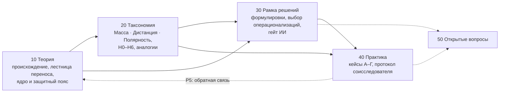

# GRA как исследовательская программа: введение и карта чтения

> **Модуль.** Это файл `00-introduction.md` модуля
> [`research/reputation-technologies/gra-research-program/`](https://github.com/G-Ivan-A/hybrid-Intelligence-lab/tree/main/research/reputation-technologies/gra-research-program).
> Модуль оформлен по **Reference Research Pattern** (модель M2, статус паттерна
> `Validated` по ADR-011). Структура — по
> [RFC: Reference Research Pattern](https://github.com/G-Ivan-A/hybrid-Intelligence-lab/blob/main/docs/rfc/2026-07-17-rfc-reference-research-pattern.md)
> и [`standards/research-standard.md`](https://github.com/G-Ivan-A/hybrid-Intelligence-lab/blob/main/standards/research-standard.md).
>
> **Политика ссылок.** Все ссылки модуля — абсолютные URL (требование issue
> [#657](https://github.com/G-Ivan-A/hybrid-Intelligence-lab/issues/657)). Правило P2
> валидатор `tools/validate-rrp-links.sh` проверяет и по абсолютным ссылкам,
> поэтому исключений из политики нет.
>
> **Статус.** `draft`. Модуль — методологическое основание GRA. Он не отменяет
> [отчёт о концепции фаундера](https://github.com/G-Ivan-A/hybrid-Intelligence-lab/blob/main/research/reputation-technologies/2026-06-20-founders-vision-and-framework.ru.md),
> а задаёт статус его утверждений: что в GRA является исходной концепцией, что
> исследовательской гипотезой и что пока неизвестно.

## BLUF

1. **GRA — открытая исследовательская программа, а не догма и не готовая
   методика.** Она возникла как гипотеза: социально-информационные системы,
   возможно, допускают описание через структурные аналоги физических и
   математических закономерностей. Всё в модели, включая формулу, имеет статус
   гипотезы и требует исследования силами людей и ИИ-команд. Разбор —
   [§1 и §4 файла 10-theory.md](https://github.com/G-Ivan-A/hybrid-Intelligence-lab/blob/main/research/reputation-technologies/gra-research-program/10-theory.md#1-происхождение-gra).
2. **GRA не выросла из гравитационной модели торговли.** Источник GRA — опыт
   фаундера в PR/GR и гипотеза о структурном описании связей. Модель Тинбергена
   — один из нескольких параллельных научных прецедентов переноса физических
   моделей в социальные науки, наряду с «социальной физикой» Стюарта, гипотезой
   Ципфа, теорией поля Левина и статистической физикой социальной динамики.
3. **GRA не наследует физические законы напрямую.** Она исследует, существует
   ли структурное соответствие. Перенос идёт по лестнице из четырёх уровней:
   физическая закономерность → математическая структура → социальная гипотеза →
   прикладная модель. Каждый переход — отдельная гипотеза со своей проверкой
   ([§2 файла 10-theory.md](https://github.com/G-Ivan-A/hybrid-Intelligence-lab/blob/main/research/reputation-technologies/gra-research-program/10-theory.md#2-принцип-структурного-соответствия)).
4. **Масса, Дистанция и Полярность — исследовательские конструкты с
   конкурирующими операционализациями.** Дистанция — многомерный конструкт:
   минимум две независимые интерпретации (физическая/пространственно-временная и
   информационно-коммуникационная), доверие — одна из рабочих. Масса — набор
   потенциально наблюдаемых характеристик узла; инерция массивных узлов —
   отдельная гипотеза. Полярность включает гипотезу направленности потоков
   (A→B ≠ B→A). Таксономия —
   [20-taxonomy.md](https://github.com/G-Ivan-A/hybrid-Intelligence-lab/blob/main/research/reputation-technologies/gra-research-program/20-taxonomy.md).
5. **Формула фаундера — гипотеза H1, один из кандидатов на модель связи.** Рядом
   с ней стоят конкурирующие математические конструкции H2–H6, включая модели
   без «силы» и без числа вовсе
   ([§5 файла 20-taxonomy.md](https://github.com/G-Ivan-A/hybrid-Intelligence-lab/blob/main/research/reputation-technologies/gra-research-program/20-taxonomy.md#5-конкурирующие-модели-связи-h0h6)).
6. **Цель программы — найти операционализации с наибольшей объяснительной
   ценностью, а не подтвердить заранее выбранную физическую аналогию.** Рамка
   выбора и запрет нефальсифицируемых формулировок —
   [30-decision-framework.md](https://github.com/G-Ivan-A/hybrid-Intelligence-lab/blob/main/research/reputation-technologies/gra-research-program/30-decision-framework.md).
7. **ИИ-агенты — инструмент формирования, операционализации, сравнения и
   предварительной проверки гипотез на доступных данных.** Их выводы не являются
   эмпирическим подтверждением и требуют независимой проверки.
8. **Граница домена.** GRA не является методологией оптимизации
   бизнес-эффективности. GRA формирует структурированное поле связей и гипотез.
   Выбор конкретной стратегии остаётся отдельной задачей.

## Почему модель M2 (RRP), а не M3

Issue [#657](https://github.com/G-Ivan-A/hybrid-Intelligence-lab/issues/657)
прямо требует RRP. Gate выбора модели в
[`standards/research-standard.md`](https://github.com/G-Ivan-A/hybrid-Intelligence-lab/blob/main/standards/research-standard.md)
разрешает M2, только если Decision Framework **выведен из материала, а не
выдуман**. Здесь условие выполняется:

| Элемент рамки решений | Из какого материала выведен |
| --- | --- |
| Лестница переноса из четырёх уровней | Обсуждение фаундера с командами по #653 и ограничения из #650: степень расстояния ≈ 1 `[650:Г1][650:Г3]`, неопределимость абсолютной силы `[650:Г5]` |
| Таблица запрещённых и допустимых формулировок | Восемь правок issue #657 к SSOT Дня 1 |
| Критерии выбора операционализаций | Шаблон Дня 1 «гипотеза → факт, который её опроверг бы» и четыре микро-кейса |
| Гейт для выводов ИИ-агентов | Охота на галлюцинации Дня 1 и данные о точности ИИ-поиска `[653:М3]` |

Отсюда тема зрелая в смысле стандарта: есть объектная модель, таксономия и
воспроизводимая процедура выбора. Эмпирической калибровки пока нет; это
зафиксировано как открытый вопрос, а не скрыто.

## Карта чтения

| Файл | На какой вопрос отвечает | Кому читать первым |
| --- | --- | --- |
| [10-theory.md](https://github.com/G-Ivan-A/hybrid-Intelligence-lab/blob/main/research/reputation-technologies/gra-research-program/10-theory.md) | Откуда GRA, что такое структурное соответствие, что в GRA «ядро», а что пересматривается; роль ИИ-агентов; граница домена | Фаундеру, методологу, рецензенту |
| [20-taxonomy.md](https://github.com/G-Ivan-A/hybrid-Intelligence-lab/blob/main/research/reputation-technologies/gra-research-program/20-taxonomy.md) | Какие бывают Масса, Дистанция, Полярность; какие модели связи конкурируют с H1; какие аналогии конкурируют с гравитацией | Исследователю, который операционализирует |
| [30-decision-framework.md](https://github.com/G-Ivan-A/hybrid-Intelligence-lab/blob/main/research/reputation-technologies/gra-research-program/30-decision-framework.md) | Как формулировать утверждения GRA, как выбирать между операционализациями, что принимать от ИИ | Автору курса, лектору, ИИ-агенту |
| [40-practice-and-cases.md](https://github.com/G-Ivan-A/hybrid-Intelligence-lab/blob/main/research/reputation-technologies/gra-research-program/40-practice-and-cases.md) | Как гипотезы выглядят на четырёх микро-кейсах Дня 1 и какой протокол дать соисследователю | Лектору, соисследователю |
| [50-open-research.md](https://github.com/G-Ivan-A/hybrid-Intelligence-lab/blob/main/research/reputation-technologies/gra-research-program/50-open-research.md) | Открытые вопросы, ранжирование гипотез, пробелы корпуса, словарь, источники, самоаудит | Тому, кто планирует следующий шаг |

## Граф зависимостей

## Как модуль связан с Днём 1 курса

SSOT Дня 1 —
[обоснование и метод](https://github.com/G-Ivan-A/hybrid-Intelligence-lab/blob/main/research/reputation-technologies/2026-10-07-day1-rationale-and-method-653.md),
[презентация](https://github.com/G-Ivan-A/hybrid-Intelligence-lab/blob/main/research/reputation-technologies/2026-10-07-day1-presentation-653.md)
и [сценарий лектора](https://github.com/G-Ivan-A/hybrid-Intelligence-lab/blob/main/research/reputation-technologies/2026-10-07-day1-lecturer-script-653.md).
Эти документы не пересказывают модуль, а ссылаются на него. В аудитории
остаются три простые линзы (масса, дистанция, полярность) и рамка «это наша
рабочая гипотеза». Научная глубина живёт здесь и не превращает День 1 в лекцию
по философии науки.

## Обозначения статусов

Модуль использует ту же шкалу, что и День 1, чтобы статус утверждения не терялся
при переходе из исследования в аудиторию:

| Значок | Статус в таблице Дня 1 | Значение в модуле |
| --- | --- | --- |
| ● | (а) зафиксировано | Факт: проверено по источнику или зафиксировано в репозитории как концепция-источник |
| ◐ | (б) интерпретация | Так мы применяем известную теорию к GRA |
| ○ | (в) гипотеза | Утверждение исследовательской программы, ждёт проверки; у каждой названо опровергающее условие |
