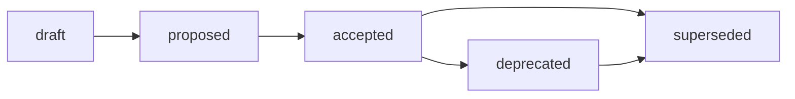

# Report Standard

## Purpose

Этот стандарт задаёт обязательную структуру Reports-артефактов Хаба: базовый
каркас Report (назначение, frontmatter, naming, lifecycle, минимальное ядро
секций), лёгкие профили подтипов (`audit`, `report`, `statistics`), routing и
границы Reports ↔ Analysis ↔ Audit ↔ Research evidence. Источник принятого
решения: [ADR-004](../docs/adr/2026-07-adr-004-reports-structure.md); rationale,
альтернативы (A/B/C/D) и trade-offs:
[RFC B-041](../docs/rfc/2026-07-02-rfc-reports-structure.md).

Стандарт — это IL-3 reusable rule о форме Report-выхода, его размещении и
relation-метаданных. Он не является Contract: операционные контракты могут
ссылаться на этот стандарт как на обязательное правило оформления, но не
подменяют его семантику. Он фиксирует только то, что ОБЯЗАТЕЛЬНО применять
повторяемо. Proposal-контекст, рассмотренные альтернативы, отклонённые варианты
и trade-offs остаются в RFC B-041 и ЗАПРЕЩЕНО дублировать их здесь. Инвентаризация
47 кандидатов остаётся в
[Reports inventory (B-038)](../docs/analysis/2026-07-01-reports-artifacts-inventory.md),
а decision rationale — в ADR-004; стандарт цитирует их, а не переписывает.

Базовые frontmatter-правила наследуются из
[Frontmatter Docs Standard](frontmatter-docs-standard.md), а имена файлов — из
[File Naming](file-naming.md). Модель Report реализует **Вариант C** ADR-004:
один базовый стандарт + профили подтипов, «A сейчас, B потом» с явным триггером
выделения профиля (см. [Type Model](#type-model)).

## Scope

Стандарт применяется к работе, которая производит **durable record of results** —
самостоятельный документ, фиксирующий «что произошло / что измерено / что
проверено» с собственным жизненным циклом. Report — это **жанр документа**, а не
конкурирующий процесс: документ может быть `audit report` или `statistics
report`, тогда как его родительская работа остаётся Audit, Analysis или Research
(Analysis §3).

| Архетип | Report role |
| --- | --- |
| A. Governance & Knowledge Hub | Report-контур Хаба: `docs/report/` (general/statistics) и `docs/audit/` (audit-reports). Этот стандарт нормативен для архетипа A. |
| B. Prompt & Pattern Library | Использует базовый Report + профили для eval reports и experiment reports с relation-метаданными к родительскому эксперименту. |
| C. Product Spoke / Runtime | Применяет `report-subtype` и границу Report ↔ Audit к release / verification / execution reports; runtime metrics-выходы могут быть statistics-профилем или оставаться в `runs/`. |
| D. Education / Learning Package | Использует general report profile для learner-progress и course-review отчётов; audit profile — для проверки учебных материалов на норму. |

Routing-следствия для B/C/D закрепляются downstream (см. матрицу дельт RFC B-041)
и не расширяют этот стандарт: без project-level ADR/standard `docs/report/` не
навязывается spoke-репозиториям.

## Identification and Placement

Тип артефакта ОПРЕДЕЛЯЕТСЯ его содержательной ролью и доминирующей стойкой, а
**не именем каталога** (content-over-path, issue #288). Audit, спрятанный в
`docs/analysis/`, остаётся Audit; statistics-report, спрятанный там же, остаётся
statistics-report.

| Элемент | Правило |
| --- | --- |
| Canonical path (general/statistics) | `docs/report/YYYY-MM-DD-name.md` (единственное число). |
| Canonical path (audit) | `docs/audit/YYYY-MM-DD-name.md` — физический дом audit-reports (ADR-004 v0.3). |
| Filename | `YYYY-MM-DD-name.md`, где `YYYY-MM-DD` — дата создания Report, `name` — короткий `kebab-case` слаг на латинице (см. [file-naming.md](file-naming.md)). |
| Evidence | Report ССЫЛАЕТСЯ и ЦИТИРУЕТ доказательную базу (evidence links), а не переписывает её (delegation, не duplication). |

**Physical routing split (ADR-004 v0.3).** Audit-reports физически размещаются в
`docs/audit/`, general reports и statistics reports — в `docs/report/`. Это
**физическое разделение, а не концептуальное**: audit-report остаётся профилем
внутри базового Report standard (Вариант C сохраняется). Путь `docs/audit/`
содержит только audit-reports (durable output Audit-процесса); audit process
artifacts (чек-листы, критерии, нормы проверки) размещаются в `standards/` или
`kb/` как контракты (IL-1), а не в `docs/audit/`.

**Output surface vs самостоятельный Report.** Терминальная секция или рендер
внутри Analysis/Audit без своего lifecycle — это output surface, не Report.
Самостоятельный Report имеет собственный frontmatter, имя и статус (Research §10,
BC-4). Этот стандарт нормирует только самостоятельные Reports.

Этот стандарт **не создаёт директории и не мигрирует файлы**: физическая
модернизация метаданных и миграция кандидатов в `docs/report/` — задача B-044.

## Frontmatter

Report ДОЛЖЕН использовать necessary and sufficient frontmatter класса Research /
report из [Frontmatter Docs Standard](frontmatter-docs-standard.md) плюс
relation-метаданные:

```yaml
---
status: draft            # knowledge: draft | reviewed | canonical | superseded
version: 0.1
updated: YYYY-MM-DD
temperature: 0.1
report-subtype: audit    # audit | report | statistics (опц.; обязателен для process outputs)
based_on: <norm/standard/checklist или "—">   # против чего проверяли (для audit)
source: <родительский Audit/Analysis/Research или issue/run>
scope: <охват: repo | project | ecosystem | slice>
supersedes: <заменяемый Report или "—">
related_artifacts:
  - <ссылки на evidence, parent work, смежные Reports>
---
```

Правила:

- Обязательное frontmatter-ядро (`status`, `version`, `updated`, `temperature`)
  наследуется из Report-профиля
  [`frontmatter-docs-standard.md`](frontmatter-docs-standard.md).
- `status` ДОЛЖЕН использовать **knowledge**-vocabulary:
  `draft`, `reviewed`, `canonical`, `superseded`. Governance-словарь
  (`proposed`, `accepted`) ЗАПРЕЩЁН для Report-артефактов.
- `report-subtype` — из фиксированного словаря `audit | report | statistics`.
  Для **process outputs** (audit report, output-for-analysis) он ОБЯЗАТЕЛЕН;
  для standalone general reports — опционален.
- `based_on` / `source` / `scope` / `supersedes` / `related_artifacts` —
  relation-метаданные. Для **process outputs** `source` и `based_on` ОБЯЗАТЕЛЬНЫ,
  чтобы фиксировать привязку к родительской работе (Analysis §3, строка
  «standalone vs process output»). Для standalone reports они опциональны и
  добавляются только когда улучшают traceability.
- `ai-generated` во frontmatter **ЗАПРЕЩЁН**. Provenance фиксируется в issue, PR,
  changelog, audit или session record.

> **Разграничение словарей (lifecycle vs frontmatter).** Правила этой секции
> нормируют frontmatter **Report-артефактов** (объект стандарта, пути
> `docs/report/` и `docs/audit/`) — они принадлежат классу Knowledge и
> используют **knowledge-vocabulary**. Сам этот документ — governance-артефакт
> класса `standards/`, поэтому его собственный `status` использует
> **governance-vocabulary** (см. [Lifecycle](#lifecycle)). Это не противоречие:
> `standards/*.md` и Report-пути — разные document classes с разными словарями
> статусов per [Frontmatter Docs Standard](frontmatter-docs-standard.md) (Status
> Vocabularies). Смешивать словари внутри одного класса ЗАПРЕЩЕНО.

## Minimum Body Sections

Каждый Report ДОЛЖЕН содержать минимальное ядро секций базового каркаса
(descriptive стойка — «что», а не causal «почему»):

| Секция | Обязательность | Содержание |
| --- | --- | --- |
| Summary / BLUF | обязательна | Краткий вывод «что произошло / измерено / проверено» первым абзацем. |
| Scope / Context | обязательна | Дата или период, автор, источники и границы охвата (`scope`). |
| Result / Findings | обязательна | Descriptive-изложение результата; факты, а не интерпретация. |
| Evidence links | обязательна | Ссылки на доказательную базу (evidence, parent work, `runs/`, `exp/`). |
| Related Artifacts | обязательна | Связанные Reports, родительская работа, нормы. |

Профиль подтипа ДОБАВЛЯЕТ обязательное ядро поверх этой базы (см. ниже). Причинный
разбор «почему», методология Audit-процесса и research-метод НЕ входят в Report —
они делегируются Analysis / Audit / Research.

## Type Model

`model`. Модель типа Report реализует **Вариант C** ADR-004: один базовый
стандарт + лёгкие профили подтипов. Подтипы входят как **профили-секции** одного
базового стандарта, а не как три независимых стандарта. Таблица subtype profiles
ниже является частью этой формы `model`. Каждый профиль добавляет обязательное
ядро поверх базы:

| Профиль | Обязательное ядро (сверх базы) | Индустриальный якорь | Покрывает | Canonical path |
| --- | --- | --- | --- | --- |
| `audit` | scope, критерии, findings, **вердикт о соответствии** | ISO 19011 / ISA 700 | audit / validation / verification / review / smoke-E2E outputs | `docs/audit/` |
| `report` | реферат/summary, тело, **выводы/conclusions** | ANSI/NISO Z39.18 / ГОСТ 7.32 | project summaries, session digests, experiment reports, retrospectives, execution reports | `docs/report/` |
| `statistics` | период, **методология**, источник данных, единицы | SDMX (ISO 17369) / DDI | inventory / matrix / scan / sync outputs, machine-readable evidence summaries | `docs/report/` |

**Триггер выделения профиля (Anti-Inflation,
[`pr-ops/repo-model.md`](../pr-ops/repo-model.md)).** Профиль выделяется в
отдельный стандарт (`audit-report-standard.md` и т.п.) **только** когда накопит
достаточно собственных повторяющихся обязательных правил или когда review pain
делает базовый Report standard неясным (критерий ADR-004). До этого порога
подтип остаётся секцией-профилем базового стандарта. Это даёт минимальную
поверхность сейчас (как A) и путь к разделению потом (как B).

Профиль `audit` описывает **только форму выхода** (output shape) и НЕ подменяет
будущий Audit standard (B-030): нормативный Audit-процесс и вердикт-семантика
принадлежат Audit-цепочке, а не этому стандарту.

## Lifecycle

Report-артефакты (объект стандарта) используют **knowledge-vocabulary** статусов:


- `draft` — Report написан, но ещё не прошёл review.
- `reviewed` — Report проверен и принят как надёжный record.
- `canonical` — Report принят как reusable basis для ссылок.
- `superseded` — Report заменён; `superseded` ТРЕБУЕТ backlink на заменяющий
  Report через `supersedes` в заменяющем документе.

Governance-словарь (`proposed`, `accepted`, `rejected`) ЗАПРЕЩЁН для Reports:
Report — knowledge-артефакт (IL-3), а не decision record.

Сам этот документ как governance-артефакт класса `standards/` подчиняется
**governance-словарю** статусов
(`draft`, `proposed`, `accepted`, `rejected`, `deprecated`, `superseded`) — это
отдельный словарь от knowledge-vocabulary, который стандарт предписывает для
нормируемых им Reports. Пока идёт review, стандарт остаётся в
`draft`/`proposed`; `accepted` фиксирует human decision gate.



Изменение принятой модели Reports (Вариант C, routing split, relation-frontmatter)
требует нового RFC/ADR, а не правки этого стандарта.

## Boundaries

[ADR-002](../docs/adr/2026-06-adr-002-artifact-document-methodology.md) остаётся
canonical owner общей таблицы artifact boundary и routing; этот стандарт НЕ
дублирует и не переопределяет её. Ниже — только локальная delta Report: граничные
кейсы, где стойку определяет доминирующий deliverable.

Границы **фиксируются ссылкой**, а не переписыванием: полные таблицы — в Analysis
§3 и Research §10. Тип артефакта определяется доминирующей стойкой:

| Граница | Правило | Дом артефакта |
| --- | --- | --- |
| Reports ↔ Analysis | Report фиксирует «что» (descriptive); Analysis объясняет «почему» (causal). Статистическая матрица или ретроспектива может быть Report-подтипом, но её родительский разбор остаётся Analysis. | `docs/report/` vs `docs/analysis/` |
| Reports ↔ Audit | Audit — процесс/стойка (проверка по норме + вердикт); audit-report — durable output этого процесса. Профиль audit-report описывает только форму выхода и не подменяет Audit standard (B-030). | `docs/audit/` (report) vs Audit process artifacts в `standards/`/`kb/` |
| Reports ↔ Research evidence | Выходы экспериментов бывают report-like, но остаются частью воспроизводимых evidence-пакетов в `exp/`. Report-mirror создаётся ТОЛЬКО когда ему нужен собственный жизненный цикл. Не переносить `research/<domain>/exp/*` в Reports. | `research/<domain>/exp/<issue-slug>/` vs `docs/report/` |
| Output surface ↔ самостоятельный Report | Терминальная секция/рендер внутри Analysis/Audit без своего lifecycle — output surface, не Report. Самостоятельный Report имеет свой frontmatter, имя и статус. | inline vs самостоятельный файл |

Нормативный тай-брейкер для граничных кейсов — один вопрос исполнителю:

> Этот документ фиксирует **устойчивый record of results со своим lifecycle**
> (→ Report), объясняет **причины/интерпретацию локального контекста**
> (→ Analysis), проверяет **соответствие норме и выносит вердикт**
> (→ Audit), или служит **воспроизводимой доказательной базой для research-claim**
> (→ `exp/`)?

Если документ делает несколько вещей сразу, он ДОЛЖЕН быть **разделён** либо
классифицирован по доминирующему deliverable. Один артефакт ЗАПРЕЩЕНО нормировать
как два типа сразу.

## Validation

Local checks:

```bash
./tools/validate-frontmatter.sh .
./tools/validate-file-naming.sh
./tools/validate-repository-structure.sh
```

Нормативный enforcement принятой модели (`report-subtype`, relation-метаданные,
routing split `docs/report/` / `docs/audit/`, knowledge-lifecycle) кодифицируется
обновлением валидаторов в цепочке cleanup B-044, не в этом стандарте. Расширение
валидаторов за пределы frontmatter, naming и registry checks отслеживается как
tech debt в [pr-ops/backlog.md](../pr-ops/backlog.md).

## Related Artifacts

- [ADR-004: Структура Reports и routing](../docs/adr/2026-07-adr-004-reports-structure.md)
  (B-042) — источник принятого решения (Вариант C, routing split, реконсиляция
  ADR-002).
- [RFC B-041: Структура Reports-артефактов](../docs/rfc/2026-07-02-rfc-reports-structure.md) —
  rationale, alternatives (A/B/C/D), trade-offs и rejected options.
- [Reports inventory and boundaries (B-038)](../docs/analysis/2026-07-01-reports-artifacts-inventory.md) —
  инвентарь 47 кандидатов, границы §3, рекомендация Варианта C §6.
- [Reports industry norms and standardization scope](../research/hub/2026-06-30-reports-industry-norms-and-standardization-scope.md) —
  индустриальные нормы, варианты §11, рекомендация §12, граничные кейсы §10.
- [ADR-002: Методология создания и управления артефактами](../docs/adr/2026-06-adr-002-artifact-document-methodology.md) —
  routing и knowledge-lifecycle артефактов; реконсилированная строка Reports;
  canonical owner общей artifact boundary/routing table.
- [`standards/standard-meta-structure.md`](standard-meta-structure.md) —
  мета-стандарт F10, задающий инвариантный каркас этого стандарта.
- [ADR-008: Мета-структура стандартов R/A/A/Report](../docs/adr/2026-07-adr-008-standard-meta-structure.md) —
  решение о едином F10-каркасе и specific-tail rule.
- [research-standard.md](research-standard.md) — sibling standard той же цепочки
  (граница `exp/` vs `runs/`, routing по типу задачи).
- [frontmatter-docs-standard.md](frontmatter-docs-standard.md) — контракт
  frontmatter по классам документов.
- [file-naming.md](file-naming.md) — дата-первое именование.
- [pr-ops/backlog.md](../pr-ops/backlog.md) — цепочка Reports B-038,
  B-041, B-042, B-043 (этот стандарт), B-044.
- Issues
  [#354](https://github.com/G-Ivan-A/hybrid-Intelligence-lab/issues/354)
  (создание этого стандарта, B-043),
  [#328](https://github.com/G-Ivan-A/hybrid-Intelligence-lab/issues/328)
  (зонтичная задача стандартизации Reports),
  [#338](https://github.com/G-Ivan-A/hybrid-Intelligence-lab/issues/338)
  (decision gate ADR-004).
