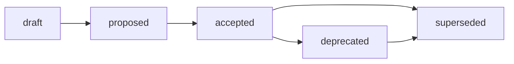

# Research Structure Standard

## Purpose

Этот стандарт задаёт обязательную структуру research-артефактов Хаба:
размещение research-отчётов, контейнер воспроизводимой доказательной базы `exp/`,
запрет обязательной папки `outputs/`, маршрутизацию Research / Analysis / Audit и
выбор **модели исследования** (Reference Research Pattern, Discussion Paper /
Survey, Analysis) для research-задачи.
Источник принятого решения:
[ADR-003](../docs/adr/2026-07-adr-003-research-structure.md); rationale,
альтернативы и trade-offs:
[RFC B-016](../docs/rfc/2026-06-30-rfc-research-structure.md).

Стандарт — это IL-3 reusable rule о форме research-артефактов, размещении
evidence и routing-критериях. Он не является Contract: операционные контракты
могут ссылаться на этот стандарт как на обязательное правило оформления, но не
подменяют его семантику. Он фиксирует только то, что ОБЯЗАТЕЛЬНО применять
повторяемо. Proposal-контекст, рассмотренные альтернативы, отклонённые варианты
и trade-offs остаются в RFC B-016 и ЗАПРЕЩЕНО дублировать их здесь.

Базовые frontmatter-правила наследуются из
[Frontmatter Docs Standard](frontmatter-docs-standard.md), а имена файлов — из
[File Naming](file-naming.md). Граница research evidence corpus (`exp/`) vs
operational run record (`runs/`) наследуется из
[ADR-002](../docs/adr/2026-06-adr-002-artifact-document-methodology.md).

## Scope

Стандарт применяется к работе, которая производит **знание**, а не
production-код: сравнение стандартов и подходов, анализ корпуса данных,
литературный обзор, benchmark, prompt-эксперимент, генерация гипотез и
индустриальных норм за пределами текущих границ репозитория.

| Архетип | Research role |
| --- | --- |
| A. Governance & Knowledge Hub | Research-контур Хаба: `research/<domain>/` и контейнер `exp/`. Этот стандарт нормативен для архетипа A. |
| B. Prompt & Pattern Library | Использует `exp/` только для воспроизводимой evidence base по prompt experiments; локальные prompt runs остаются в operational records проекта. |
| C. Product Spoke / Runtime | Применяет distinction research evidence vs operational run; runtime/pipeline outputs остаются в `runs/` или локальном artifact storage. |
| D. Education / Learning Package | Использует Research / Analysis / Audit routing для curriculum research; evidence для course-wide claims МОЖЕТ ссылаться на `exp/`. |

Routing-следствия для B/C/D закрепляются downstream (см. матрицу дельт RFC
B-016) и не расширяют этот стандарт.

## Identification and Placement

| Элемент | Правило |
| --- | --- |
| Canonical path | `research/<domain>/` для research-отчётов Хаба. |
| Report filename | `YYYY-MM-DD-name.md`, где `YYYY-MM-DD` — дата создания или старта исследования, `name` — короткий `kebab-case` слаг на латинице (см. [file-naming.md](file-naming.md)). |
| Evidence container | `research/<domain>/exp/<issue-slug>/` — единый контейнер воспроизводимой evidence base. |
| Experiment slug | `<issue-slug>` ОБЯЗАН включать номер issue для traceability, например `exp/research-structure-302/`. |
| Direction navigation | `research/<domain>/README.md` — навигация и политики направления. |

Целевая структура направления:

```text
research/<domain>/
  README.md                      # навигация и политики направления
  YYYY-MM-DD-name.md             # research report — основной носитель знания
  YYYY-MM-DD-other.md
  exp/                           # контейнер воспроизводимой evidence base
    <issue-slug>/                # один эксперимент = один issue-slug
      README.md                  # гипотеза, метод, как запустить и воспроизвести
      <script>.py | run.sh       # точка входа эксперимента
      <evidence>.{json,md,csv}   # зафиксированные результаты прогона (плоско)
```

Правила размещения:

- `research/<domain>/YYYY-MM-DD-name.md` — единственный ОБЯЗАТЕЛЬНЫЙ носитель
  research-вывода. Каждое направление ДОЛЖНО иметь такой dated report как
  основной артефакт знания.
- `research/<domain>/exp/<issue-slug>/` — опциональный evidence corpus. Он
  создаётся ТОЛЬКО когда вывод нужно сделать воспроизводимым (scan, benchmark,
  сбор evidence). Каждый эксперимент ДОЛЖЕН ссылаться на родительский dated
  report.
- Россыпь sibling-папок `exp-<slug>/` на уровне отчётов ЗАПРЕЩЕНА для новой
  работы: все эксперименты собираются в единый контейнер `exp/` (переходный
  режим для legacy — см. ниже).

## Frontmatter

Research report ДОЛЖЕН использовать necessary and sufficient frontmatter класса
Research / report из [Frontmatter Docs Standard](frontmatter-docs-standard.md):

```yaml
---
status: draft
version: 0.1
updated: YYYY-MM-DD
temperature: 0.3
---
```

- `status` ДОЛЖЕН использовать **knowledge**-vocabulary:
  `draft`, `reviewed`, `canonical`, `superseded`. Governance-словарь
  (`proposed`, `accepted`) ЗАПРЕЩЁН для research-артефактов.
- Опциональные поля (`owner`, `source`, `scope`, `type`, `context`, `method`,
  `related_*`, `external_artifacts`, `stage`, `projects`, `source_id`,
  `based_on`) добавляются ТОЛЬКО когда улучшают traceability и потребляются
  индексом, валидатором или процессом.
- `README.md` контейнера `exp/<issue-slug>/` наследует базовые четыре поля
  (`status`, `version`, `updated`, `temperature`).
- `ai-generated` ЗАПРЕЩЁН во frontmatter. Provenance фиксируется в issue, PR,
  changelog, audit или session record.

> **Разграничение словарей (lifecycle vs frontmatter).** Правила этой секции
> нормируют frontmatter **research reports** (объект стандарта, путь
> `research/`) — они принадлежат классу Knowledge и используют
> **knowledge-vocabulary**. Сам этот документ — governance-артефакт класса
> `standards/`, поэтому его собственный `status` использует
> **governance-vocabulary** (см. [Lifecycle](#lifecycle)). Это не противоречие:
> `standards/*.md` и `research/*.md` — разные document classes с разными
> словарями статусов per
> [Frontmatter Docs Standard](frontmatter-docs-standard.md) (Status
> Vocabularies). Смешивать словари внутри одного класса ЗАПРЕЩЕНО.

Внешнее research-утверждение (external claim) ОБЯЗАНО в теле отчёта содержать
источник, автора или организацию, ссылку и границы применимости.

## Minimum Body Sections

`N/A`. Этот стандарт нормирует размещение, evidence-контейнер и routing
research-артефактов, а не фиксированный H2-каркас внутри самого research-отчёта.
Обязательный минимум содержания research report (источник, автор, ссылка и
границы применимости внешнего claim) задан в разделе [Frontmatter](#frontmatter)
и в правилах размещения [Identification and Placement](#identification-and-placement),
а не отдельным списком инвариантных секций отчёта. Поэтому раздел неприменим в
смысле «минимальное ядро секций нормируемого артефакта».

## Type Model

`model`. Research-артефакт имеет **две формы выхода**, различающиеся зрелостью
темы, а не типом артефакта:

| Форма | Когда применяется | Носитель |
| --- | --- | --- |
| Discussion Paper / Survey | тема на ранней стадии: собираются индустриальные практики и формулируются гипотезы; воспроизводимой таксономии и рамки решений ещё нет | один или несколько датированных отчётов `research/<domain>/YYYY-MM-DD-name.md` + опц. `exp/` |
| Reference Research Pattern (RRP) | тема зрелая: есть таксономия и пространство решений, исследование обязано быть воспроизводимой методологией | модуль из шести файлов `research/<domain>/<topic>/00-…50-…` (SSOT формы — [RFC Reference Research Pattern](../docs/rfc/2026-07-17-rfc-reference-research-pattern.md)) |

Обе формы остаются одним типом артефакта — Research; выбор между ними и
разграничение с типом Analysis нормируются в
[Три модели исследования](#три-модели-исследования-rrp-discussion-paper-и-analysis).
Различия Research / Analysis / Audit — это routing между разными стандартами, а
не формы внутри этого стандарта (см.
[Маршрутизация Research / Analysis / Audit](#маршрутизация-research--analysis--audit)).
Anti-inflation trigger для форм привязан к разделу
[Три модели исследования](#три-модели-исследования-rrp-discussion-paper-и-analysis):
новая форма вводится только при доказанной боли маршрутизации, а не по факту
появления нестандартного артефакта.

## Lifecycle

Этот стандарт как governance-артефакт класса `standards/` подчиняется
**governance-словарю** статусов
(`draft`, `proposed`, `accepted`, `rejected`, `deprecated`, `superseded`).
Это отдельный словарь от **knowledge-vocabulary**
(`draft`, `reviewed`, `canonical`, `superseded`), который стандарт предписывает
для нормируемых им research reports (см. [Frontmatter](#frontmatter)):
`standards/*.md` и `research/*.md` — разные document classes, и каждый использует
свой словарь статусов per
[Frontmatter Docs Standard](frontmatter-docs-standard.md). Пока идёт review, этот
стандарт остаётся в `draft`/`proposed`; `accepted` фиксирует human decision gate.
Он является technical replacement для `research-profile.md`
как источника правил структуры research; физическое удаление профиля выполняется
в B-021.



Rules:

- Изменение принятой модели структуры research (`exp/`, запрет `outputs/`,
  routing) требует нового RFC/ADR, а не правки этого стандарта.
- `superseded` требует backlink на заменяющий стандарт.

## Boundaries

[ADR-002](../docs/adr/2026-06-adr-002-artifact-document-methodology.md) остаётся
canonical owner общей таблицы artifact boundary и routing; этот стандарт её не
переопределяет и не дублирует. Локальная delta research-стандарта — две границы,
которые он владеет содержательно: research evidence corpus (`exp/`) vs
operational run record (`runs/`) и routing Research / Analysis / Audit по
содержательной роли артефакта. Их полные таблицы вынесены в specific tail (см.
[Граница `exp/` vs `runs/`](#граница-exp-vs-runs) и
[Маршрутизация Research / Analysis / Audit](#маршрутизация-research--analysis--audit))
и здесь не повторяются.

## Validation

Local checks:

```bash
./tools/validate-frontmatter.sh .
./tools/validate-file-naming.sh
./tools/validate-repository-structure.sh
```

Нормативный enforcement принятой модели (`exp/`, запрет `outputs/`, routing)
делегирован обновлению валидаторов (B-023). Расширение валидаторов за пределы
frontmatter, naming и registry checks отслеживается как tech debt в
[pr-ops/backlog.md](../pr-ops/backlog.md).

## Related Artifacts

- [Standard Meta-Structure Standard](standard-meta-structure.md) — F10-скелет,
  которому соответствует структура этого стандарта (B-052/B-053).
- [ADR-008: Мета-структура стандартов](../docs/adr/2026-07-adr-008-standard-meta-structure.md) —
  источник правила F10 и смягчённого правила specific-tail cross-reference.
- [ADR-003: Структура research, контейнер `exp/` и маршрутизация](../docs/adr/2026-07-adr-003-research-structure.md) —
  источник принятого решения.
- [RFC B-016: Структура research, контейнер `exp/` и маршрутизация](../docs/rfc/2026-06-30-rfc-research-structure.md) —
  rationale, alternatives, trade-offs и rejected options.
- [ADR-002: Методология создания и управления артефактами](../docs/adr/2026-06-adr-002-artifact-document-methodology.md) —
  routing `runs/` и граница operational run record.
- [RFC: Reference Research Pattern](../docs/rfc/2026-07-17-rfc-reference-research-pattern.md) —
  SSOT структуры RRP (шесть файлов), различения Research Method vs Domain
  Methodology и статуса `Experimental`.
- [analysis-standard.md](analysis-standard.md) — форма и subtype profiles
  артефакта типа Analysis.
- [glossary.md](glossary.md) — определения `Research Method`,
  `Domain Methodology`, `Conceptual Framing`, `Discussion Paper / Survey`.
- `research-profile.md` — legacy профиль; technical
  replacement задаёт этот стандарт, удаление выполняется в B-021.
- [frontmatter-docs-standard.md](frontmatter-docs-standard.md) — контракт
  frontmatter по классам документов.
- [file-naming.md](file-naming.md) — дата-первое именование.
- [pr-ops/backlog.md](../pr-ops/backlog.md) — цепочка B-016..B-023.
- Issues
  [#294](https://github.com/G-Ivan-A/hybrid-Intelligence-lab/issues/294) (зонтичная
  задача стандартизации research),
  [#290](https://github.com/G-Ivan-A/hybrid-Intelligence-lab/issues/290) (коллизия
  `outputs/` vs `runs/`),
  [#288](https://github.com/G-Ivan-A/hybrid-Intelligence-lab/issues/288) (размытие
  типов Research / Analysis / Audit),
  [#318](https://github.com/G-Ivan-A/hybrid-Intelligence-lab/issues/318)
  (создание этого стандарта, B-018),
  [#515](https://github.com/G-Ivan-A/hybrid-Intelligence-lab/issues/515)
  (легитимизация трёх моделей исследования, B-103).

## Evidence Container `exp/`: плоская структура, запрет `outputs/`

Этот раздел реализует границу применимости из [Scope](#scope) и запрет из
[Purpose](#purpose): контейнер воспроизводимой evidence base, объявленный как
опциональный носитель доказательств, получает здесь свою обязательную форму.
Внутри `exp/<issue-slug>/` применяется **плоская структура**: `README.md`,
скрипт и зафиксированные результаты лежат рядом.

- Обязательная папка `outputs/` **ЗАПРЕЩЕНА**. Обязательная папка `inputs/`
  **ЗАПРЕЩЕНА**.
- `README.md` эксперимента ОБЯЗАН описывать гипотезу, метод, как запустить и как
  воспроизвести прогон, и ДОЛЖЕН ссылаться на parent dated report.
- Скрипт перезаписывает результаты на месте; git фиксирует дельту прогона.
  Снимок результата остаётся read-only evidence.
- При большом числе входных/выходных файлов РАЗРЕШАЕТСЯ опциональная группировка
  по роли данных (например, `data/`), но обязательная папка `outputs/`
  ЗАПРЕЩЕНА в любом случае. Дефолт — плоско; группировка появляется только при
  реальной операционной боли (Anti-Inflation principle,
  [pr-ops/repo-model.md](../pr-ops/repo-model.md)).

## Граница `exp/` vs `runs/`

Этот раздел раскрывает границу, объявленную в [Purpose](#purpose) как
наследуемую из ADR-002. `exp/` и `runs/` — разные контейнеры с разной
семантикой. ЗАПРЕЩЕНО смешивать их.

| Контейнер | Назначение | Привязка | Семантика |
| --- | --- | --- | --- |
| `research/<domain>/exp/<issue-slug>/` | Research evidence corpus: воспроизводимая доказательная база, обосновывающая утверждение в research-отчёте. | ВСЕГДА ссылается на parent dated report. | «Докажи знание»: артефакт существует ради knowledge claim. |
| `runs/` | Operational run record: факт выполнения операционной/бизнес-задачи или pipeline (ADR-002). | НЕ обязан быть привязан к research-отчёту. | «Зафиксируй выполнение»: артефакт существует ради записи прогона. |

Нормативный критерий разведения — один вопрос исполнителю:

> Этот артефакт существует, чтобы **доказать утверждение в research-отчёте**
> (→ `exp/`), или чтобы **зафиксировать факт выполнения операционной/бизнес-задачи
> или pipeline** (→ `runs/`)?

Если операционная задача произвела данные, а позже на них проводится
исследование, research-отчёт ДОЛЖЕН **цитировать `runs/` как источник данных** и
ЗАПРЕЩЕНО поглощать run-запись внутрь `exp/`.

## Маршрутизация Research / Analysis / Audit

Этот раздел реализует routing-критерии, заявленные в [Purpose](#purpose), и
границу «знание vs production-код» из [Scope](#scope). Тип артефакта
ОПРЕДЕЛЯЕТСЯ его содержательной ролью, а **не именем каталога**. Аудит, спрятанный
в `docs/analysis/`, остаётся Audit; research, спрятанный в `docs/analysis/`,
остаётся Research.

| Тип | Главный вопрос | Дом артефакта | Доказательная база |
| --- | --- | --- | --- |
| Research | Что известно и какие варианты существуют за нашей границей? | `research/<domain>/YYYY-MM-DD-name.md` | опц. `research/<domain>/exp/<issue-slug>/` |
| Analysis | Что происходит в нашем локальном/внутреннем контексте? | `docs/analysis/YYYY-MM-DD-name.md` | inline или ссылка на `runs/` |
| Audit | Соответствует ли текущее состояние норме/контракту? | `docs/audit/YYYY-MM-DD-name.md` | воспроизводимые проверки / вывод валидатора |
| Operational / Business run | Запись выполнения задачи/pipeline | `runs/` (ADR-002) | — |

Определения (нормативны для routing):

- **Research** — генерация нового знания, гипотез, индустриальных норм за
  пределами текущих границ.
- **Analysis** — исследование локального/внутреннего контекста без генерации
  нового внешнего знания.
- **Audit** — проверка соответствия существующему стандарту/контракту.

## Классификация на этапе создания задачи

Этот раздел операционализирует routing из [Scope](#scope): исполнитель (человек
или агент) ОБЯЗАН классифицировать задачу до размещения артефакта, применяя
проверки в этом детерминированном порядке:

1. Проверяем текущее состояние против явной нормы/контракта/checklist →
   **Audit** (`docs/audit/`).
2. Иначе, генерируем или сравниваем НОВОЕ знание (внешние источники, индустрия,
   гипотезы, варианты за границей репо) → **Research**
   (`research/<domain>/` + опц. `exp/`).
3. Иначе, рассуждаем о ЛОКАЛЬНОМ контексте без внешнего знания и без проверки
   нормы → **Analysis** (`docs/analysis/`).
4. Иначе, главный результат — ФАКТ выполнения операционной/бизнес-задачи или
   данные прогона → **Operational run** (`runs/`).

Нормативные тай-брейкеры для граничных кейсов:

- **Research vs Analysis.** Наличие внешних источников, индустриального
  сравнения или проверки гипотезы относит документ к Research; чистое
  рассуждение о внутреннем состоянии — к Analysis. Если документ делает и то, и
  другое, он ДОЛЖЕН быть **разделён** либо классифицирован по доминирующему
  deliverable. Один артефакт ЗАПРЕЩЕНО нормировать как два типа сразу.
- **Analysis vs Audit.** При наличии нормы и семантики
  pass/fail/finding/remediation артефакт классифицируется как Audit, даже если
  файл лежит в `docs/analysis/`.
- **Research vs Operational run.** Артефакт ради knowledge claim → `exp/`;
  артефакт ради записи прогона → `runs/` (см. границу выше).

## Три модели исследования: RRP, Discussion Paper и Analysis

Этот раздел операционализирует выбор модели исследования, объявленный в
[Purpose](#purpose), и границу «производство знания vs production-код» из
[Scope](#scope). Он **не отменяет** ни базовый метод этого стандарта (дата-первый
отчёт + опциональный `exp/` остаются формой по умолчанию), ни структуру RRP:
SSOT шести файлов и статуса `Experimental` — только
[RFC Reference Research Pattern](../docs/rfc/2026-07-17-rfc-reference-research-pattern.md).

Раздел закрывает «серую зону» между быстрой инвентаризацией и зрелым модульным
исследованием: research на ранней стадии, который уже опирается на индустриальные
источники и порождает гипотезы, но ещё не имеет ни таксономии, ни рамки решений.
До фиксации этой модели такой артефакт не попадал ни в один класс и маршрутизация
зависела от точки входа исполнителя.

### Сравнение моделей

| | **Reference Research Pattern (RRP)** | **Discussion Paper / Survey** | **Analysis** |
| --- | --- | --- | --- |
| Тип артефакта | Research | Research | Analysis |
| Главный вопрос | как устроена зрелая тема и как в ней выбирать | что известно в индустрии и какие гипотезы из этого следуют | что есть у нас сейчас |
| Зрелость темы | высокая: пространство решений известно | ранняя: пространство решений ещё не выделено | не применимо: тема не исследуется, а инвентаризуется |
| Обязательные элементы | Theory, Taxonomy, Decision Framework, Practice, Open Questions в шести файлах модуля | явная маркировка предварительного статуса, обзор индустриальных практик с источниками, сформулированные гипотезы | структурирование существующих фактов и ответы на конкретные вопросы «что есть сейчас» |
| Явно НЕ требуется | — | полная таксономия, Decision Framework, воспроизводимость выбора | внешние источники и индустриальное сравнение |
| ЗАПРЕЩЕНО | предъявлять модуль с пустыми файлами ради симметрии формы | выдавать предварительные гипотезы за принятую норму | генерировать новые гипотезы и теоретические модели — это переводит артефакт в Research |
| Форма | модуль `research/<domain>/<topic>/` из шести файлов | один или несколько датированных отчётов `research/<domain>/YYYY-MM-DD-name.md` | датированный отчёт `docs/analysis/YYYY-MM-DD-name.md` |
| Доказательная база | опц. `exp/<issue-slug>/`, обязательное основание практики в теории (P5 RFC) | источники внешних claim по правилу [Frontmatter](#frontmatter); опц. `exp/<issue-slug>/` | inline или ссылка на `runs/` |
| Нормативный источник формы | [RFC RRP](../docs/rfc/2026-07-17-rfc-reference-research-pattern.md) | этот стандарт | [analysis-standard.md](analysis-standard.md) |

Модель — это **зрелость и форма выхода**, а не отдельный тип: RRP и Discussion
Paper — две формы одного типа Research (см. [Type Model](#type-model)), а Analysis
— другой тип, живущий по своему стандарту. Поэтому выбор между RRP и Discussion
Paper ЗАПРЕЩЕНО делать раньше, чем выполнена маршрутизация по типу (см.
[Классификация на этапе создания задачи](#классификация-на-этапе-создания-задачи)).

### Порядок выбора

Исполнитель (человек или агент) применяет проверки в этом детерминированном
порядке; первая сработавшая определяет модель:

1. Работа отвечает на вопрос «что есть сейчас» — инвентаризация, быстрая оценка,
   структурирование **существующих** фактов, **без** новых гипотез и
   теоретических моделей → **Analysis** (`docs/analysis/`).
2. Иначе работа генерирует новое знание, и у темы **уже есть** выделенное
   пространство решений: возможны таксономия и рамка выбора, а результат обязан
   быть воспроизводимой методологией → **RRP** (модуль из шести файлов).
3. Иначе работа генерирует новое знание на ранней стадии: обзор индустриальных
   практик и формулировка гипотез без готовой таксономии и рамки решений →
   **Discussion Paper / Survey** (датированный отчёт).

Тай-брейкеры:

- **Discussion Paper vs Analysis.** Наличие внешних источников, индустриального
  сравнения или **новой гипотезы** относит артефакт к Discussion Paper. Чистое
  описание внутреннего состояния — Analysis, даже если оно объёмно. Гипотеза,
  появившаяся в ходе инвентаризации, не переводит артефакт в Research
  автоматически: она выносится отдельным Discussion Paper либо в раздел открытых
  вопросов без развёртывания.
- **Discussion Paper vs RRP.** Решающий признак — не объём и не число файлов, а
  наличие **Decision Framework**: если исследование не может ответить «в каком
  случае что выбирать», модуль RRP предъявлять ЗАПРЕЩЕНО (пустой
  `20-taxonomy.md` хуже отсутствующего — Trade-offs RFC). Discussion Paper —
  легитимный конечный результат, а не недоделанный RRP.
- **Промоушен.** Discussion Paper МОЖЕТ быть развёрнут в RRP, когда таксономия и
  рамка решений появились. При развёртывании исходный отчёт получает
  `status: superseded` и backlink на модуль; переписывание истории ЗАПРЕЩЕНО.
  Обратный переход (свёртка модуля в отчёт) требует RFC.

### Обязательная маркировка Discussion Paper

Discussion Paper ОБЯЗАН быть отличим от принятой нормы с первого экрана:

- `status: draft` (knowledge-vocabulary, см. [Frontmatter](#frontmatter));
- в теле отчёта — явная строка предварительного статуса: результат
  предварительный, отражает позицию автора и НЕ является нормой Хаба;
- гипотезы ОБЯЗАНЫ быть перечислены явно и отделены от установленных фактов;
- каждый индустриальный claim ОБЯЗАН нести источник, автора/организацию, ссылку
  и границы применимости — общее правило [Frontmatter](#frontmatter) действует
  без послаблений.

Requirement выведен из индустриальных практик ранних стадий исследования, а не
из формы существующих неклассифицированных артефактов:

| Индустриальная практика | Что заимствовано |
| --- | --- |
| [IETF Internet-Draft (RFC 2026, §2.2)](https://datatracker.ietf.org/doc/html/rfc2026#section-2.2) | документ ранней стадии обязан быть явно помечен как «work in progress» и НЕ может цитироваться как норма |
| [W3C Working Draft (W3C Process)](https://www.w3.org/policies/process/) | предварительный документ публикуется для комментариев; статус зрелости объявлен в самом документе, а не выводится читателем |
| Академический position / discussion paper (например, [OECD Working Papers](https://www.oecd.org/en/publications/oecd-economics-department-working-papers_18151973.html)) | дисклеймер «взгляды авторов, не позиция организации» + приглашение к обсуждению как обязательный элемент формы |
| Survey / review article (например, [ACM Computing Surveys](https://dl.acm.org/journal/csur)) | обзор состояния области с систематическим цитированием источников признаётся самостоятельным научным вкладом, а не заготовкой монографии |

Отсюда три обязательных элемента модели: **маркировка предварительного статуса**,
**обзор индустриальных практик с источниками**, **явные гипотезы**. Полная
таксономия и Decision Framework в этих практиках не требуются, поэтому не
требуются и здесь.

### Anti-Inflation

Раздел не вводит новых governance-файлов, новых каталогов и нового frontmatter-поля
для модели: модель выводится из содержания артефакта по правилам выше
(`content-over-path`). Четвёртая модель или отдельный файл-стандарт для
Discussion Paper вводятся ТОЛЬКО при доказанной боли маршрутизации —
повторяющемся misrouting, который эта таблица не разрешает
([pr-ops/repo-model.md](../pr-ops/repo-model.md)).

## Переходный режим для legacy `exp-*`

Этот раздел ограничивает применение формы `exp/` из [Scope](#scope) для
существующих артефактов. Стандарт не выполняет физическую миграцию (это B-022) и
не удаляет `standards/research-profile.md` (это B-021). До миграции:

- Существующие `research/<domain>/exp-<slug>/` с `outputs/` остаются валидными
  как legacy-compatible. Их формат **заморожен**: он читается однозначно как
  sibling evidence corpus прежнего образца.
- Для **новой** работы ОБЯЗАТЕЛЕН целевой формат — единый контейнер
  `exp/<issue-slug>/` с плоской структурой. Создавать новые sibling `exp-<slug>/`
  или новые обязательные `outputs/` ЗАПРЕЩЕНО.
- Изменение валидаторов под `exp/` и routing выполняется отдельной задачей
  (B-023); enforcement за пределами регистрации артефактов не входит в этот
  стандарт.
